---
tags:
  - notes
  - sysI
comments: true
dg-publish: true
---

## I Introduction to ISA

### I.1 What is An Instruction?

$Instruction = opcode + operands$

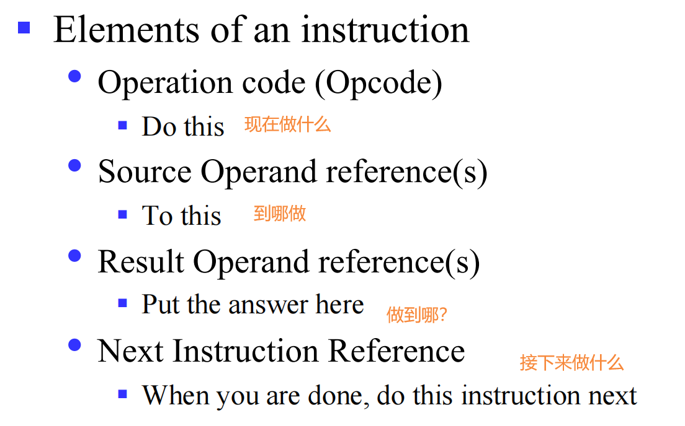

> [!DEFINITION ]
>
> The physical hardware that is controlled by the instructions is referred to as the _Instruction Set Architecture_ (ISA)

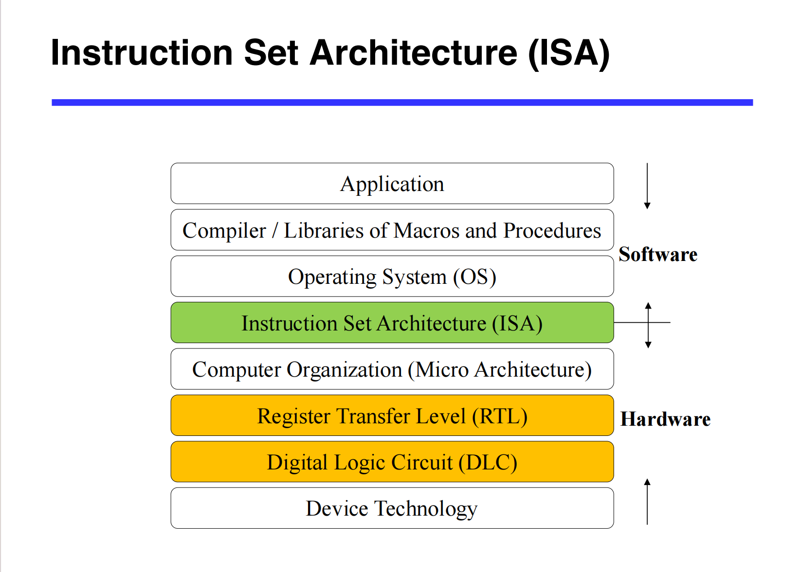

可以看到 ISA 处于硬件和软件的衔接处

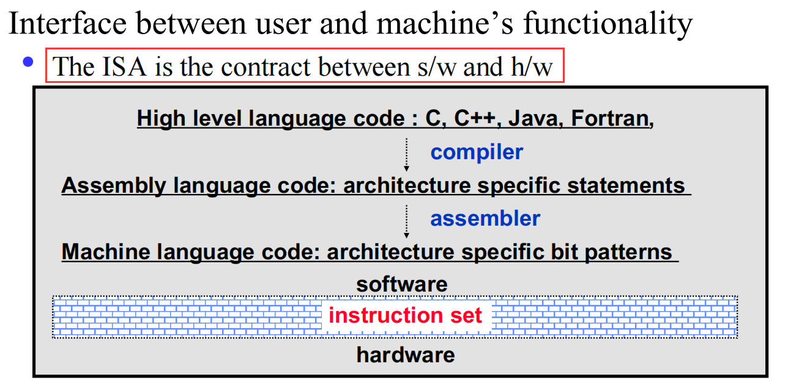

**ISA Specifies How the ComputerChanges State**

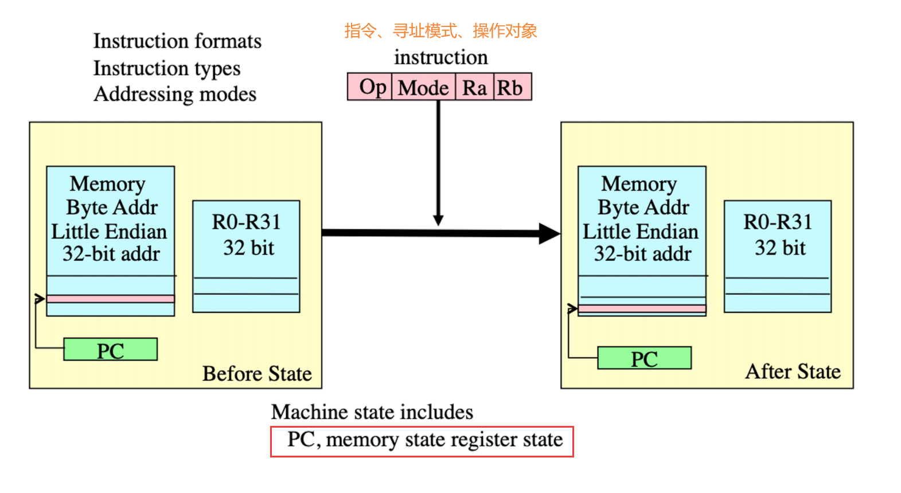

### I.2 How can we design an instruction?

> [!CITE]
>
> 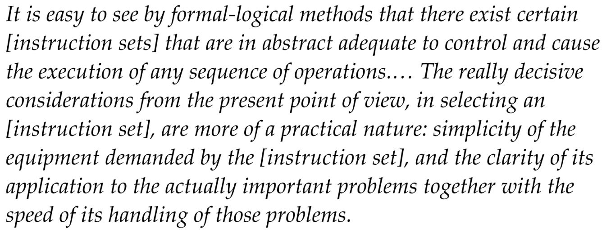

**Some Thoughts of Instruction Formats**

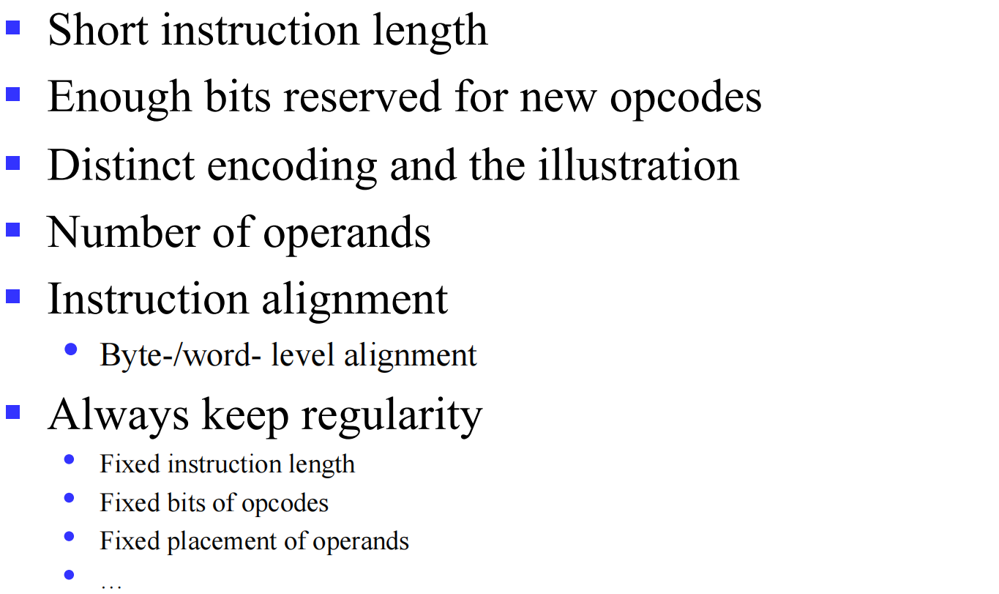

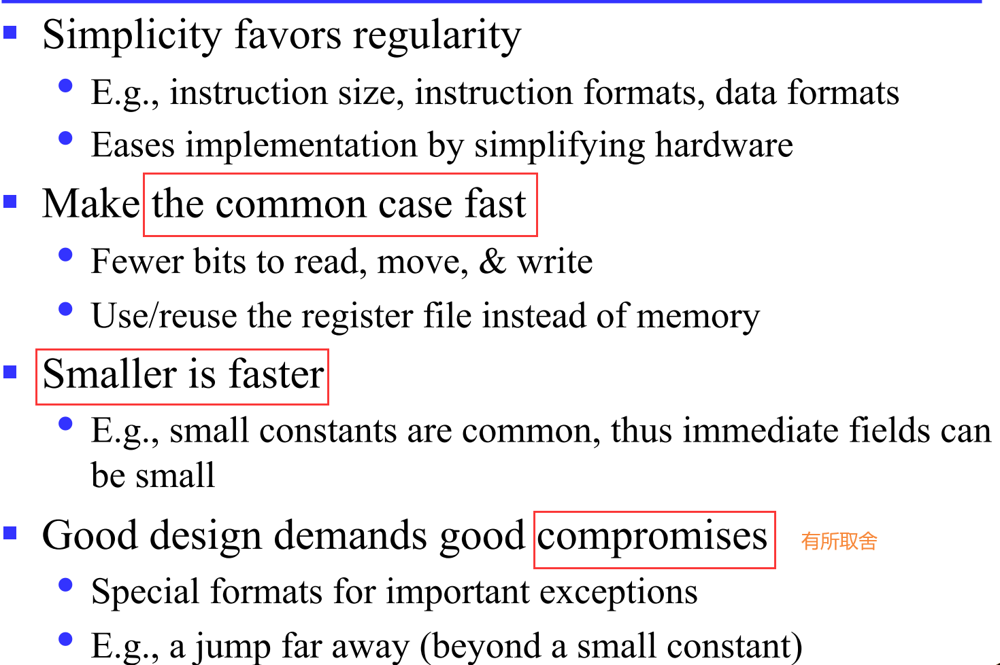

## II RISC-V ISA

> [!DEFINITION ]
>
> An open-source implementation of a _reduced instruction set computing_ (RISC) based _instruction set architecture_ (ISA)
> More on [github](https://github.com/riscv/riscv-isa-manual)
> 下面跳过一些
> 
> [Lec06-2](attachments/Lec06-2.pdf#page=6)

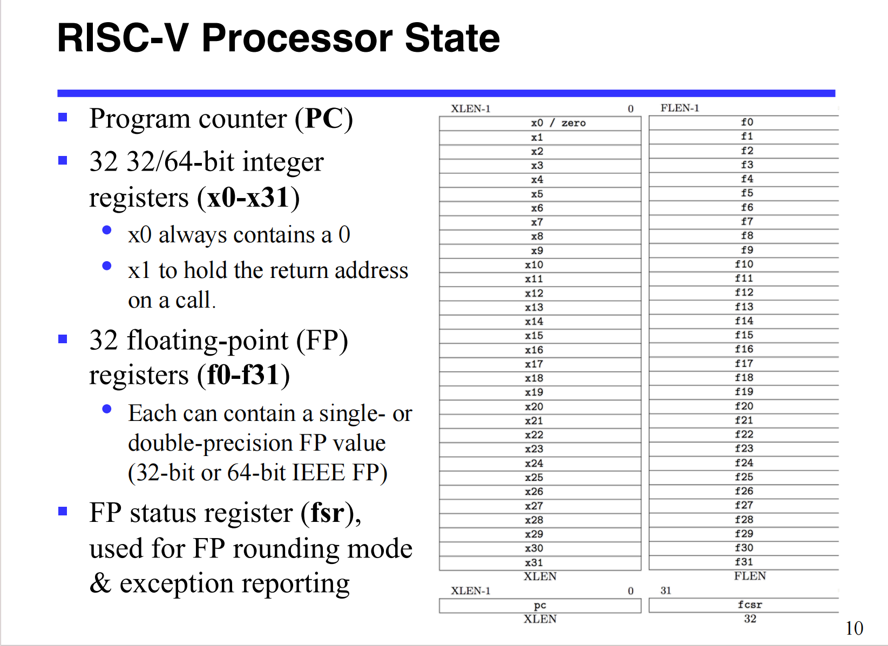

> [!NOTE]
>
> 注：下面的笔记全部来自 [鹤翔万里](https://tonycrane.cc/) （伟大，无需多言）
>
> -  [Introduction of RISCV ISA](https://note.tonycrane.cc/cs/pl/riscv/)

 >

> - [unprivileged riscv](https://note.tonycrane.cc/cs/pl/riscv/unprivileged/)
>
> -  [x86 汇编指令](https://note.tonycrane.cc/cs/pl/asm/)
> [!QUESTION]
>
> How many operands are best?
> 
> 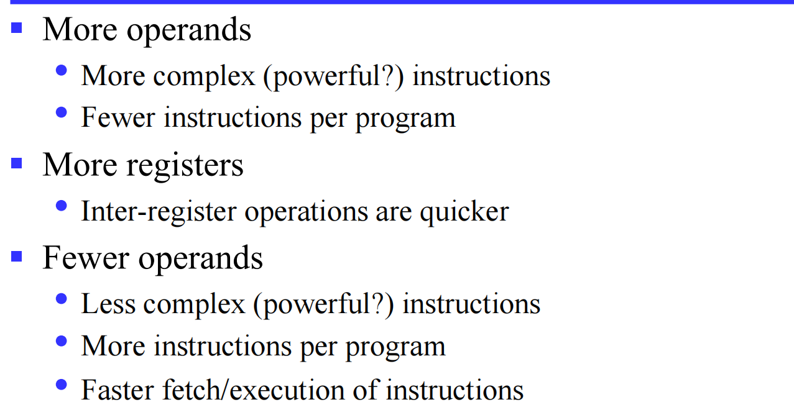
> [!INFO]
>
> 下面的 pdf 部分看完 [RISC-V 非特权级 ISA](https://note.tonycrane.cc/cs/pl/riscv/unprivileged/) 能够更加简单的理解
>
>  [riscv-spec-20191213#page=34](attachments/riscv-spec-20191213.pdf#page=34)
>  
>  下面是 RISC vs CISC 的详细讲解
>  
>  [Lec06-1](attachments/Lec06-1.pdf#page=52) (CISC/RISC classification should *NOT* be a dichotomy!)
> **随手记**
> 
> PC 寄存器定位汇编位置（4 字节）读取二进制编码
> 
> 先看 opcode ，决定类型……执行…
>
>执行结束后 pc 自动+4 顺序执行下一条

## III RISC-V Assembly Language

### III.1 Variable Definition & Arithmetic Operations when Converting C code to RISC-V

> Assign eachvariable to some offsetfrom sp. Exact values don't matter as long as we're consistent

来看下面的代码：

> [!INFO]
>
> 局部变量储存在栈中
>
> 指针寄存器：sp bp，常与 ss 构成远指针
>    - _sp_：堆栈指针寄存器，ss:sp 指向堆栈顶端
>    - bp：基址指针寄存器，常用 ss:bp 指向堆栈中数据

```c
int a = 5;
char b[] = "string";
int c[10];
uint8_t d = b[3];
c[4] = a+d;
c[a] = 20;
```

那么空间分配如下：

- a:0(sp) // 从 0 开始
- b:4(sp) // 一个 int 占据 4 个 byte
- c:12(sp) // b 本身占据 7 个 byte，为了让 b 所占据的空间每 4 byte 对齐
- d:52(sp) // c 中占据 10 个byte

下面是汇编实现过程：

[Lec06-3#page=8-15](attachments/Lec06-3.pdf#page=8)

最后总结如下

```s
# 给a分配t0存储在0(sp)处
li t0 5
sw t0 0(sp)
# b
li t0 0x69727473
sw t0 4(sp)
li t0 0x0000676E
sw t0 8(sp)
# d
lb t0 7(sp)
sb t0 52(sp)
lw t0 0(sp)
lbu t1 52(sp) 
add t2 t0 t1
sw t2 28(sp)
li t0 20
lw t1 0(sp)
slli t1 t1 2 #t1*=4
addi t1 t1 12
add t1 t1 sp
sw t0 0(t1)
```

> [!ATTRENTION]
>
> Memory can be used for variables we can't store in registers, but 100 x slower than using registers directly; so use loads and stores as infrequently as possible!

### III.2 Control Flow

#### III.2.1 Fontrol Flow and goto

在 C 语言中，我们比较多的情况下会逐行运行，直到出现 `if...else...` `switch() case:...` 这类条件执行语句；因为此时我们是有选择的执行语句而非每一条都执行。

> [!INFO]
>
>  `goto _lable_` 语句更为直接，一个简单的演示如下
> 
> 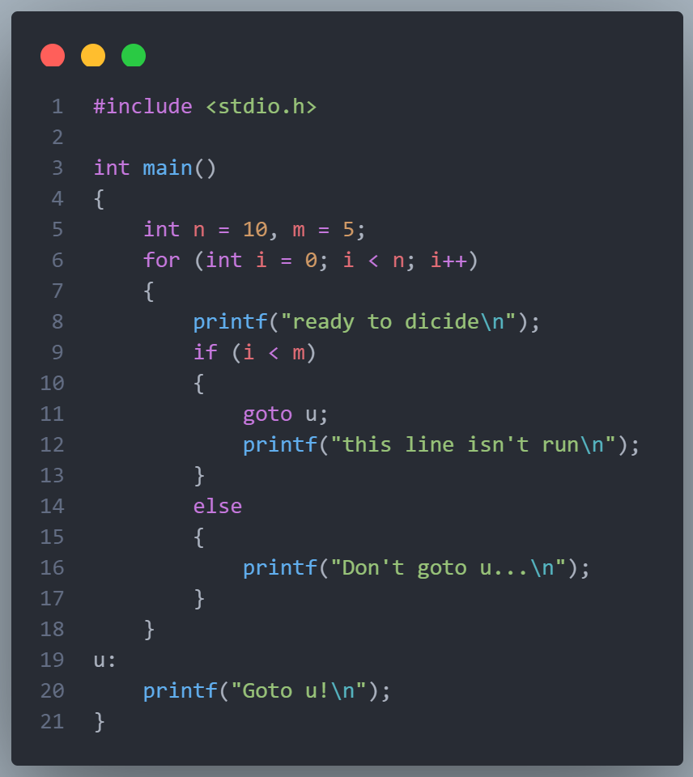
>
> 输出为
> ```
> ready to dicide
> Goto u!
> ```
>> 在 C 语言中注意，`goto _lable_` 会使得代码的可维护性降低；但在汇编中，由于 `goto` 语句与可实现的跳转十分相像，所以有利于我们可以先将 C 语言语句翻译为 `goto` 语句，再由 `goto` 语句翻译为汇编语言

#### III.2.2 Reducing C with goto

[Lec06-3#page=42-53](attachments/Lec06-3.pdf#page=42)

#### III.2.3 RISC-V Control Flow

##### III.2.3.1 pseudoinstructions

> RISC-V 中的[伪指令](https://note.tonycrane.cc/cs/pl/riscv/unprivileged/#_12)

#### III.2.4 Converting C code to RISC-V with goto

我们需要将下面的 C 语言代码转换为汇编语言：

```c
int a = 0; 
for(int i = 0; i < 10; i++) { 
    if(i == 7) { 
        break; 
    } a = a + i; 
} 
a = a + 50;
```

##### III.2.4.1 step 1: 拆解跳转语句

```c
int a = 0; 
int i = 0; 
Loop: if(i >= 10) goto End; 
    if(i == 7) goto End;
    a = a + i; 
    i = i + 1; 
    goto Loop;
End: a = a + 50;
```

##### III.2.4.2 step 2:将立即数用寄存器存储

```c
int a = 0;
int i = 0;
Loop:
    int j = 10;
    if(i>=j)goto End;
    j=7;
    if(i==j)goto End;
    a=a+i;
    i=i+1;
    goto Loop;
End:a=a+50;
```

##### III.2.4.3 step 3: 转变为汇编语言

> 省略了空间分配

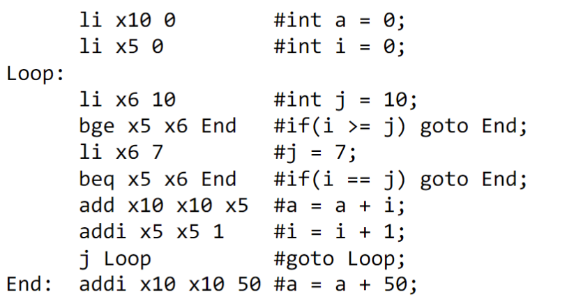

### III.3 Function Call

#### III.3.1 Functions

使用汇编语言实现函数调用需要注意：

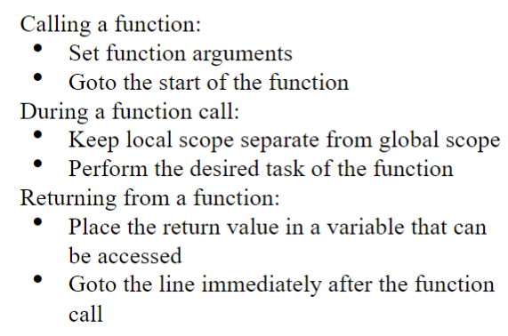

两个问题：

- Problem with Maintaining Scope 
    - 即变量的有效范围
    - 在 C 中全局变量和局部变量可以使用同一个名字而不同的空间/地址
    - 但在 RISC-V 中没有这一说法，所以在调用函数时：
    - We'll need a way to store variables somewhere that no called function can change
- Problem with returning from a function
    - 即如何获取函数返回值？告诉函数返回值放在哪里
    - We'll need a way to send in the return address to a function, and jump to that return address when we finish with the function.

#### III.3.2 RISC-V Memory Model

在 C 语言（等很多语言）中内存主要被分为了 4 个部分：

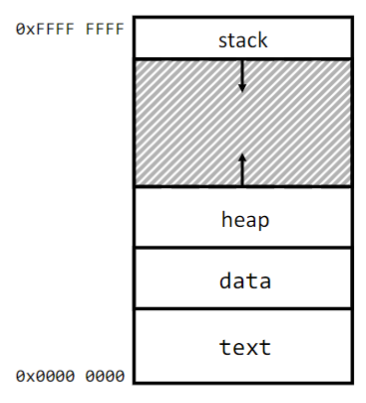

> 更为详细可见 [这张图](https://cyrus28214.top/img/s/6516efb5c458853aef15f8fb.png)，其中 stack 上方的空间由 OS（操作系统）控制

##### III.3.2.1 Text

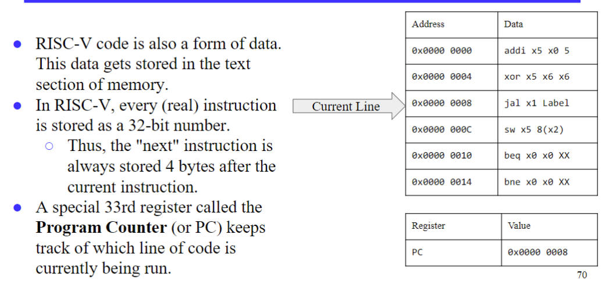

PC 寄存器在 text 区域一条一条读取着指令：每当执行完一条指令时，自己自动加上指令长度以读取下一条指令；当遇到跳转时，则根据具体情况更改加/减情况以执行对应的指令

> [!EXTENSION]
> 
> 可以看看 [cyrus' blog](https://cyrus28214.top/post/38f6f91d6364/)

###### III.3.2.1.1 jal (jump and link)

`jal rd _lable_`

- Jumps to the given label, but also sets rd to PC+4 (the return address) 
- Often used for function calls

`j _lable_`

这是一条 **伪指令**，相当于 `jal x0 _lable_` ，因为 `x0` 始终为 0，所以写入 `rd` 就被忽略了；也就是说，我们没有打算返回来，也就是我们并不想要 **link** 。

###### III.3.2.1.2 jalr (jump and link register)

`jalr rd rs1 imm` 或者 `jalr rd imm(rs1)`

- jumps to the instruction at address rs1+imm, and sets rd to PC+4 
- Less common than other jumps, but used for higher-order functions and some function calls (more in the future)

`jr rs1`

类上，但是是跳转到寄存器处

##### III.3.2.2 Stack

In C ( or many code language): Each function call automatically creates a stackframe,with nested calls growing the stack downward.

In RISC-V:One of our registers(by convention x 2, nick named _sp_,or "_stack pointer_") is set to thebottom of the stack. A function can choose to create a stackframe, by manipulating sp.

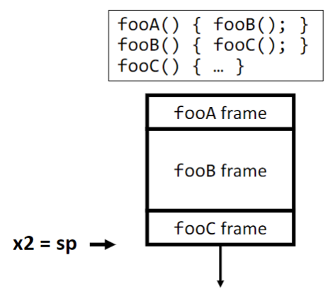

由于 Stack 是向着低地址增长的（由前面的图可以看出来），所以 sp 是向下走的。

#### III.3.3 RISC-V Functions

> [!INFO]
>
> 寄存器的常用用途如下：
> 
> 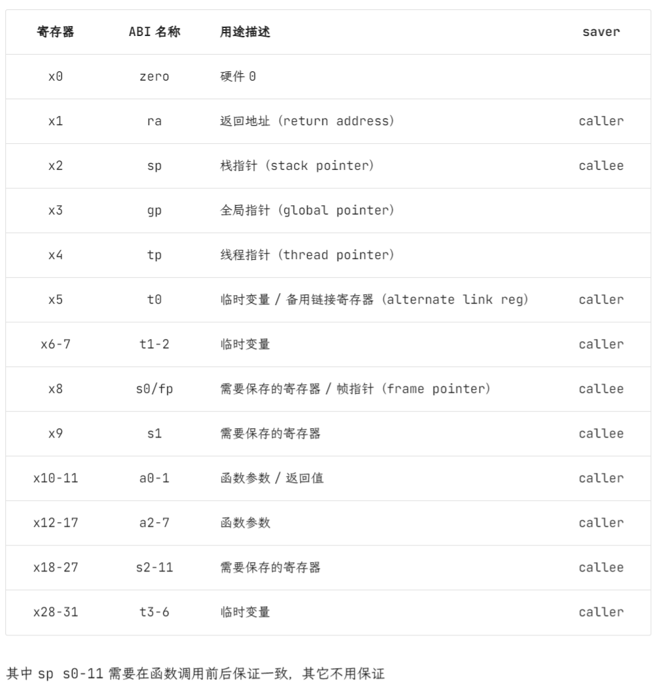

[Lec06-1#page=93-98](attachments/Lec06-1.pdf#page=50)

#### III.3.4 Calling Convention

TO BE CONTINUE

### III.4 From source code to a running program

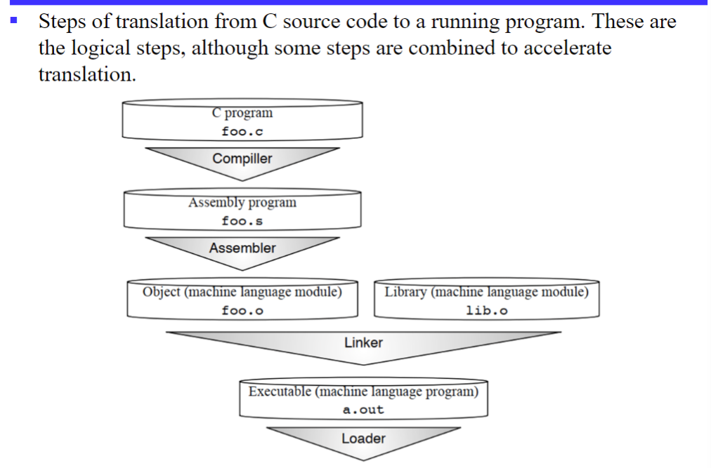

我们在本章节学习的内容正是 `complier` 做的工作

#### III.4.1 Compiler: \*.c -> \*.s

##### III.4.1.1 Preprocessor (\*.c -> \*.i)

预处理：Expands all  <u>macro definitions and include statements (and anything else starting with a #)</u>  and passes the result to the actual compiler

##### III.4.1.2 Compiler (\*.i -> \*.s)

编译：中间其实依旧有很多过程

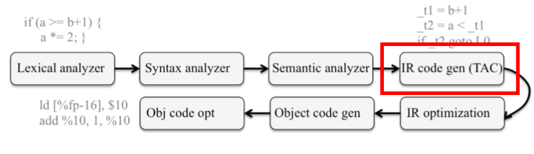

##### III.4.1.3 Bootstraping: Self-Compiling Compilers

有兴趣可以看看 [这里](attachments/06-ISA&ASM-11.png)

#### III.4.2 Assembler: \*.s -> \*.o

> [!DEFINITION ]
>
> Not simply to produce object code from the instructions that the processor understands , but to extend them to include operations useful for the assembly language programmer or the compiler writer. This category, based on clever configurations of regular instructions, is called _pseudo-instructions_.
> 将我们写的伪指令转变为真正存在的指令

##### III.4.2.1 Input: in Assembly Language (\*.s)

```c
#include <stdio.h>
int main(){
    printf("Hello, %s\n", "world");
    return 0;
}
```

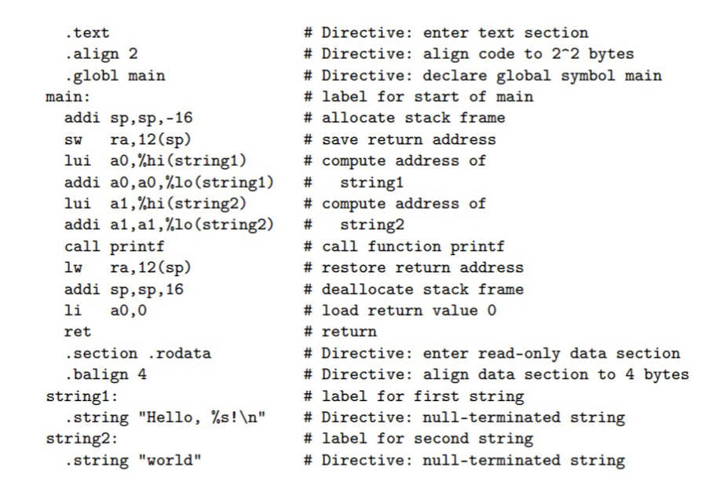

##### III.4.2.2 Output: in RISC-V Machine Language (\*.o)

  The assembler produces the object using the _Executable and Linkable Format_ (**ELF**, formerly named _Extensible Linking Format_) standard format.

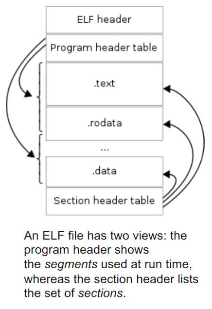

There are three main types of object files:

###### III.4.2.2.1 relocatable object file

function of it: holds code and data suitable for linking with other object files to create an executable or a shared object file.

format of it:

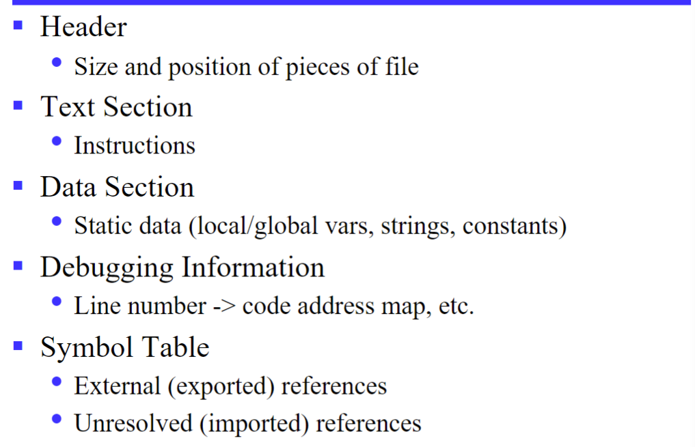

- An executable file holds a program suitable for execution; the file specifies how exec creates a program's process image. 
- A shared object file holds code and data suitable for linking in two contexts. First,  <u>the linker</u>  processes the shared object file with other relocatable and shared object files to create another object file. Second, the  <u>dynamic linker</u>  combines it with an executable file and other shared objects to create a process image

> [!我的理解]
>
> Rolocatable object file 是汇编器的输出，链接前的 **.o** 文件，往往缺少必要的头文件（如 stdio.h）而在运行时缺乏相应的函数地址而不能够执行
>
> Executable object file 则是链接后的文件，可执行

##### III.4.2.3 Symbols and References

**Gloabl labels** ：可以被其他 object files 使用

**Local labels** ：不可以被其他 object files 使用

> [!QUESTION]
>
> Handle forward references?
>
> - Two-pass assembly
> - One-pass (or backpatch) assembly

### III.5 Linker

> Rather than compile all the source code every time one file changes, the linker allows individual files to be compiled and assembled separately. Separately compiling modules and linking them together  <u>obviates the need to recompile the whole program every time something changes.</u> 

#### III.5.1 Linker Functions 1: Fixing Addresses

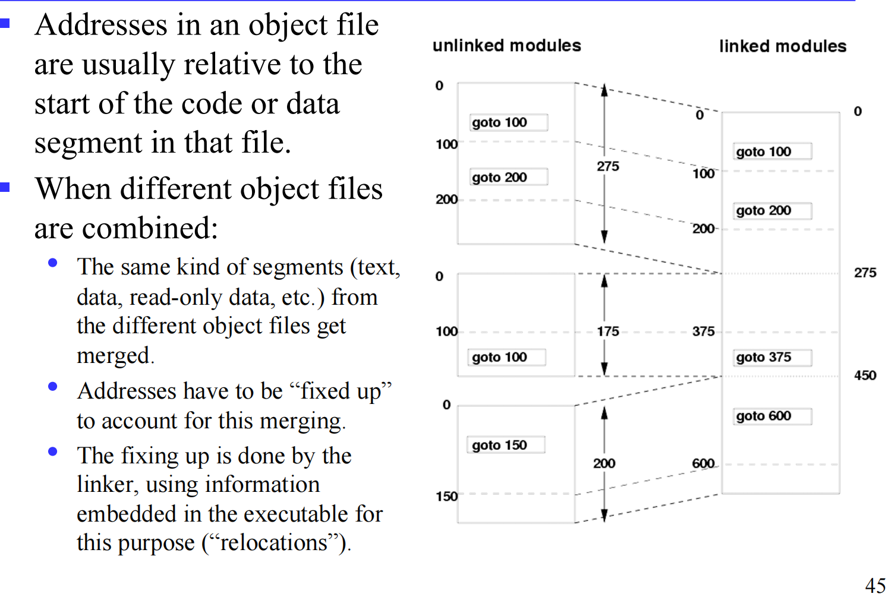

#### III.5.2 Linker Function 2: Symbol Resolution

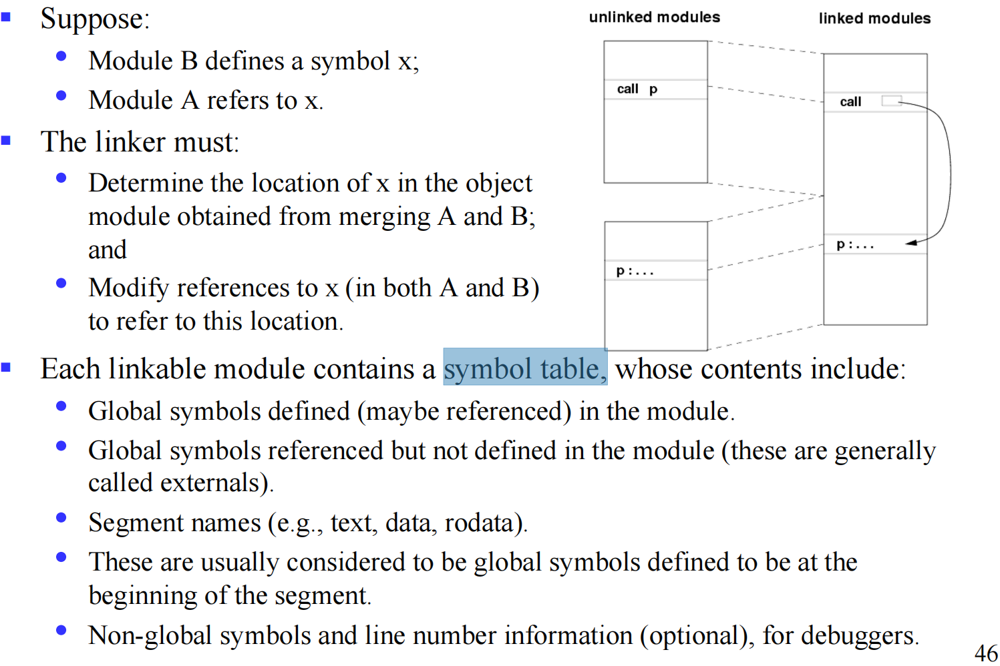

---


- P 52 quiz
    - Q 1 -> E // 在 preprocessor 预处理后 ITEM_NUM 这个宏已经被替换了，之后也就 **不存在** 了
    - Q 2 -> B // 虽然使用了全大写，但是这确实是一个 **变量(B)** ；而 static 说明这个变量的作用范围 **不会离开该文件**
    - Q 3 -> AD // malloc 这是一个函数，被定义在其他文件中，所以既 **作为指令** 又被从其他文件 **调用过来**
- P 53 Static vs. Dynamic Linking
    - 静态链接将库(libc)中所有内容"拷贝"过来，而这个库往往是很大的
    - 动态链接则是在被调用时才开始加载链接；同时只是跳转到一个短的 _stub function_
    - 现在默认使用的都是动态链接

### III.6 Loader

- P 59
    - PCB (process control block)
    - API ()
- P 61
    - reserved 区域预留出来表示未被分配（也不能够分配）
- P 64
    - Position-Independent Code (PIC)
- P 66－67
    - 没听懂    
---

Loading Dynamically-linked Programs

Position-Independent Code (PIC)

global offset table (GOT)

procedure linkage table (PLT)

**ELF Dynamic Linking: PLT and GOT**

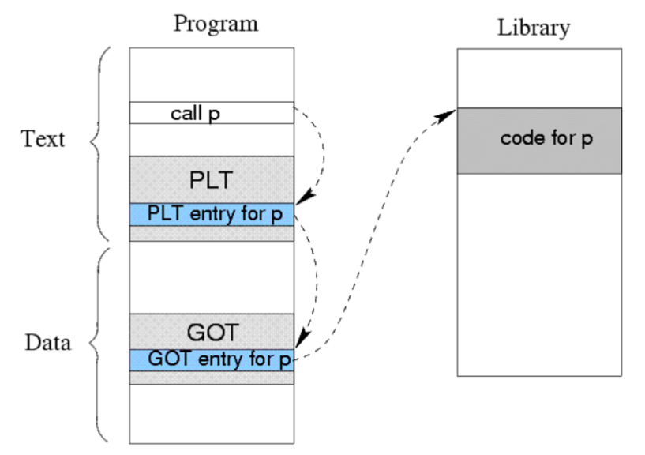

**ELF Dynamic Linking: Lazy Linkage**

ELF（Executable and Linkable Format）动态链接中的延迟绑定（Lazy Linkage）是一种优化技术，用于提高程序的启动时间和内存使用效率。在ELF格式的动态链接中，程序在启动时不需要立即解析和绑定所有外部函数和变量，而是等到第一次使用这些函数和变量时再进行绑定。这种方法可以显著减少程序启动时需要加载和初始化的动态链接库数量，从而加快启动速度。

延迟绑定的具体过程是：当程序第一次调用一个外部函数时，程序的控制权会转移到一个特殊的处理程序，这个处理程序会查找并绑定该函数的实际地址，然后再执行该函数。之后，程序会直接使用这个地址，而不再需要查找过程，从而提高后续调用的效率。

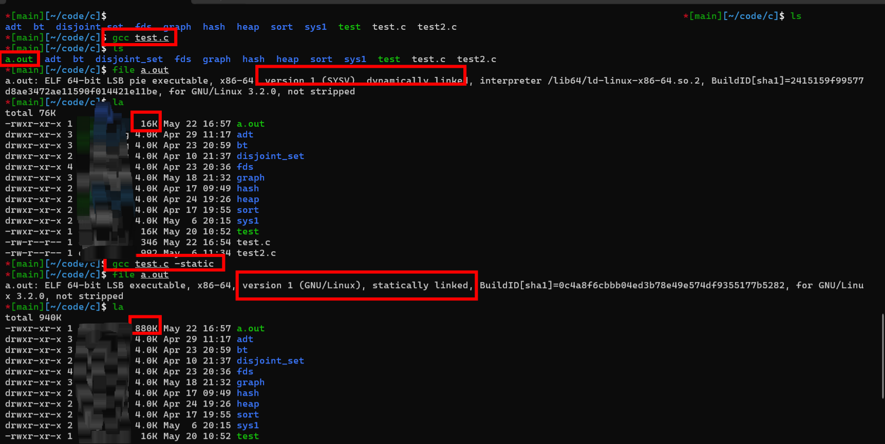

