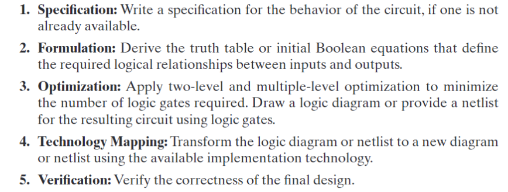
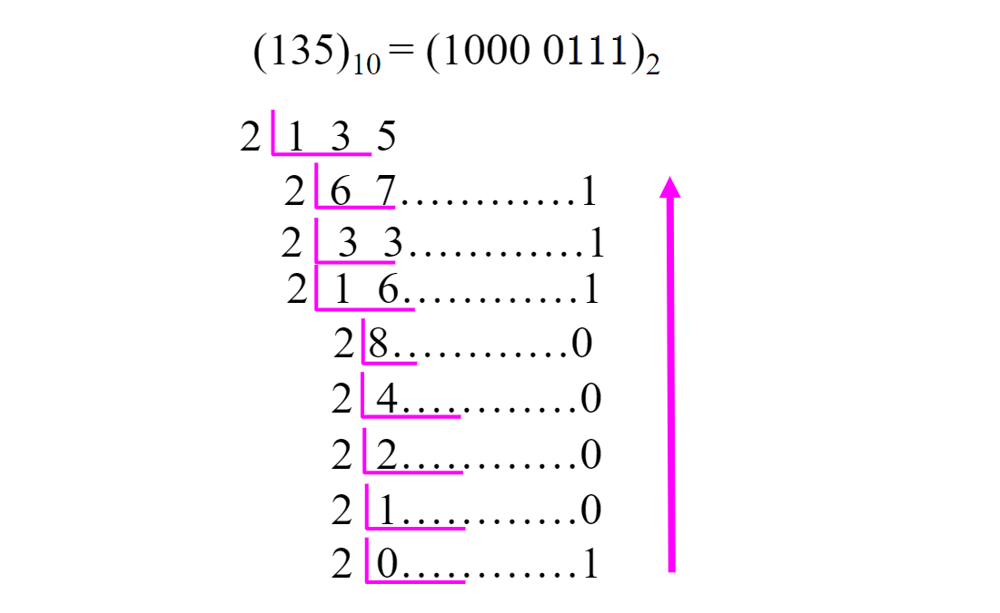
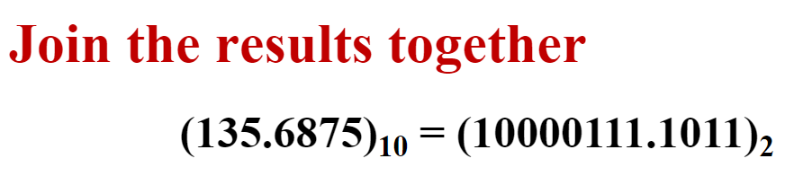
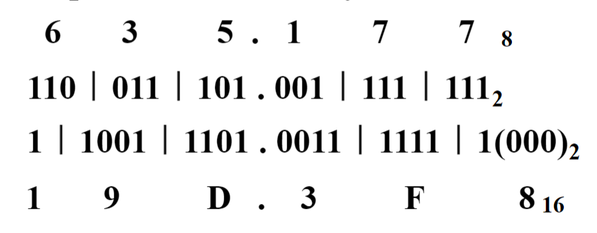
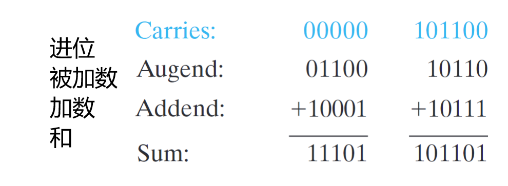
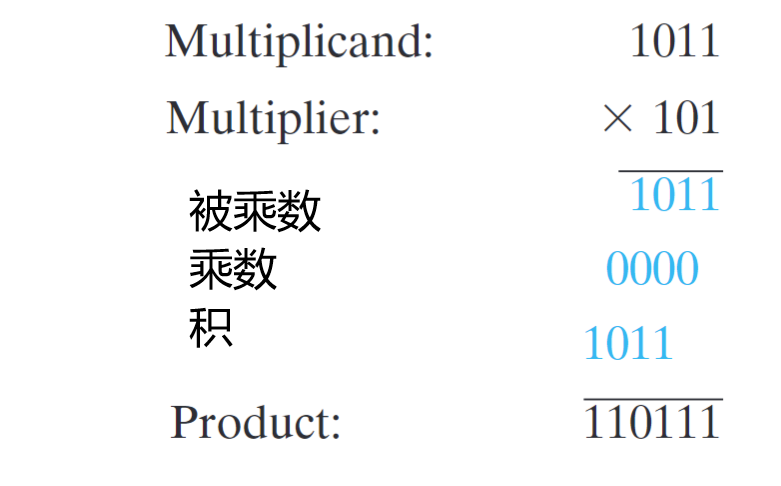
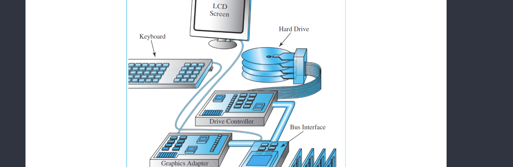
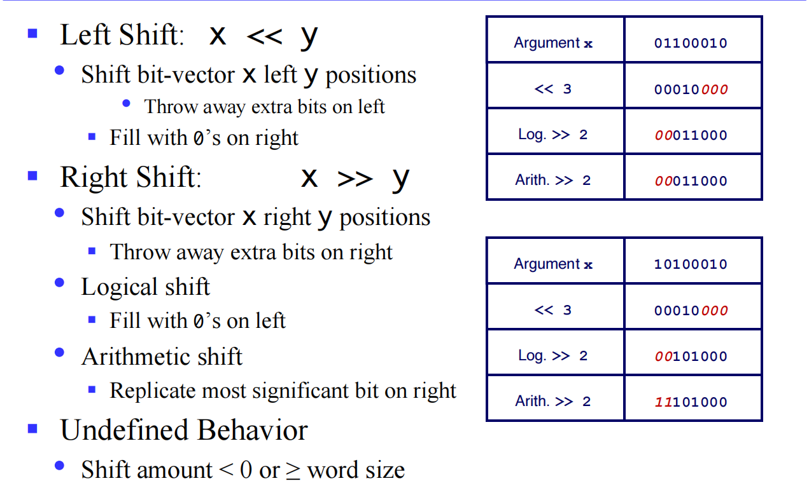
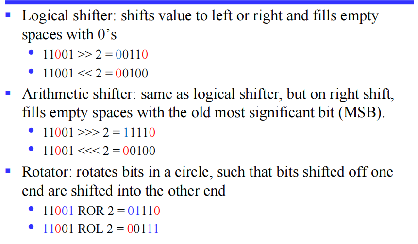
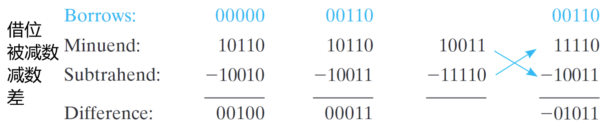

---
tags:
  - notes
  - sysI
comments: true
dg-publish: true
---

# CS-I

CS-I 是我个人对于计算机系统一 (Computer System I) 的缩写，这里记录了我的一些学习笔记；起初对于课程缺乏了解，没能构建起体系，比较杂乱，以后有空再系统整理。

- [实验文档](https://zju-sys.pages.zjusct.io/sys1/sys1-sp24/)

<!-- more -->

## I some verilog syntax from lab guide

-  [verilog & circuit](https://zju-sys.pages.zjusct.io/sys1/sys1-sp24/lab0-2-appendix/)
- [generate & integer](https://zju-sys.pages.zjusct.io/sys1/sys1-sp24/lab2-1-appendix/#generate)
- [localparam & parameter](https://zju-sys.pages.zjusct.io/sys1/sys1-sp24/lab2-1-appendix/#_1)
- [start-finish](https://zju-sys.pages.zjusct.io/sys1/sys1-sp24/lab3-3/#start-finish)
- [reg initial](https://zju-sys.pages.zjusct.io/sys1/sys1-sp24/lab3-1-appendix/#_5)
- [Trigger Signal in @always](https://zju-sys.pages.zjusct.io/sys1/sys1-sp24/lab3-1-appendix/#_8)
- [more @always](https://zju-sys.pages.zjusct.io/sys1/sys1-sp24/lab3-1-appendix/#always_1)
- [valid-ready](https://zju-sys.pages.zjusct.io/sys1/sys1-sp24/lab4-1/#valid-ready)
- [typedef & struct](https://zju-sys.pages.zjusct.io/sys1/sys1-sp24/lab4-1-appendix/#typedef)
- [package & queue & interface](https://zju-sys.pages.zjusct.io/sys1/sys1-sp24/lab4-1-appendix/#package)

## II Introduction to computer systems


**信息：** 数字系统存储、转移、处理的对象，是对物质世界与人类社会中存在的各种各样现象的表示。

模拟信号&数字信号

当前绝大多数电子数字系统的信号都采用两个离散值，称为二进制(binary),其中用到的两种离散值分别称为 0 和 1，也就是二进制系统中所用到的数字。

我们经常用两种一定范围的电压——高电平（HIGH）和低电平（LOW）（具体范围可以参考 [原书对应部分](../ebooks/Logic-and-computer-design-fundamentals.pdf#page=21&selection=57,0,64,5) )来表示两种离散值；相应的，TURE 和 FALSE 也可以用于表示。

实际上，我们经常这么干

- HIGH == 1 == TRUE
- LOW == 0 == FALSE

数字计算机其他计算机以及它们的组成元件等等不作记录，自行翻书。

计算机系统设计过程的 **基础** 是 “抽象的层次” 概念。

### II.1 抽象层次

下面是现代计算机系统典型的抽象层次：

- 算法
- 编程语言
- 操作系统
- 指令集结构
- 微结构
- 寄存器传输
- 逻辑门
- 晶体管电路

### II.2 数字设计过程

组合数字电路设计流程：（第 2、3 章将会介绍）



即：

- 功能描述
- 形式化
- 优化
- 工艺映射
- 验证

## III 数制

我们常常使用的是十进制计数法，但在开头我们说明了在信息表示中二进制具有其独特的优势，掌握二进制对于我们了解计算机是必不可少的。

### III.1 数制规定

在一串数字中，数字根据其位置具有不同的权重；例如，十进制权重是 10 的幂，（radix 基底）r 进制的数权重则为 r 的幂。

通常我们这样一串数字 

$$
(A_{n-1}A_{n-2}……A_{1}A_{0}.A_{-1}……A_{-m})_{r}
$$ 

表示 r 进制的一串数字，以小数点决定其位置权重，下标 k 即为它们权重为 $r^{k}$ ，其值为 $\sum_{k=-m}^{n-1} A_{k}r ^{k}$ ；A 满足逢 r 进 1。

分整数部分和小数部分考虑，即：


### III.2 数制运算与相互转换

我们主要使用二进制、八进制、十进制、十六进制（下面以二进制为例主要讲解，其余类推）。

#### III.2.1 十进制

想必加减乘除无需多言。

#### III.2.2 二进制 (Binary number representation)

二进制也比较熟悉了，下面是一张指数表


##### III.2.2.1 进制转换

###### III.2.2.1.1 二转十

按照数制规定即可（后面八、十六不再赘述）。

###### III.2.2.1.2 十转二

**整数部分**

一直除以 2 直到商为 0，余数**倒序排列**即可。



**小数部分**

一直乘以二，**顺序取整数区域**即可。


最后将两个部分相加即可。

> [!PRACTICE]
>
> 
> [!ATTRENTION]
>
> The algorithm for any radix $r >1$.
> [!TIP]
>
> 其他进制间的进制转换很简单了，根据 2/8/16 进制之间直观地关系。
> 
> 8 进制就是 3 位二进制，16 进制则是 4 位二进制。8 进制与 16 进制互相转换往往先变为 2 进制。
>
> 
>
> 不过需要注意的是，当将 8/16 进制转变为 2 进制时，可能需要补 0，尤其需要注意在小数部分后进行补 0。

##### III.2.2.2 四则运算 (Arithmetic operations)

二进制同样需要借位。

###### III.2.2.2.1 加法

基于统一性，在进行最低位相加减的时候，我们依旧需要一个 C (carry in) ，显然，这个 C = 0 。

更多时候，我们会将更高位（高于当前加法器的下一位）设为 1 表示溢出



###### III.2.2.2.2 减法


因为 Z 是借位，所以在做减法时实际上是要比当前计算的位数要高一位的。

> 我们可以将加法器和减法器合并做成 **全加减法器** ，这在 lab 中会有所提及。

###### III.2.2.2.3 乘法

与我们手动计算的是基本一致的，而且比十进制似乎更加简单只是位数变多了一点点；这一点我们在设计乘法器时将用到



###### III.2.2.2.4 除法

对于单位数除法，只有两种合法形式，即只有被除数为 1 时才成立；

> [!useless]
>
> 如果我们把 0 作为除数会怎样？一个简单的测试是使用 python，作为一个简单的计算器十分方便，我们会发现输出如下

```bash
[~]$ python
Python 3.10.12 (main, Nov 20 2023, 15:14:05) [GCC 11.4.0] on linux
Type "help", "copyright", "credits" or "license" for more information.
>>> 1/0
Traceback (most recent call last):
  File "<stdin>", line 1, in <module>
ZeroDivisionError: division by zero
```

对于多位除法如下，将被除数从最高位开始比对；减去除数后剩余部分再重复操作，这一点我们在设计除法器时将用到。



#### III.2.3 八进制及十六进制

由于八进制一位所能表示的数（0 ~ 8）恰好是二进制三位所能表示的，二八互换就很方便了，看下面例子就知道了（二进制左侧 0 为凑位数加上的）

$$
(011110010)_{2} = (362)_{8}
$$

二进制三个一体转八进制；那么十六进制也是同理了

## IV operations

### IV.1 The Modulo Operation（模运算）

> [!definition]
> 
> If A, B, M satisfy A = B + K * M , then recorded as **A ≡ B(mod M)** , call B and A congruence modulo M.

可得补码还有另一种定义：补码 = M + X (mod M) （证明略）。

### IV.2 Inverse code & Complement code（反码&补码）

设源码为 X（二进制格式，不妨有 m 位）

- 若 X >= 0 源码 = 反码 = 补码 = X
- 若 X< 0 那么
    - 源码 = X
    - 反码 = ~X
    - 补码 = ~X + 1

在计算机中数字一般以 **补码** 形式存储，这在做加减法时会有极大的优势。

为什么要加这个 1？不难发现，源码＋反码使得二进制的每一位都变为了 1，再加 1 就使得和变为了 $2^{m}$ （记为 M） ，而这恰恰使得我们使用将减法变为加负数在补码上恰好成立，证明过程略。

> [!tip]
> 
> 我们补码变源码该如何操作？
> 
> 很容易我们想到先减一再取反，毕竟这是我们来的路；
> 
> 但是有个很神奇的现象，我们依旧是先取反再加一，结果确实是源码，这很容易证明。
> 
> 总之呢，我们源码、补码相互转换只需要 **取反加一** 即可

### IV.3 shift operation （移位操作）



> [!INFO]
>
> 关于 _logic right shift_ & _arithmetic right shift_ ，最大的区别在于移位后空出的地方补什么？看下面的图就理解了
> 
> 

### IV.4 some useful terminology



看完这张表就可以去看看 [xg 的笔记本](https://note.tonycrane.cc/cs/system/cs1/topic1/)

> [!NOTE]
>
> The number represented by the computer‘s internal code is called machine number, and the corresponding value is called true value.

