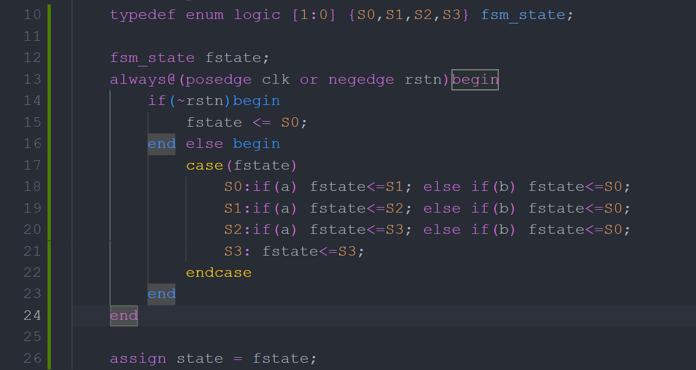
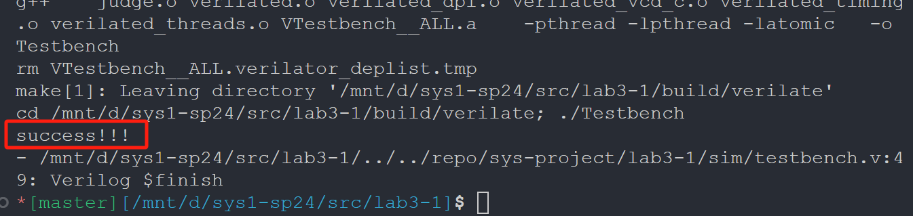
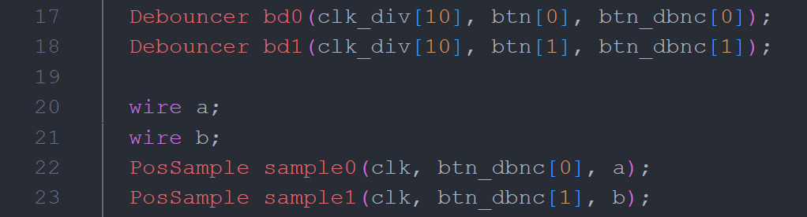
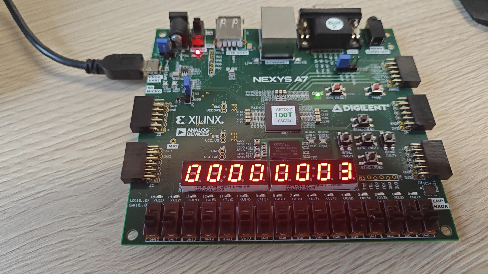
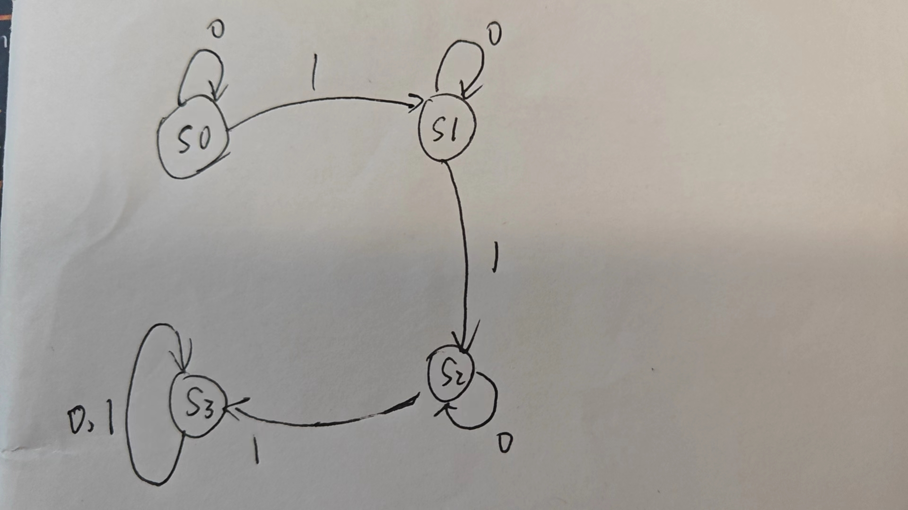
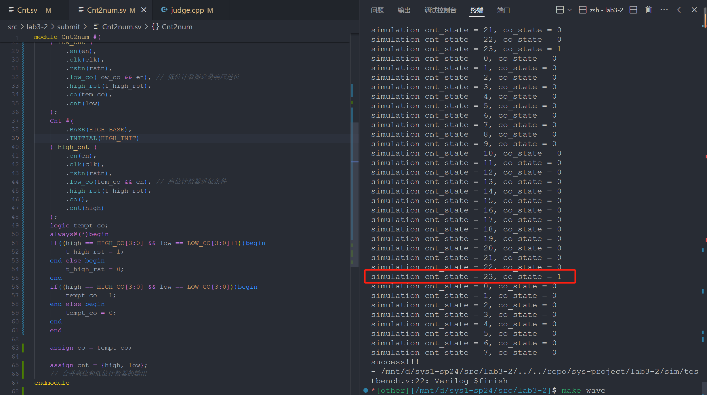
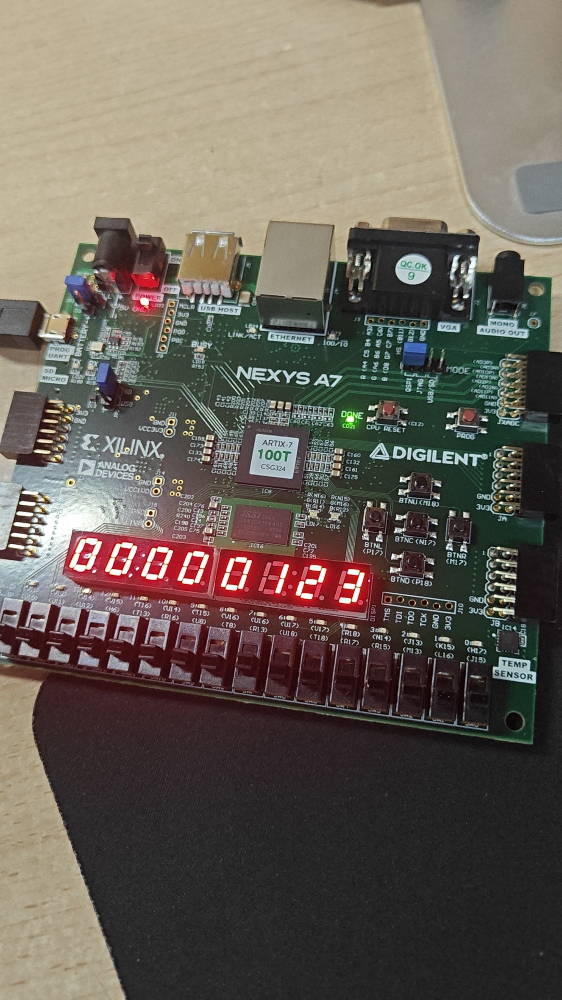
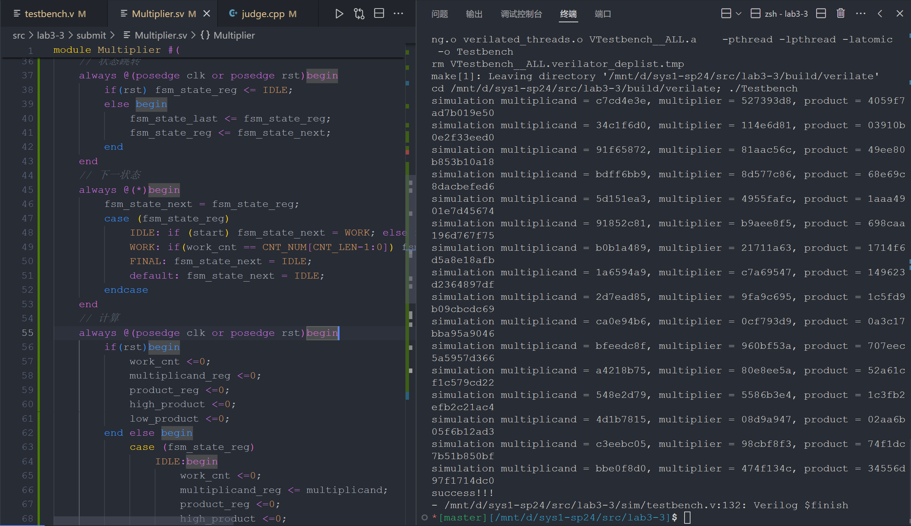
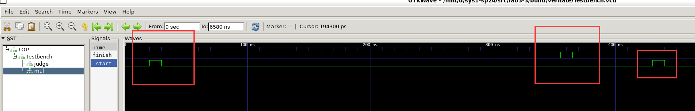
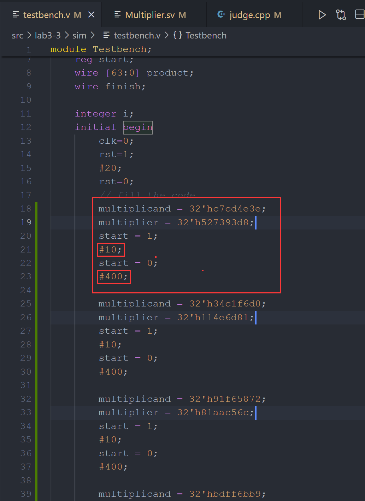

## lab 3-1

  1. **请在实验报告中详细描述每一步的过程并配有适当的截图和解释，对于仿真设计和上板验证的结果也应当有适当的解释和照片 Total: 15%**

> **细分：**
> 
> **- 使用 enum 语法 FSM 设计 5%**
> 
> 
> 
> 如上，学习 enum 语法后，根据具有四个状态（即 0、1、2、3 个连续 a）枚举 S 0、S 1 等等，然后根据状态表填写 always 块即可，仿真结果通过
> 
> **- 综合实现有限状态机 10%**
> 结合下面两幅图我们可以得知，按下 FPGA 板的 N17 表示输入字符 a, P 18 表示输入字符 b 
> 
> 
> 下板验证：
> 输入一个 a:
> 
> 输入两个 a 后一个b
> 
> 输入 3 个 a 后，任何操作都不改变状态：
> 
2. **思考比较`enum + case`的编程范式和数组查表的编程范式之间的优劣 5%**

相比之下，**enum + case 的编程范式**更加具有以下优点：

1. **可读性**：使用 `enum` 定义的状态机代码结构清晰，易于理解和提高可维护性
2. **灵活性**：可以通过简单的修改 `case` 语句来改变状态转换逻辑
3. **适应性**：适用于状态转换逻辑复杂，状态数目不是很多的情况。

而**查表法的优点**体现在

1. **性能**：查表法通常能够提供最快的状态转换，因为它直接通过索引访问预定义的状态。
2. **资源利用**：对于大型状态机，查表法可以更有效地利用查找表（LUTs），减少逻辑电路的使用

当然，正如实验指导中所说，除非有自动化脚本生成 table.hex，否则优先考虑**enum + case 的编程范式** ( 不建议手写，因为很容易写错 )

（各自的劣势主要就是对方的优点）

3. **绘制一个有限状态机的状态图和状态转移表，如果输入的 01 字符串中 1 的个数大于 3 个，则 FSM 输出 1 表示接受，反之输出 0 表示拒绝。10%**

一共有四种状态，用 S N 表示输入了 N 个 1
（没注意 hint，如果改成 hint 应该是分别对应 S 0、S 1 组成的二进制数的值）
下表使用 c_state 表示 current state，二三栏表示输入的 X 为对应值时的 next state

| c_state | input ‘0’ | input ‘1’ | output |
| ------- | --------- | --------- | ------ |
| S0      | S0        | S1        | 0      |
| S1      | S1        | S2        | 0      |
| S2      | S2        | S3        | 0      |
| S3      | S3        | S3        | 1      |

最后 assign Y = (c_state == S 3); 或者说 assign Y = output;

状态图如下：


（不好意思，写完了才看到 hint……我这样计数应该也可以吧）

> hint: 输入为信号 X，内部状态为 S1、S0，输出为 Y

4. **观察以下有限状态机电路实现存在的不足和不足的原因，如果电路不稳定可能会发生什么问题（bonus，分数不溢出 report）：+10%**

```verilog
always@(posedge clk)begin
    if(~rstn) state < = 2'b01;
    else state[1:0] < = state[0:1];
end
```

代码使用了异步复位（`~rstn`），而状态转移逻辑只是简单地将当前状态的高低位对换，这意味着可能在相同条件下状态一直可以改变；而异步复位可能会在电路不稳定时在一个区间内反复触发，使得 state 来回振荡，会导致过大的开销，甚至导致电路出现故障。

## lab 3-2

1. **请在实验报告中详细描述每一步的过程并配有适当的截图和解释，对于仿真设计和上板验证的结果也应当有适当的解释和照片 Total: 20%**


> **细分：**
> 
> **- 仿真通过，输出`success!!!` 10%**
> 
> `make verilate` 
> 
> 
> 
> **- 综合实现计数器 10%**
> 
> 放不了视频，放下板的 23 时进位的照片吧
> 
> 


1. **简述如何使用 Cnt2num 实现 1234 的 BCD 码计数器，并思考 Cnt2num 预留 co、low_co、high_rst 引脚的意义 10%**

我们使用两个 Cnt 分别代表了 Cnt 2 num 的高低两位，同理可以用两个 Cnt 2 num （记作 c2 high，c 2 low）分别代表 Cnt 4 num 的高两位、低两位，当合起来是 1233 时进位并下一步归零；

- co 可以作为 c 2 low 的进位输给 c 2 high
- c 2 high 的 low_co 则可以接收 c2 low 的 co
- high_rst 则使得能够在 cnt 达到特定数值后最高位进位并所有计数器归零

## lab 3-3

1. **请在实验报告中详细描述每一步的过程并配有适当的截图和解释，对于仿真设计和上板验证的结果也应当有适当的解释和照片 Total: 20%**

> **细分：**
> 
> **- 仿真通过，输出`success!!!` 10%**
>
> `make verilate`
> 
> 
>
> **- 综合实现乘法器 10%**
>
> 按照实验指导，我做了如下工作
> 
> > - 利用三段式设计补全 Multipler.v 代码
> >     - 
> > - 利用随机数生成了 16 组数据放入 testbensh.v 中
> > - 补全 judge.v 的接入
 

2. **解释仿真测试样例和下板的顶层结构为什么满足 start-finish 握手协议。尝试给出 start-finish 握手协议存在的缺点和改进的方法。 10%**

我是先较为随意地设置了两次 start 之间的间隔时间，观察 finish 在 start 之后多久变为 1 后，选择一个比较合适的间隔时间一满足



可以看到 finish 在 start 出现后 300 多 ns 后出现，故将两个 start 间隔设置为 400 ns，如下 



3. **请仿照乘法器的设计方法和我们手动计算除法的方式，设计32bit 无符号整数除法器，你只需要给出设计思路即可。流程图和伪代码是推荐的描述形式。 10%**

```verilog
module Divider_32(
        input    clk,
        input    rst,

        input    start,
        input    [31:0] dividend, 
        input    [31:0] divisor,

        output    finish,
        output    [31:0] quotient,
        output    [31:0] remainder
        ); 
endmodule
```

下面是伪代码（我们暂且忽略 clk 等）：

我的思路是取 64 位（对应 32 位相乘可得 64 位），通过不断左移取被除数高位处1 位、2 位……直到大于被除数，那么就减去被除数并且将此时差当作余数和 temp 低 32 位合并为新的 temp，然后 temp 继续左移一位，知道迭代结束

```verilog
    reg [63:0] temp; // 临时被除数，扩展到64位以避免溢出
    reg [31:0] quotient;      // 商
    reg [31:0] remainder;     // 余数
    integer i;
  
always @(dividend or divisor) begin
    remainder = 32'b0;                  // 初始化余数为0
    temp = {remainder, dividend}; // 初始化临时被除数
    quotient = 32'b0;                   // 初始化商为0
  
    // 主循环
    for (i=31; i >= 0; i = i-1) begin // 迭代32次
        remainder = temp[63:32] - divisor;
        if (remainder >= 0) begin
            quotient[i] = 1'b1;
            temp = {remainder, temp[31:0]};
       end else begin
            // 啥也不干
        end
        temp = temp << 1; // 左移被除数
    end
    // 计算余数
    remainder = temp[63:32];
end

```


4. **(bonus) 尝试改进目前的有限状态机，使得一次乘法操作或者连续乘法操作消耗的时钟周期数可以减少。 +15%**

- 我们所采用的应该是 **Booth Multiplier(Radix-2) Algorithm**，对应自然还存在 **Booth Multiplier(Radix-4) Algorithm** 等等，也就是将 product_reg 一次向左移两位，这样可以使得时钟周期数减半；当然其中的难点还是不少的。
    - 例如，我们使用 Radix-4 自然要面对乘以 0、1、2、3 的可能。0、1、2 都比较简单，对应操作：不处理、加乘数、加左移一位后的乘数；但是乘 3 比较困难，一个解决方法是 
    - "To avoid multiplying by 3, we use Booth’s observation and recode the digit set to be 2, 1, 0, ‐1, and ‐2."

但是我没有很明白这个意思，所以也只是作为了解，无法再加讲解；下面是我自己的猜想：

- 正如上面所说，乘以 2 的次方数（如 1、2、4、8）都是比较容易的，我们可以将被乘数根据乘数移位后相加，一个简单的例子如下：（缺点是移位器使用较多……）

$$
x*14 = x*8 + x*4 + x*2 = (x< <3) + (x < < 2) + (x < < 1)
$$
