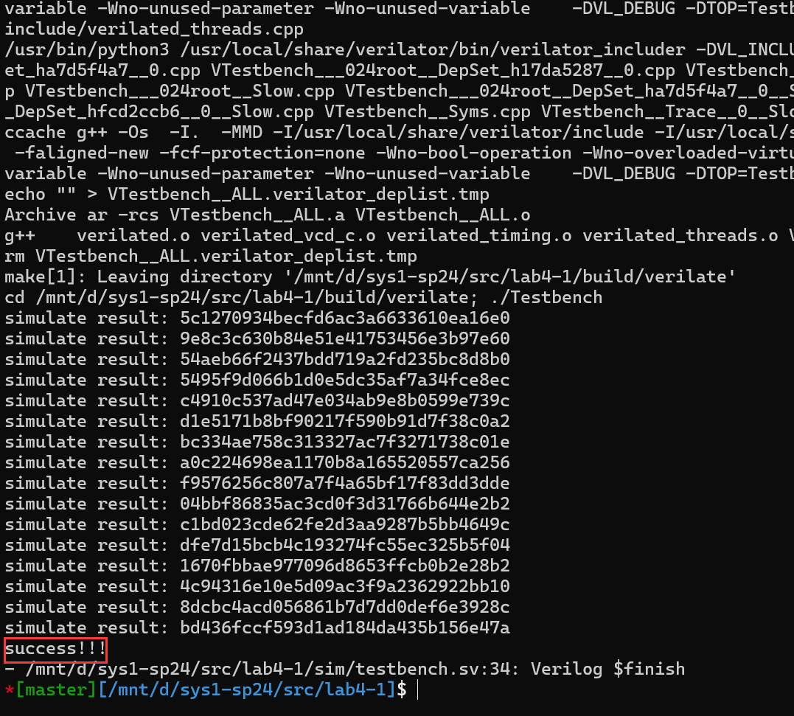
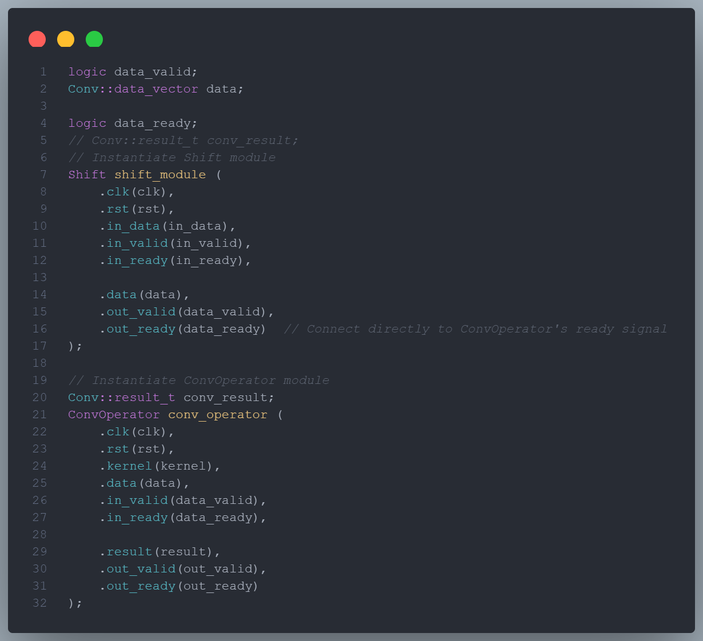
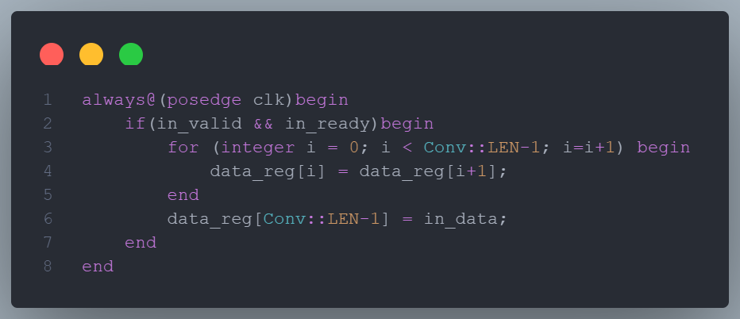
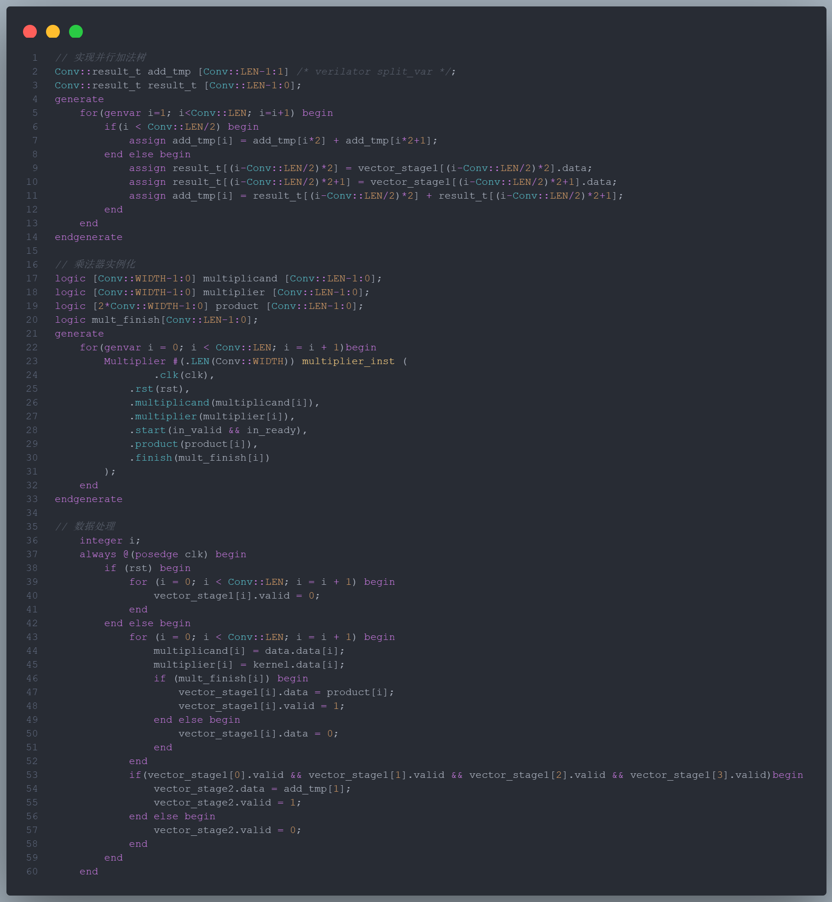
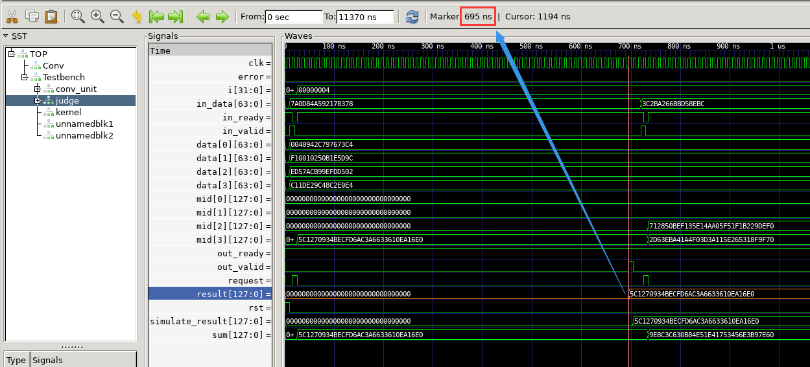
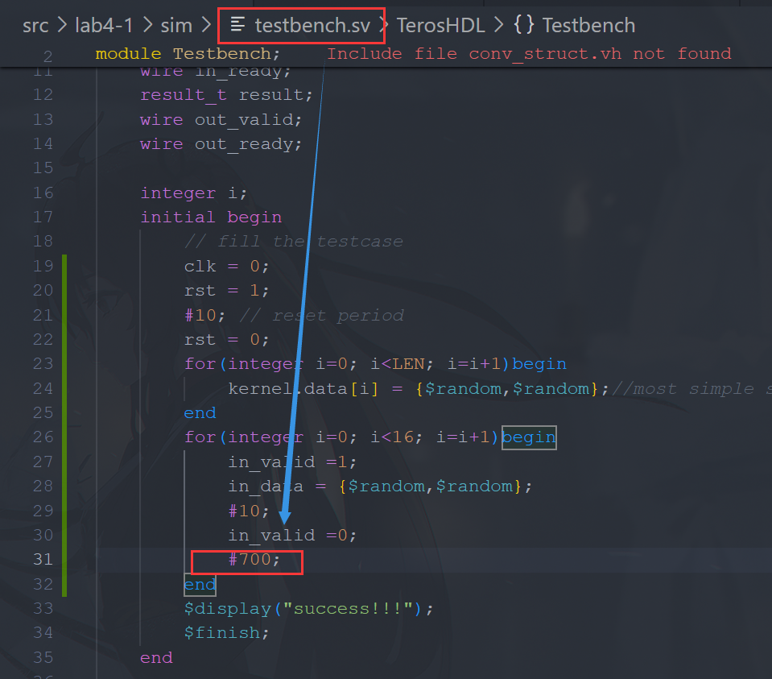
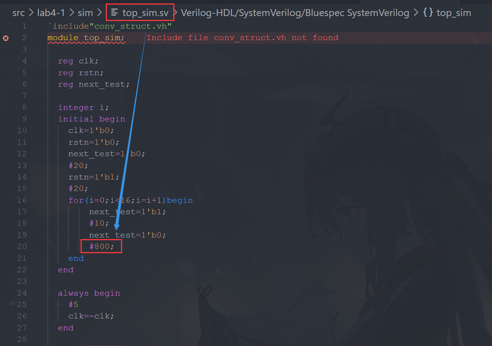

## I **请在实验报告中详细描述每一步的过程并配有适当的截图和解释，对于仿真设计和上板验证的结果也应当有适当的解释和照片。80%**
 

> **细分：**
> 
> **- 仿真通过，输出`success!!!` 40%**
> 
> 运行 `make`，输出 `success!!!`
> 
> 
> **- 综合实现卷积单元 40%**

实现过程如下：
### I.1 ConvUnit.sv

实例化 shift_module 和 conv_operator ，并引入 data_valid 和 data_ready 在二者之间进行握手

### I.2 Shift.sv

利用移位寄存器在与 in_data 来源握手成功后更新数据

### I.3 ConvOperator.sv

重点在于对于输入数据的处理，相关 verilog 代码如下，其中包括 **乘法器实例化、并行加法树实现、数据转移** 等

## II **解释仿真测试样例和下板的顶层结构为什么满足 valid-ready 握手协议。20%**

### II.1 仿真测试样例

考虑到 64 位乘法器需要运行至少 64 个周期即 640ns，我们先取较大数保证运行完毕，观察实际所需时间

如上，大致为 700ns，所以将 in_valid 1/ 0 之间的时间间隔设为 700ns 以保证握手成功

### II.2 下板顶层结构

在 top_sim.sv 中也是相似的道理

## III **`ConvUnit` 模块被划分为 `Shift` 模块和 `ConvOperator` 模块，模块间用 valid-ready 协议传递数据。请思考能否对 `ConvOperator` 作类似上述的模块分割和数据交换，并给出这样分割后可能带来的性能提升。（bonus）5%**

我认为可以设计

-  `vector_Multiplier_module` 

将 [ConvOperator.sv](#ConvOperator.sv) 中的乘法器实现和并行加法树单独封装形成一个模块，即完成 **两个向量的点乘** 并将结果传给 _result_

而其他部分不必封装，向 `vector_Multiplier_module` 提供提取出来的向量即可
 
无疑这样能够使得时序逻辑更加清晰，同时封装处理使得不必担心其他信号的影响，稳定性提高，性能加强