## lab5-1

### 4.1 实验环境配置[¶](https://zju-sys.pages.zjusct.io/sys1/sys1-sp24/lab5-1/#_7 "Permanent link")

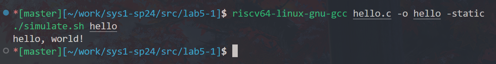
### 4.2 理解简单 RISC-V 程序 10%[¶](https://zju-sys.pages.zjusct.io/sys1/sys1-sp24/lab5-1/#risc-v10 "Permanent link")

请阅读 `src/lab5-1/acc_plain.s` 回答以下问题 :

#### 1. `acc`是如何获得函数参数的，又是如何返回函数返回值的？2%

- `acc` 通过寄存器 **a0** 和 **a1** 获得函数参数的 
sp 寄存器储存的是**栈指针**，指令 `addi sp, sp, -48` 为这个函数分配了 48Byte 大小的**栈帧**。`addi s0,sp,48` 使得 s0 回到分配空间的起点处，并用 `sd a0,-40(s0) ` `sd a1,-48(s0)`  将 a0 和 a1 的值分别保存在 -40(sp) 和 -48(s0) 处，之后使用 `ld a5,-40(s0)` 等载入 a5 等进行调用。

- `acc` 通过寄存器 **a0** 返回函数返回值
一般使用 a0 a1 寄存器保存函数返回值，`mv a0,a5` 实现了这一点。

#### 2. `acc`函数中`s0`寄存器的作用是什么，为什么在函数入口处需要执行`sd s0, 40(sp)`这条指令，而在这条指令之后的`addi s0, sp, 48`这条指令的目的是什么？2%

- s0 寄存器储存的是**帧指针**，作用是指向当前函数的栈帧，有利于进行栈回溯；同时在该函数结束时便于恢复至上一函数的栈。
- `sd s0, 40(sp)` 将上一个的 s0 中的帧指针保存至 40(sp) 处，以便该函数结束时恢复。
- `addi s0, sp, 48` 将 s0 中的值设为 sp 向高位移动 48 位，即当前函数的帧指针。
#### 3. `acc`函数的栈帧 (stack frame) 的大小是多少？2%

- 指令 `addi sp, sp, -48` 为这个函数分配了 48Byte 大小的栈帧。
#### 4. `acc`函数栈帧中存储的值有哪些，它们分别存储在哪（相对于`sp`或`s0`来说）？2%

1. 上一个帧指针 (s0)：存储在栈帧中偏移为 40(sp) 的位置。
2. 参数 a0：存储在栈帧中偏移为 -40(s0) 的位置。
3. 保存的上一个帧指针 (s0)：存储在栈帧中偏移为 40(sp) 的位置。
4. 参数 a0：存储在栈帧中偏移为 -40(s0) 的位置。
5. 临时变量 (res)：存储在栈帧中偏移为 -32(s0) 的位置。
6. 临时变量 (i)：存储在栈帧中偏移为 -24(s0) 的位置。
#### 5. 请简要解释`acc`函数中的 for 循环是如何在汇编代码中实现的。2%

**循环起始标签**：在汇编代码中，循环的起始点被标记为`.L3`，这是一个标签。在此标签之后是循环的实际代码。

**循环体内部**：循环体内部的操作是累加计算的核心。

**循环条件判断**：循环体内部的代码执行结束后，会执行一条分支指令`ble a4, a5, .L3`。

该指令的将 a4 与 a5 进行比较：

- 如果 a4 小于等于a5，则跳转到.L3标签处，继续执行循环体内的代码
- 如果 a4 大于 a5，则跳出循环，执行循环后的代码

---

请阅读`src/lab5-1/acc_opt.s`回答以下问题：
#### 1. 请查阅资料简要描述编译选项`-O0`和`-O2`的区别。

编译选项 `-O0` 和 `-O2` 代表了两个不同的优化级别：

- `-O0` 是默认的编译选项，表示不做任何优化。也就是说，编译器只是简单地将源代码转换成目标代码，不做任何优化处理；
    
- `-O2` 是一个更高级的优化选项，它会在 `-O0` `-O1` 的基础上进行更多的优化。`-O2` 会执行几乎所有不包含时间和空间折中的优化。当设置 `-O2` 选项时，编译器并不进行循环展开（loop unrolling）以及函数内联。`-O2` 优化会增加编译时间，但能提高生成代码的执行效率
#### 2. 请简要讨论 `src/lab5-1/acc_opt.s` 与 `src/lab5-1/acc_plain.s` 的优劣。

-  `-O0` 下产生的 `acc_plain.s` 主要用于调试，因为它生成的是未经优化的代码，便于跟踪和调试，运行效率往往较低。

-  `-O2` 下产生的 `acc_opt.s` 主要用于生产环境，它通过优化代码来提高程序的运行效率，但往往会使得调试变得更加困难。

### 理解递归汇编程序 15%[¶](https://zju-sys.pages.zjusct.io/sys1/sys1-sp24/lab5-1/#15 "Permanent link")

请阅读`src/lab5-1/factor_plain.s`回答以下问题 :

#### 1. 为什么`src/lab5-1/factor_plain.s`中`factor`函数的入口处需要执行`sd ra, 24(sp)`指令，而`src/lab5-1/acc_plain.s`中的`acc`函数并没有执行该指令？2%

- 在 `factor_plain.s` 中的 factor 函数中，由于**涉及递归调用，函数需要显式地保存返回地址到 ra 寄存器中**。这是因为每次递归调用时，返回地址都会被覆盖，所以需要在函数入口处将其保存起来，以便在递归调用返回时能正确找到返回地址，从而顺利返回到上一级调用。

- 而在 `acc-plain.s` 中的 acc 函数中，**没有涉及递归调用**，因此不需要在函数入口处显式地保存返回地址到栈帧中。在非递归函数中，一般情况下，返回地址都会存储在 ra 寄存器中，并在函数调用过程中自动保存和恢复，所以不需要额外的处理。
#### 2. 请解释在`call factor`前的`mv a0, a5`这条汇编指令的目的。2%

在 `mv a0,a5` 这条指令之前，a5 寄存器中存储的是当前函数 factor 需要计算阶乘的值。而在 `call factor` 指令中，函数参数是**通过 a0 寄存器传递**的，因此在调用 factor 函数之前，需要将待计算阶乘的值从 a5 寄存器移动到 a0 寄存器中，以便将其**作为参数**传递给 factor 函数。
#### 3. 请简要描述调用`factor(10)`时栈的变化情况；并回答栈最大内存占用是多少，发生在什么时候。3%

- 初始时，调用 factor(10)函数前，栈上分配 32 字节的空间。进入 factor 函数后，将返回地址和帧指针保存到栈上，增大栈空间。将参数 10 保存到栈帧中，并加载到寄存器。进入循环后，递归调用 factor 函数，每次调用都分配新的栈帧，增大栈空间。递归结束后，计算阶乘并返回结果。清理栈并恢复返回地址和帧指针，减小栈空间。

- 最大内存占用发生在调用递归函数时，每次递归调用都会在栈上分配新的栈帧，直到递归结束。因此，最大内存占用为 32 字节（栈帧大小）乘以递归调用的次数，即栈帧的最大深度。在本例中，调用 factor(10)时，递归深度为 10,因此最大内存占用为 320 字节，发生在递归调用达到最大深度时。
#### 4. 假设栈的大小为 4KB，请问`factor(n)`的参数`n`最大是多少？2%

栈的大小为4KB，即4096字节。

基于上述分析，栈深度应该不超过 $\frac{4096}{32} = 128$ ，故 n 最大为 128，以确保不会栈溢出。

---

请阅读`src/lab5-1/factor_opt.s`回答以下问题 :

#### 1. 请简要描述`src/lab5-1/factor_opt.s`和`src/lab5-1/factor_plain.s`的区别。2%

> [!INFO]
>
> 为了正确地得到一个有符号或无符号的 64 位积，RISC-V 中带有四个乘法指令。要得到整数 32 位乘积（64 位中的低 32 位）就用 **mul** 指令。要得到高 32 位，如果操作数都是有符号数，就用 mulh 指令；如果操作数都是无符号数，就用 mulhu 指令；如果一个有符号一个无符号，可以用 mulhsu 指令。在一条指令中完成把 64 位积写入两个 32 位寄存器的操作会使硬件设计变得复杂，所以 RV32M 需要两条乘法指令才能得到一个完整的 64 位积。

`factor_opt.s`：采用了**更加简洁的汇编代码**，减少了不必要的指令和加载/保存操作。使用了 mul 指令一次性计算阶乘的乘积，而不是递归调用。没有显式保存和恢复帧指针(s0)和返回地址(ra), 而是直接使用寄存器。没有额外的循环标签，而是使用条件分支指令 bne 来实现循环。整体上更加**紧凑和高效**。

`factor_plain.s`：采用了**较为简单直观的汇编代码**，容易理解和调试。使用了递归调用的方式来计算阶乘，每次递归调用都会在栈上分配新的栈帧。显式保存和恢复帧指针（s0)和返回地址（ra),以及参数的加载和保存。使用了循环标签来实现循环，**逻辑较为明确清晰**。
****
#### 2. 请从栈内存占用的角度比较`src/lab5-1/factor_opt.s`和`src/lab5-1/factor_plain.s`的优劣。2%

`factor_opt.s`：由于 factor_opt.s 中采用了迭代计算阶乘，而不是递归调用，因此**不需要在栈上分配额外的栈帧来保存递归调用的状态**。减少了函数调用和返回时需要保存和恢复的寄存器，例如帧指针（s0)和返回地址(ra)。没有额外的递归深度，因此**栈上不需要维护多个递归调用的状态，节省了栈空间。**

`factor_plain.s`：factor_plain.s 中使用了递归调用的方式来计算阶乘，**每次递归调用都会在栈上分配新的栈帧**。每次递归调用都需要保存和恢复一定数量的寄存器值，包括返回地址（ra)和帧指针（s0),以及参数的加载和保存。**递归调用导致栈的深度增加，从而增加了栈的内存占用。**
#### 3. 请查阅尾递归优化的相关资料，解释编译器在生成 `src/lab5-1/factor_opt.s` 时做了什么优化，该优化的原理，以及什么时候能进行该优化。2%

> [!INFO]
>
> 尾递归优化是一种编译器优化技术，用于优化尾递归函数的执行，以减少函数调用的开销和栈空间的使用。尾递归是指在函数的最后一个操作是递归调用自身的情况。

- 在生成 factor_opt.s 这样的代码时，编译器可能会进行尾递归优化，具体优化包括将**递归调用转换为迭代调用，以减少栈帧的分配和释放，从而减少内存消耗。**

- 尾递归优化的**原理是将递归函数转换为迭代函数**。通常通过使用循环来替代递归调用来实现。在每次递归调用时，更新函数参数的值，并将控制权传递给自身，直到满足递归结束条件。这样，就避免了在每次递归调用时分配新的栈帧，从而减少了栈空间的使用。

- 编译器在进行尾递归优化时，通常会检查函数的调用位置和参数，并确定是否满足尾递归的条件。只有当函数的最后一个操作是对自身的递归调用，并且该调用是函数的返回值时，才能进行尾递归优化。

在生成 factor_opt.s 时，编译器可能会检测到 factor 函数的最后一个操作是对自身的递归调用，并且该调用是函数的返回值，因此可以进行尾递归优化。优化后的代码将使用循环来计算阶乘，避免了递归调用时栈帧的分配和释放，从而**减少了内存消耗**。

### 理解 switch 语句产生的跳转表 5%[¶](https://zju-sys.pages.zjusct.io/sys1/sys1-sp24/lab5-1/#switch-5 "Permanent link")

请阅读这两个文件 `switch.c & switch.s` 并回答以下问题 :

#### 1. 请简述在`src/lab5-1/switch.s`中是如何实现 switch 语句的。2%

1. 首先，将输入的参数减去一个偏移量（20），得到一个调整后的值，存储在寄存器 a5 中。
2. 然后，比较这个调整后的值和一个预设的边界值（6，存在 a4 中）：
    - 如果调整后的值大于6，说明 x 大于 26 或者小于 20，则跳转到标签 `.L8`，执行默认的情况。
    - 如果调整后的值小于等于6，则继续执行后面的代码。
3. 如果调整后的值小于等于6，将其乘以4，这是因为后面将要对应6个情况，每个情况用一个字（32位）表示，所以每个情况之间的间隔是4字节。
4. 根据调整后的值计算出对应情况的地址：
    - 加载一个表示 .L4 标签的地址到寄存器 a4 中。
    - 将调整后的值乘以4，得到该情况在表中的偏移量。
    - 将该偏移量加到 .L4 标签地址上，得到**对应情况的地址**。
5. 从这个地址中读取一个字（32位），这个字是一个**跳转地址**，下一步就要转到对应情况的代码块。
6. 执行对应情况的代码块。
7. 在每个情况的代码块中，执行完相应的指令后，会遇到一个 ret 指
令，返回到函数的调用者。

#### 2. 请简述用跳转表实现 switch 和用 if-else 实现 switch 的优劣，在什么时候应该采用跳转表，在什么时候应该采用 if-else。3%

##### 跳转表实现

用**跳转表实现 switch 的优势**：
- 效率高：跳转表使用了直接跳转，通过索引来访问目标地址，因此在具有多个分支的情况下，可以更快地确定执行的路径。
- 简洁明了：跳转表的实现通常比 if-else 结构更加简洁，易于理解和维护。
- 可读性好：跳转表将不同情况的处理逻辑封装在一个表中，易于理解和修改。

用**跳转表实现 switch 的劣势**：
- 适用性有限：跳转表通常要求 case 值是连续的整数或枚举类型（例如我们所考虑的情况），并且在一定的范围内。对于不连续或者非整数类型的情况，跳转表的使用就不太合适。
- 内存占用较高：跳转表需要额外的内存空间来存储跳转表，对于分支较多的情况，跳转表可能会占用较多的内存。

##### 用 if-else 实现

用 **if-else 实现 switch 的优势**：
- 适用性广泛：if-else 结构适用于任意的条件判断，不受条件的类型和取值范围的限制，适用性更广。
- 内存占用低：相比于跳转表，if-else 结构不需要额外的内存空间来存储跳转表，因此在内存占用方面可能更加节省。

用 **if-else 实现 switch 的劣势**：
- 效率低：if-else 结构需要逐个判断条件，并根据条件的真假来确定执行的路径，在分支较多的情况下，效率较低。
- 可读性差：if-else 结构嵌套较深或者分支较多时，代码可能变得复杂，可读性较差。

##### 使用选择

结合上述分析，我们可以得知：

**跳转表适用情况**：
- 当 switch 语句中的 case 值是连续的整数或者枚举类型，并且分支较多时，可以考虑使用跳转表。
- 当对性能要求较高，需要快速确定执行路径时，跳转表是一个较好的选择。

**if-else 适用情况**：

- 当 switch 语句中的 case 值不连续或者为非整数类型时，应该使用 if else 结构。
- 当 switch 语句中的分支较少时效率尚可，并且不需要过多的内存占用时，此时可能 if-else结构更加适合。

### 设计冒泡排序的汇编代码


### 设计斐波那契数列的汇编代码

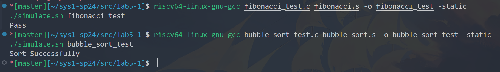

## lab5-2

### qemu 程序调试

#### 实验环境配置

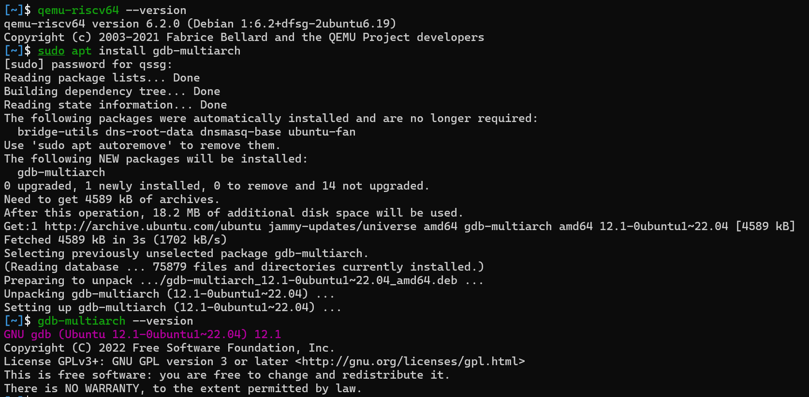

#### 尝试通过调试破解数据

##### phrase_1

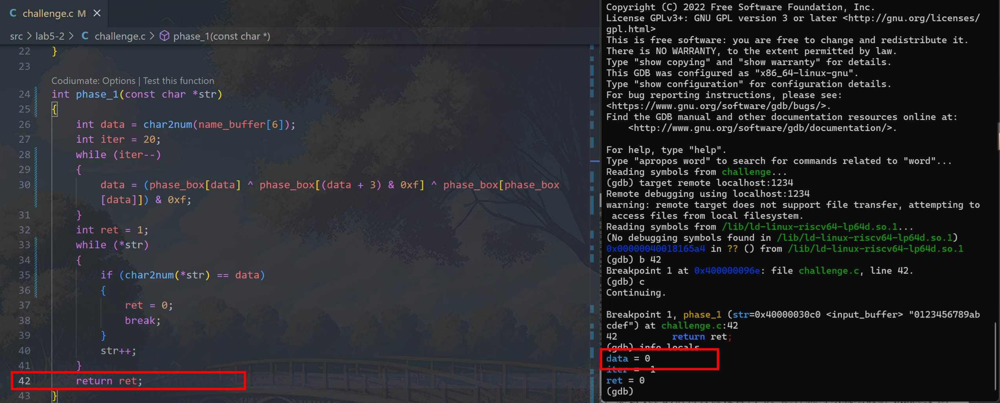

观察 c 代码，我们希望返回的 **ret = 0** ，那么也就是在字符串 `str` 中有一个输入对应 data 中的数字。观察函数 `char2num` ，不难发现只能够返回 **-1~15** 这 17 个数，所以简单来说我们输入 `0123456789abcdefg` 即可（因为可以遍历所有 data 的可能）

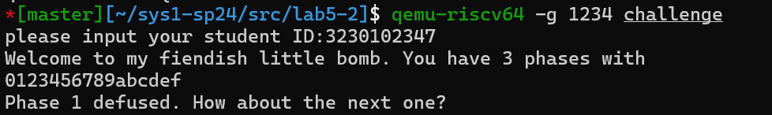

当然，我们以学习 gdb 为主，在 _data_ 运算完毕后查看

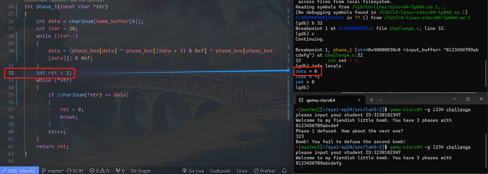

所以只需要 **输入包括 `0` 的字符串** 即可：


##### phase_2

同样断点获得迭代运算完成的 `data 数组`：


```c
data[1] = (data[1] + char2num(str[0])) & 0xf;
data[2] = (data[2] + char2num(str[1])) & 0xf;

int ret = 1;
if (char2num(str[0]) == data[0] && char2num(str[1]) == data[1] && char2num(str[2]) == data[2])
{
    ret = 0;
}
return ret;
```

阅读上面的源代码，不难发现其实就是将输入的 $str[0]，str[1]$ 加至 data 数组并高位截断（即对 16 取模），而 data[0] 不会再改变，故 **输入 `73c` 开头的字符串** 即可：

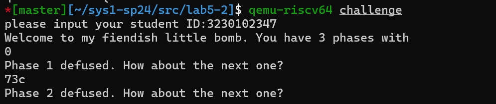


##### phase_3

断点获得进入上述汇编代码之前的 `sum = 2` （这是根据我的学号后四位异或得到的）

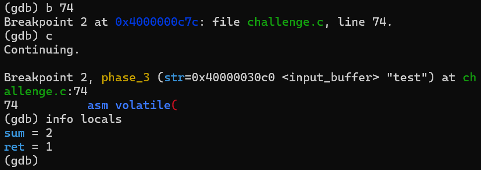

然后翻译下面的代码

```c
asm volatile(
  "mv t0, %[sum]\n"
  "mv t1, %[str]\n"
  "j phase_3_L1\n"
  "phase_3_L2:\n"
  "xor t0, t0, t2\n"
  "addi t1, t1, 1\n"
  "phase_3_L1:\n"
  "lbu t2, 0(t1)\n"
  "bne t2, zero, phase_3_L2\n"
  "bne t0, zero, phase_3_L3\n"
  "mv %[ret], zero\n"
  "phase_3_L3:\n"
  "nop\n"
  : [sum] "=r"(sum), [ret] "=r"(ret)
  : [str] "r"(str)
  : "memory", "t0", "t1", "t2");
```

其实等价于下面的 c 代码

```c
int t0 = sum;
const char *t1 = str;
while (*t1)
{
    t0 ^= *t1;
    t1++;
}
if (t0 == 0)
{
    ret = 0;
}
```

不难得知，就是问我们怎样输入能够让 sum (2 => 0010) 依次异或每个字符后结果为 0 (0000)。

需要注意的是，我们这里没有使用 `chat2num` 函数，所以使用的是 ascii 码值：

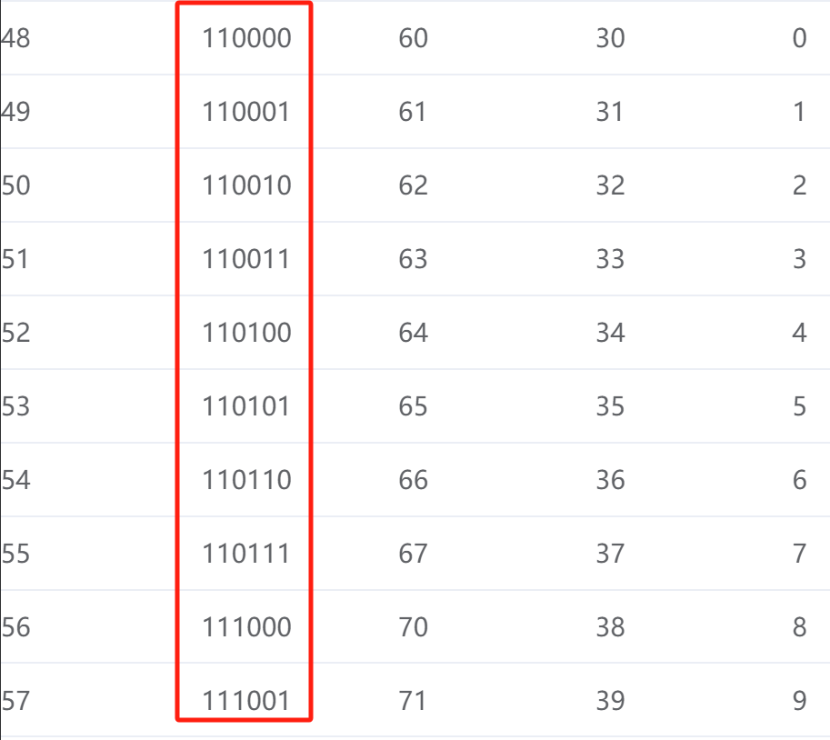
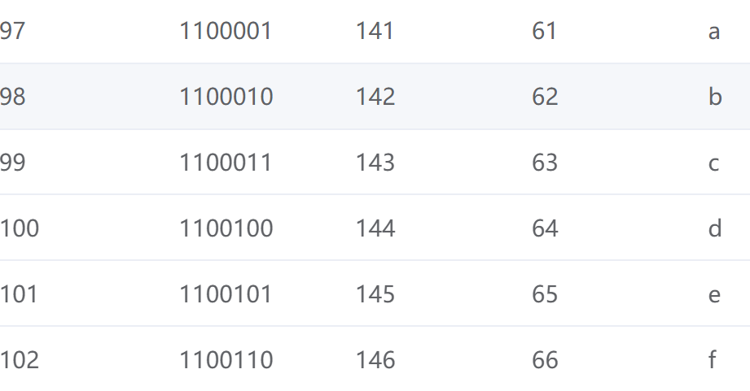

注意到在 ascii 表中连续的两个字符取异或即为 0010 （其余高位为 0），所以我们输入 `02` 即可：

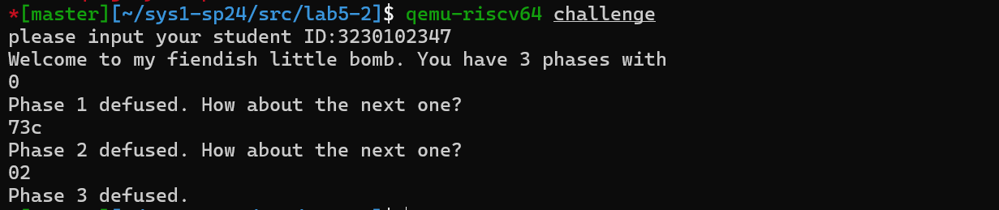

### spike 程序调试

#### Bonus 1

##### spike 调试部分给出调试过程的关键截图，并且给出 printm 到第一个字符输出的函数调用链、输出字符的关键函数、输出字符那一句汇编。 （bonus）

从 printm 到第一个字符输出的函数调用链：

查看 asm 源码可见 _primtm_ 下一步跳转 _vprintm_ ，继而继而下一步跳转 _vsnprintf_  之后是 _vprintm_  => _uart16550_putchar_ 

下面是 $vprintm \to vsnprintf$ 的过程：

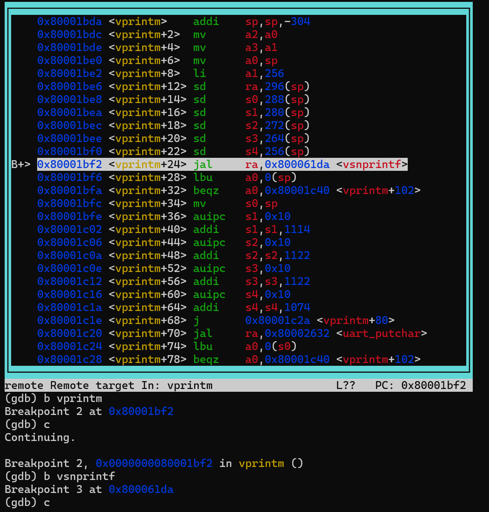

所以函数调用链为：_printm → vprintm → vsnprintf → vprintm → uart16550_putchar_

输出字符的关键函数：_uart16550_putchar_ 


输出字符那一句汇编：`sb a0,0(a3)`


输出完毕


#### Bonus 2

##### 调试定位了串口字符输出的函数之后，阅读 riscv-pk 对应的该函数的源码，尝试理解串口字符输出的具体细节。（bonus）

> [!INFO]
>
> 函数 `uart16550_putchar` 负责通过 UART（通用异步收发传输器）接口发送单个字符，特别是使用 16550 UART 协议。下面是其工作原理的详细解释：

 %%### 关键概念和寄存器

- **UART 寄存器**：UART 硬件接口通过一组寄存器进行控制。代码中使用的关键寄存器包括：
  - `UART_REG_LSR`（线路状态寄存器）：提供有关 UART 状态的信息。相关位：
    - `UART_REG_STATUS_TX`（0x20）：指示发送缓冲区（保持寄存器）是否为空。
  - `UART_REG_QUEUE`：用于发送和接收数据。

- **寄存器移位**：某些设备可能需要移位寄存器索引，这通过 `uart16550_reg_shift` 进行处理。

### 函数 `uart16550_putchar` %%

函数 `uart16550_putchar`通过执行以下步骤来通过 UART 发送字符：

1. **等待发送缓冲区为空**：
   ```c
   while ((uart16550[UART_REG_LSR << uart16550_reg_shift] & UART_REG_STATUS_TX) == 0);
   ```
   这一行不断检查线路状态寄存器（LSR），以查看发送缓冲区是否为空。它使用按位与操作来隔离 `UART_REG_STATUS_TX` 位。如果此位被设置，则表示缓冲区为空，函数可以继续发送字符。


2. **将字符写入发送缓冲区**：
   ```c
   uart16550[UART_REG_QUEUE << uart16550_reg_shift] = ch;
   ```
   这一行将字符 `ch` 写入发送缓冲区（QUEUE 寄存器）。然后字符通过 UART 发送出去。

%% ### UART 初始化和配置

`uart16550_done` 函数通过配置必要的寄存器来设置 UART。以下是相关步骤的概述：

1. **确定时钟频率**：
   ```c
   if (scan->clock_freq != 0)
     uart16550_clock = scan->clock_freq;
   ```
   该函数设置 UART 时钟频率，可以从设备树获取，也可以使用默认值。

2. **计算波特率的除数**：
   ```c
   uint32_t divisor = uart16550_clock / (16 * (scan->baud ? scan->baud : UART_DEFAULT_BAUD));
   ```
   这计算了实现所需波特率的除数。除数由 UART 时钟频率和波特率使用以下公式计算：

   \[
   \text{divisor} = \frac{\text{uart16550\_clock}}{16 \times \text{baud rate}}
   \]

3. **设置除数锁存**：
   ```c
   uart16550[UART_REG_LCR << uart16550_reg_shift] = 0x80;                // 启用 DLAB
   uart16550[UART_REG_DLL << uart16550_reg_shift] = (uint8_t)divisor;    // 设置除数（低字节）
   uart16550[UART_REG_DLM << uart16550_reg_shift] = (uint8_t)(divisor >> 8); // 设置除数（高字节）
   uart16550[UART_REG_LCR << uart16550_reg_shift] = 0x03;                // 8 位数据，无校验，一个停止位
   ```
   - **启用除数锁存访问**：设置 DLAB（除数锁存访问位），允许设置除数。
   - **设置除数**：除数分为低字节和高字节，并分别写入 `DLL`（除数锁存低字节）和 `DLM`（除数锁存高字节）。
   - **配置线路控制寄存器**：配置 UART 以使用 8 个数据位、无校验和一个停止位。

4. **启用 FIFO 并设置阈值**：
   ```c
   uart16550[UART_REG_FCR << uart16550_reg_shift] = 0xC7;
   ```
   这一行启用 FIFO（先进先出）缓冲区并设置触发中断的阈值。

### 总结

- **`uart16550_putchar(uint8_t ch)`**：等待 UART 发送缓冲区为空，然后发送字符。
- **UART 初始化（`uart16550_done`）**：配置 UART 时钟，设置波特率除数，并配置 UART 线路设置和 FIFO。

这个过程确保 UART 被正确配置，并且字符能够可靠地通过串行接口发送出去。 %%

%% ## 参考文档

https://blog.csdn.net/zhangjs0322/article/details/10152279 %%
