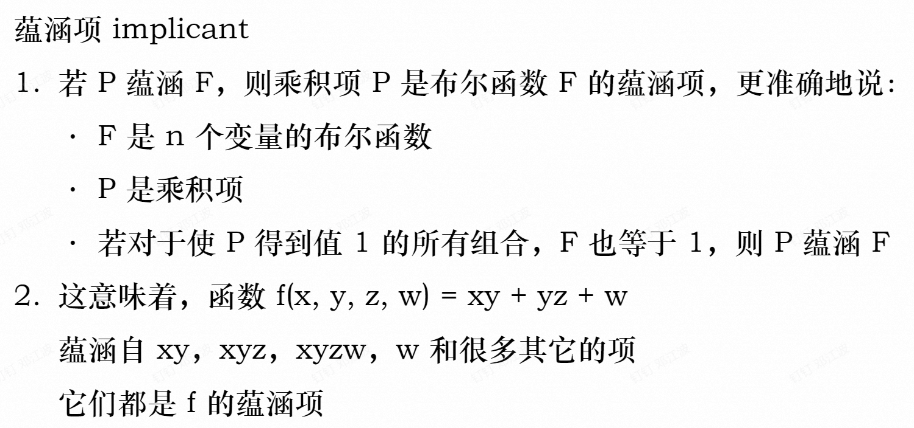

---
tags:
  - notes
  - sysI
comments: true
dg-publish: true
---

## I 二值逻辑与逻辑门

### I.1 二值逻辑

> [!DEFINITION ]
>
>  **Binary variables** take one of two values.
> **_e.g._** True/False, On/Off, Yes/No, 1/0...

与二值运算有关的基本逻辑运算有三种：AND、OR、NOT（与或非）：

二进制逻辑运算是非常像二进制二则运算（加&乘）的，观察下面的真值表不难得出：

### I.2 逻辑门

逻辑门分 `与门` `或门` `非门`，图形如下：（其中非门亦称 `反相器` ）

在电路中，电压和电流都可以作为信号传递信息

在电压型逻辑电路中，两个不重叠的电压范围分别用于表示 `logic 1` 和 `logic 0` ；

其间的电压范围称为过渡范围(transition region)

#### I.2.1 门延时(gate delay)

> each gate has another very important property called **gate delay ($t_{G}$)**, the length of time it takes for an input change to result in the corre- sponding output change.

  下方是有无 $t_{G}$ 的不同的定时图：

  

> [!NOTE]
>
> 1. **PHL (Propagation High to Low)**：表示信号从高电平（逻辑“1”）转换到低电平（逻辑“0”）所需的时间。这是信号下降沿的延迟时间，也称为下降时间（fall time）。
>  
>2. **PLH (Propagation Low to High)**：表示信号从低电平（逻辑“0”）转换到高电平（逻辑“1”）所需的时间。这是信号上升沿的延迟时间，也称为上升时间（rise time）。

#### I.2.2 常见电器元件

下面是一张比较完整的电器元件图标以及它们的真值表：

大部分我们将在后面进一步学习

- 值得注意的是，除**反相器**外，其他元件都可以有多个输入；
- 反相器输出端的圆圈名为“否定指示器(negation indicator)”，俗称“泡泡”；有这个“泡泡”多半就是取反；
- **与非门&或非门**比与门&或门使用更多；
- 异或&异或非在图中有所体现。

##### I.2.2.1 通用门

> [!DEFINITION ]
>
>  A gate type that alone can be used to implement all possible Boolean func- tions is called a **universal gate** and is said to be “functionally complete.”

我们下面说明与非门(NAND)是一个通用门，也就是说明 NAND 可以表示 AND、OR、NOT：

- 一个**一输入 NAND** 可以充当 NOT（当然，这么干是不合理的，直接换为 NOT 得了，如下图）
- 在 NAND 输出后面加上一个 NOT 可以形成 AND（反两次，合理）
- 在 NAND 每个输入前面加上一个 NOT 可以形成 OR（根据 DeMorgan’s theorem，2.2 细讲）

## II 布尔代数

> - The _Boolean algebra_ we present is an algebra dealing with binary variables and logic operations.
> 
> -  A _Boolean function_ can be described by a Boolean equation consisting of a binary variable identifying the function fol- lowed by an equals sign and a Boolean expression

书中引入了一个使用布尔函数的[典型案例](../ebooks/Logic-and-computer-design-fundamentals.pdf#page=63&selection=27,0,29,38) ，得出一个布尔函数，其真值表如下：

电路图如上，其等效 Verilog & VHDL 模型如下

### II.1 布尔代数基本恒等式

  下面的 `X` 和 `Y` 都是为 **0/1** 的值

> 对于 15 项，不难发现 $(X+Y)(X+Z)=XX+X(Y+Z)+YZ=X(1+YZ)+YZ=X+YZ$

(不难发现左右公式是对偶的)

**precedence**: parentheses（括号） > NOT > AND > OR

The **dual** of an algebraic expression is obtained by interchanging + and · and interchanging 0’s and 1’s.

上表最后两个公式是**德摩根定理（DeMorgan’s theorem）**：

该定理可推到多变量依旧成立，此处省略

> [!NOTE]
>
>  _Shannon's  Theorem_：
> $$f(x_1, x_2, \ldots, x_n) = x_1 \cdot f(1, x_2, \ldots, x_n) + \overline{x_1} \cdot f(0, x_2, \ldots, x_n)=(\overline{x_1} +f(1,x_{2}, \ldots, x_{n}))(x_{1}+f(0, x_{2},\ldots,x_{n}))$$

### II.2 代数运算

> Boolean algebra is a useful tool for simplifying digital circuits.

看看下面这一变形：

分别根据第一个式子和最后的式子画出电路图

上下电路图是等效的，但下方的显然简洁了许多

> When a _Boolean equation_ is implemented with logic gates, each **term** requires a gate, and each variable within the term designates an input to the gate. We define a **literal** (字符) as a single variable within a term that may or may not be complemented. 
> For instance, the  expression for the function in Figure 2-8(a) has three terms and eight literals; the one in Figure 2-8(b) has two terms and four literals. 

通俗来说，`term` 可以等同理解为**多项式的项数**而 `literal` 则是变量个数（包括重复的），我们简化电路的思路往往是减少 `term` `literal` ，两个都减少自然是最好的。借助于 DeMorgan’s theorem，下面是一些简化的例子：

#### II.2.1 对偶式

> **The dual of an expression(对偶式)** is obtained by changing AND to OR and OR to AND throughout (and 1 s to 0 s and 0 s to 1 s if they appear in the expression)
>
> The **duality principle of Boolean algebra(布尔代数对偶原则)** states that a Boolean equation remains valid if we take the dual of the expressions on both sides of the equals sign.

4 ~ 6 式正是 1 ~ 3 式的对偶式，1~3 容易得证，4~6 自然也就成立了

##### II.2.1.1 一致率定理

来看下面这个化简 $XY+\overline{X}Z+YZ=XY+\overline{X}Z$ 证明过程如下：

可以看到"$YZ$ is redundant and can be eliminated"

下面是这个式子一个简单应用：

$(A+B)(\overline{A}+C)=A\overline{A}+AB+\overline{A}C+BC=AB+\overline{A}C$

> 其对偶式子则为 $(X+Y)(\overline{X}+Z)(Y+Z)=(X+Y)(\overline{X}+Z)$

### II.3 反函数

我们常使用 $\overline{F}$ 来表示函数 F 的反函数，它的输出与 F 是相反的；对函数取反可以相当于对运算、变量、常量都取反来获得

> 注意，对偶式不将变量取反，或者说我们可以先获得 F 对偶式，然后各变量取反

下面是两个典型的例子：

### II.4 卡诺图

#### II.4.1 范式

#### II.4.2 （质）蕴涵项

参见[笔记](https://note.jiepeng.tech/CS/DigitalDesign/Chap02/Chap02_2/#karnaugh-map)

## III 标准形式

### III.1 硬件描述语言(HDL)

> - **HDLs** resemble programming languages, but are speciically oriented to describing hardware structures and behavior.
> - An obvious use for an HDL is to provide an alternative to schematics. 
> - When a language is used in this fash- ion, it is referred to as a **structural description**, in which the language describes an interconnection of components. Such a structural description, referred to as a **netlist**, can be used as input to logic simulation just as a schematic is used.

#### III.1.1 Verilog

下面是 verilog 原型，其中 `()` 内第一个参数为输出，其余为输入，除反相器（即非门外）可以有多个输入

verilog 还有逻辑运算符，与 C 是较为相似的

#### III.1.2 VHDL

VHDL 没有原型，但有逻辑运算符

## IV Transistors

> [!INFO]
>
> PPT 上直接给专业名词，看不懂一点，用 GPT 解释了一下下：
>
> 1. **Integrated Circuit (IC)**：集成电路，是一种将大量的微小电子元件（如晶体管、二极管、电阻器、电容器等）集成在单个半导体芯片上的技术。集成电路广泛应用于各种电子设备中，如计算机、手机、家用电器等。
> 
> 2. **Transistor-Transistor Logic (TTL)**：晶体管-晶体管逻辑，是一种数字电路设计中使用的逻辑家族，它使用双极型晶体管（BJT）来实现逻辑门。TTL 电路曾经是计算机和许多其他电子设备中的标准逻辑家族，但现在很大程度上被 CMOS 技术所取代。
> 
> 3. **Bipolar Junction Transistor (BJT)**：双极型晶体管，是一种三端电子器件，它有两种类型：NPN 型和 PNP 型。BJT 使用两种载流子（电子和空穴）进行导电，因此得名“双极型”。BJT 广泛应用于放大和开关电路中。
>   
> 4. **Complementary Metal-Oxide Semiconductor (CMOS)**：互补金属-氧化物半导体，是一种使用 PMOS 和 NMOS 晶体管来构建逻辑门和其它电路的半导体技术。CMOS 技术因其低功耗和高噪声容限而广泛应用于集成电路设计中。
>  
> 5. **Field Effect Transistor (FET)**：场效应晶体管，是一种三端电子器件，其中栅极电压控制源极和漏极之间的电流流动。FET 有多种类型，包括 JFET（结型场效应晶体管）和 MOSFET（金属-氧化物-半导体场效应晶体管）。
>  6. **CMOS Transistors**：CMOS晶体管，是指在一个集成电路中同时使用PMOS和NMOS晶体管的晶体管。在CMOS技术中，PMOS和NMOS晶体管以互补的方式使用，以实现低功耗和高性能的数字逻辑电路。
> 
> 7. **Gate, source, drain**：这些是与场效应晶体管（FET）相关的术语。栅极（Gate）是控制晶体管导通和截止的电极。源极（Source）是电流进入晶体管的地方。漏极（Drain）是电流离开晶体管的地方。
>  
> 8. **NMOS transistor / PMOS transistor**：
>     
>    - NMOS 晶体管（N 型金属-氧化物-半导体场效应晶体管）：在 NMOS 晶体管中，N 型通道被创建在 P 型衬底上，电流主要由电子携带。
>    - PMOS 晶体管（P 型金属-氧化物-半导体场效应晶体管）：在 PMOS 晶体管中，P 型通道被创建在 N 型衬底上，电流主要由空穴携带。
>    - 
>    - 通过控制 Gate 来控制 source 和 drain 之间的电流，可以用来完成逻辑与门和或门
> 
> 9. **VDD**：代表电源的正电压供应。VDD 中的 “DD” 通常被解释为 “drain and source”，意味着这个电压被施加到晶体管的漏极和源极。在数字电路中，VDD 通常是指逻辑高电平或正电源电压。VDD 的具体电压值取决于电路的设计和电源的要求，常见的值有5V、3.3V、1.8V 等。
> 10. **GND**：代表地或零电压参考点。GND 是电路中所有电压测量的参考点，也是电路中返回电流的路径。在电子设备中，GND 是电源的负极端，所有非地信号都相对于 GND 来测量。

### IV.1 Buffer Gate

相当于取非两次，利用电路延迟达到将数据延迟的目的。

### IV.2 Transmission Gate

让 $A \overline{A}$ 分别对应 PMOS 和 NMOS 即可保证两者同时开放，IN == OUT，同时利用电平周期达到延迟的效果

