---
tags:
  - notes
  - sysI
comments: true
dg-publish: true
---

## I Basic computational units

Basic adder

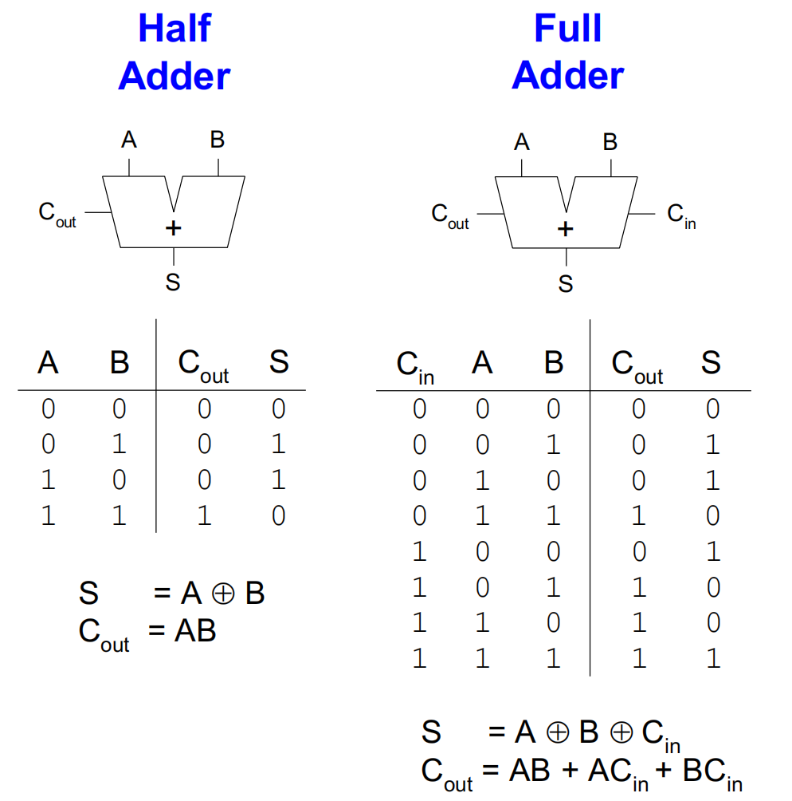

### I.1 Carry Propagate Adders (CPA)

#### I.1.1 Ripple-Carry Adder (RCA)

> [实验指导——行波进位加法器](https://zju-sys.pages.zjusct.io/sys1/sys1-sp24/lab2-1/#_4)

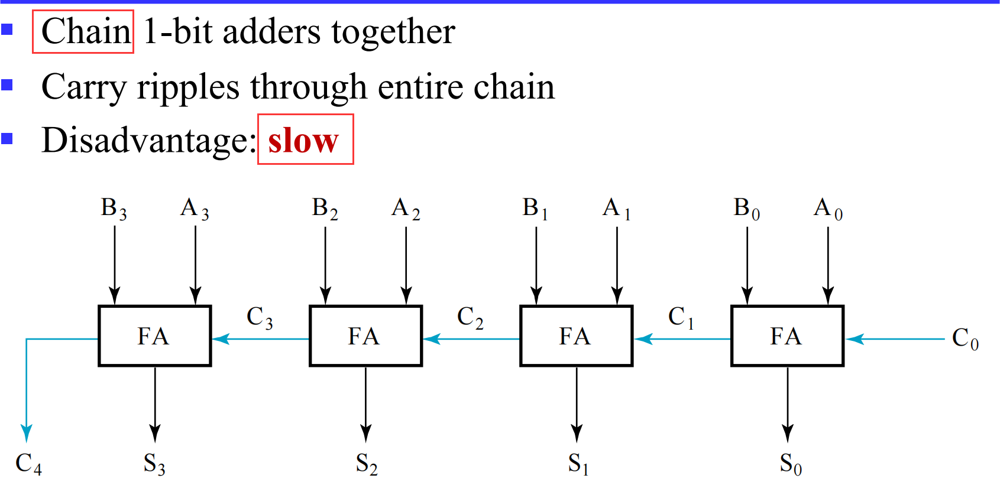

$t_{ripple} = N*t_{FA}$ where $t_{FA}$:delay of a 1-bit full adder

#### I.1.2 Carry-Lookahead Adder (CLA)

> [实验指导——超前进位加法器](https://zju-sys.pages.zjusct.io/sys1/sys1-sp24/lab2-1/#_5)
> 下面第二个公式有误，应该为 $P_{i} = A_{i} \oplus B_{i}$

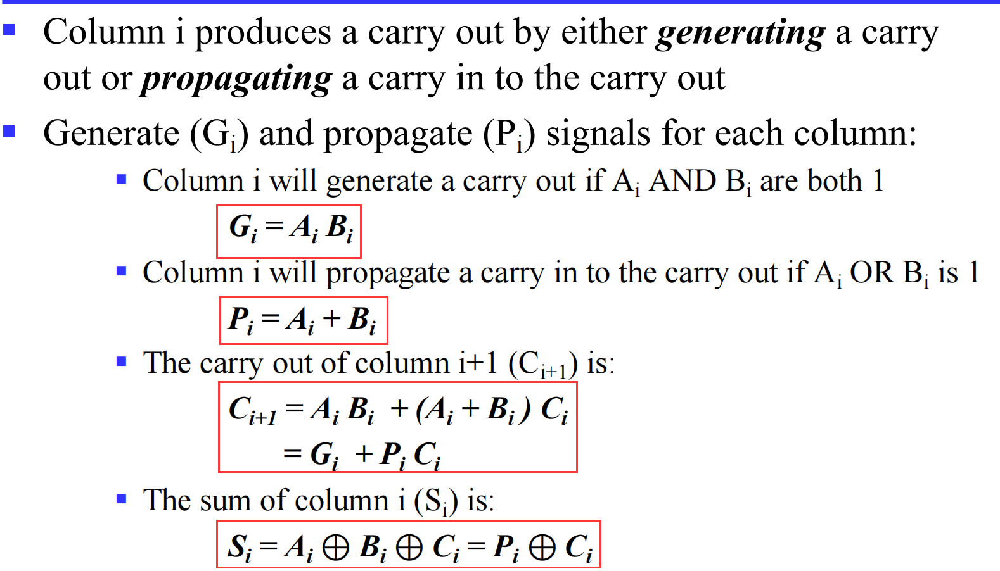

对应于上面的公式，我们不难理解为什么是 **Partial full adder**，高位的接收到的进位并不是低位的加法器提供的，而是根据上面的公式计算得到

硬件开销无疑是十分大的，也可以看到，每组中：

- 第一个与门输出的是G
- 左侧的异或门输出的是 S
- 右侧的异或门输出的是 P
- 或门输出的就是 C

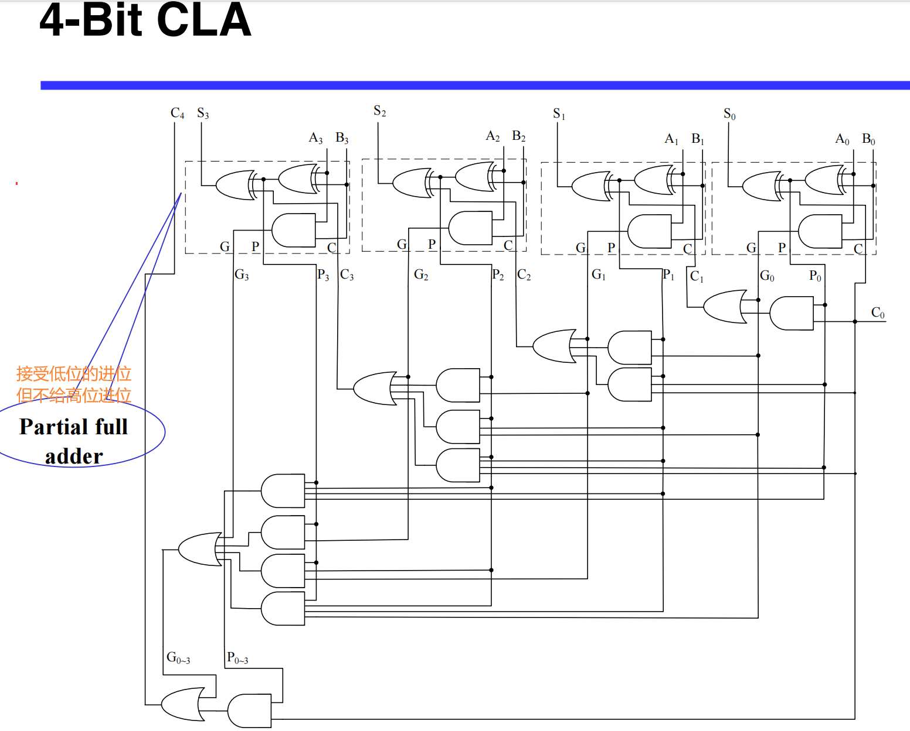

##### I.1.2.1 Block/Group Level

把 C_4 展开后发现具有相近的结构，引入 group generate (G3-0) and group propagate (P3-0)

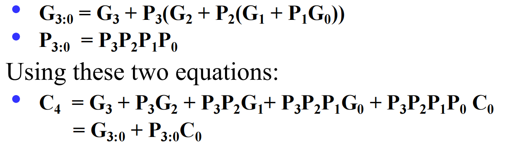

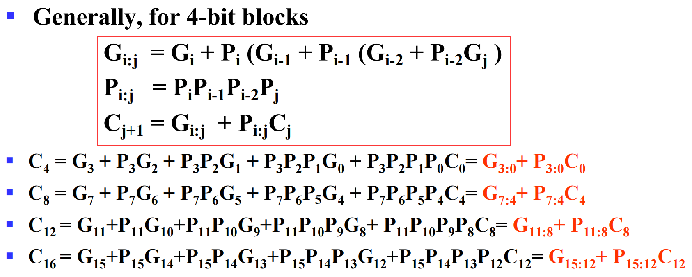

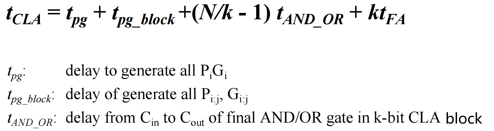

> [!INFO]
>
>  _metric types_ （指标类型）: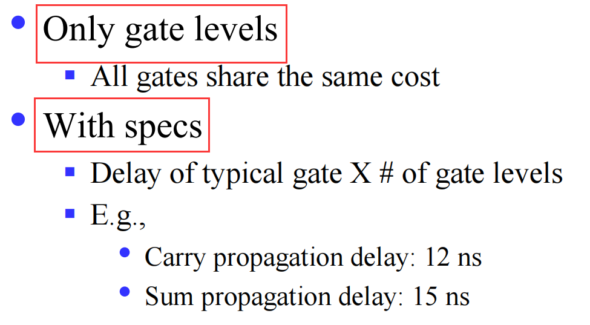

### I.2 Prefix Adder

如果我们定义： $G_{-1} = C_{in}, P_{-1} = 0$

那么发现：$C_{i-1} = G_{i-1:-1}, S_{i}= (A_{i}\oplus B_{i})\oplus G_{i-1:-1}$

所以，我们的目标就是计算 $G_{0:-1},G_{1:-1}\dots G_{i-1:-1}$ ，称为 profixs (前缀)

#### I.2.1 progress

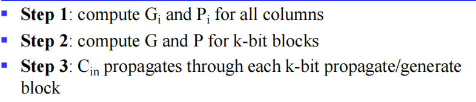

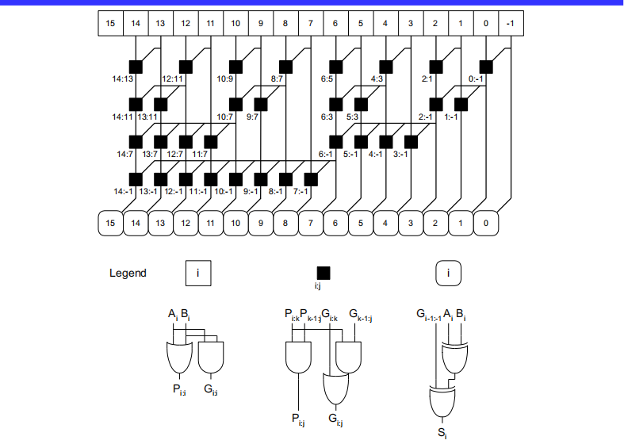

> 止步 lec 05-1 P 21，等朋辈辅学罢……没有理解 G 和 P

## II Arithmetic logic unit (ALU)

> [!DEFINITION ]
>
> **算术逻辑单元**（英语：Arithmetic logic unit，[缩写](https://zh.wikipedia.org/wiki/%E7%B8%AE%E5%AF%AB "缩写")：**ALU**）是一种可对[二进制](https://zh.wikipedia.org/wiki/%E4%BA%8C%E8%BF%9B%E5%88%B6 "二进制")[整数](https://zh.wikipedia.org/wiki/%E6%95%B4%E6%95%B0 "整数")执行[算术运算](https://zh.wikipedia.org/wiki/%E7%AE%97%E6%9C%AF "算术")或[位运算](https://zh.wikipedia.org/wiki/%E4%BD%8D%E6%93%8D%E4%BD%9C "位操作")的[组合逻辑](https://zh.wikipedia.org/wiki/%E7%BB%84%E5%90%88%E9%80%BB%E8%BE%91%E7%94%B5%E8%B7%AF "组合逻辑电路")[数字电路](https://zh.wikipedia.org/wiki/%E6%95%B0%E5%AD%97%E7%94%B5%E8%B7%AF "数字电路")。ALU 与[浮点数运算单元](https://zh.wikipedia.org/wiki/%E6%B5%AE%E7%82%B9%E8%BF%90%E7%AE%97%E5%99%A8 "浮点运算器")（FPU）不同，后者仅对[浮点数](https://zh.wikipedia.org/wiki/%E6%B5%AE%E7%82%B9%E8%BF%90%E7%AE%97%E5%99%A8 "浮点运算器")进行操作。ALU 是许多类型的计算电路的基本部件，这些计算电路包括计算机的[中央处理单元](https://zh.wikipedia.org/wiki/%E4%B8%AD%E5%A4%AE%E5%A4%84%E7%90%86%E5%99%A8 "中央处理器")（CPU）、[浮点处理单元](https://zh.wikipedia.org/wiki/%E6%B5%AE%E7%82%B9%E8%BF%90%E7%AE%97%E5%99%A8 "浮点运算器")（FPU）和[图形处理单元](https://zh.wikipedia.org/wiki/%E5%9C%96%E5%BD%A2%E8%99%95%E7%90%86%E5%99%A8 "图形处理器")（GPU）。单个CPU、FPU 或 GPU 可能包含多个 ALU。
> 
> ALU 的输入包括需要运算的数据（也称为[运算数](https://zh.wikipedia.org/wiki/%E9%81%8B%E7%AE%97%E6%95%B8 "运算数")）和表明了运算操作类型的指令码。ALU 的输出是其执行运算的结果。在许多的设计中，ALU 还带有状态输入或输出，可将其之前操作或当前操作的信息在 ALU 和外部状态[寄存器](https://zh.wikipedia.org/wiki/%E5%AF%84%E5%AD%98%E5%99%A8 "寄存器")间传递。

### II.1 datapath

> [!DEFINITION ]
>
> The combination of a set of registers with a shared ALU and interconnecting paths is the _datapath_ for the system.

one most classic mode of datapath is

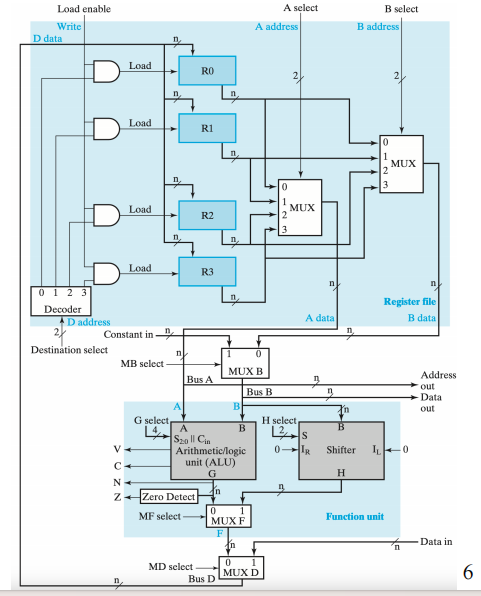

### II.2 How to Design An ALU

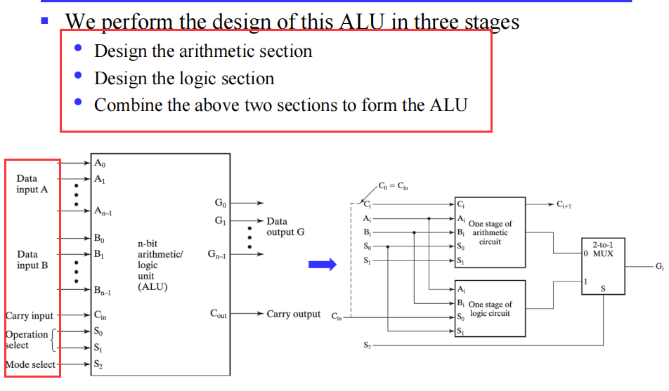

如图中描述的，就是一部分用于实现运算，另一部分实现选择（一个简单的方式是通过多路选择器）

#### II.2.1 example

简单的例子我们不看了，来看下面这个

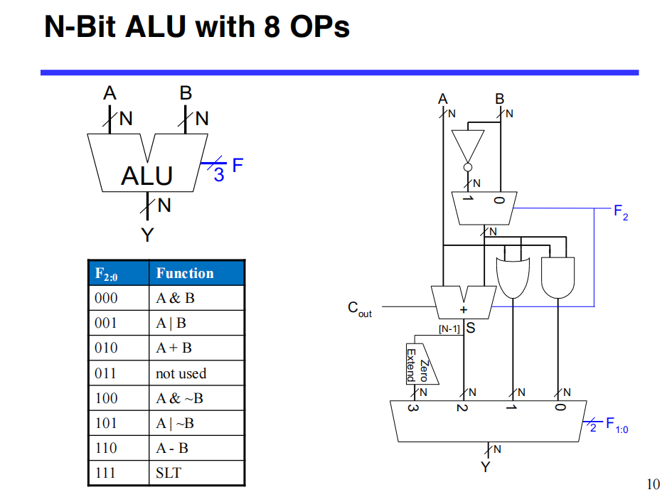

不难发现我们需要实现的操作有 8（7 也成）个，在多路选择器中需要三位数去控制；考虑到全都单独算很多重复电路（例如对 B 的取反），所以设计了上图右侧电路以便重复使用输出信号

> [!HELP]
>
> 上课时一直没看懂 A-B 和 SLT(set less than，即当且仅当 A < B 时输出 1)是怎么实现的，还以为自己记错了，不应该是 $A-B = A+\sim B+1$ 吗？
> 
> 且看，$F_{2}$ 有一个输入给了加法器，就是当 $C_{in}$ 用的，那就没事了；至于 SLT， $A<B \equiv A-B<0$ ；之后呢？结果为负数，那么符号位为 1，我们就看最高位即可

### II.3 Shifter Design

首先可以先回顾一下 [shift operation （移位操作）](README.md#shift-operation-（移位操作）) [移位寄存器](https://zju-sys.pages.zjusct.io/sys1/sys1-sp24/lab4-1/#_7) （串行），下面是一些并行移位寄存器的组合逻辑电路实现

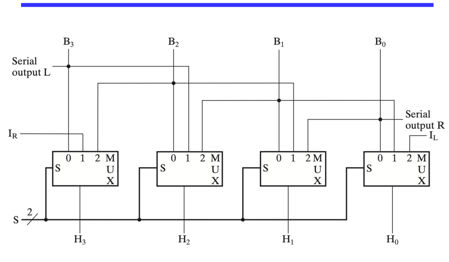

> [!HELP]
>
> - S 控制移位模式（左/右移，算术/逻辑）
> - $I_{L}和 I_{R}$ 则代表了移位过程中补位的数据

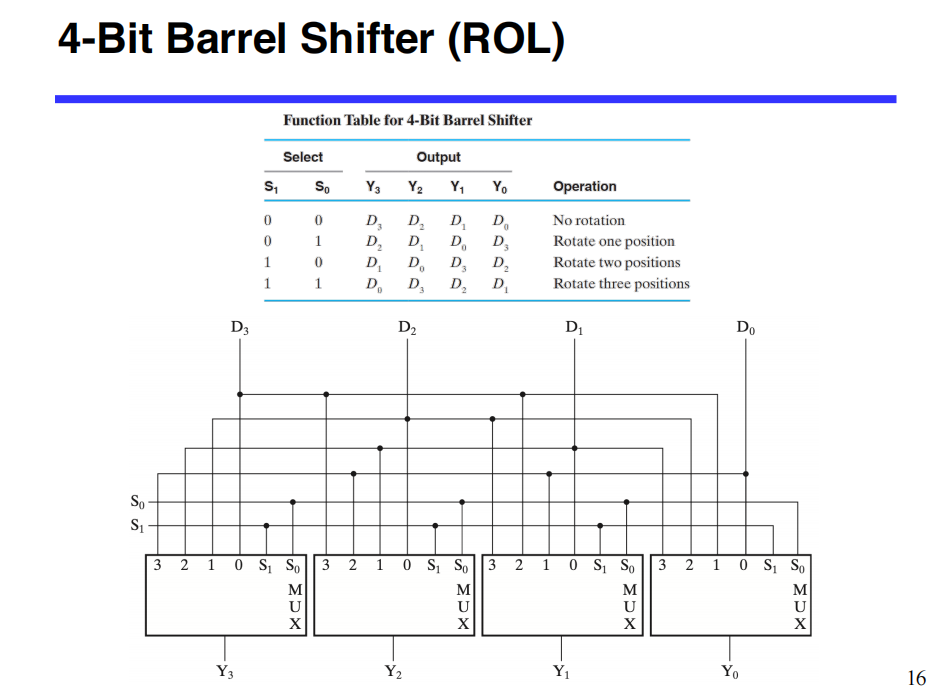

## III Fixed number operations

### III.1 Multiplication

#### III.1.1 Unsigned Multiplication

直接看[实验指导——乘法器](https://zju-sys.pages.zjusct.io/sys1/sys1-sp24/lab3-3/#_5)

#### III.1.2 Signed Multiplication

- 将符号位取异或，其余 n-1 位同上进行乘法即可
- 使用 [sign extension](01-Information_Representation.md#sign-extension) 也可完成：
    - 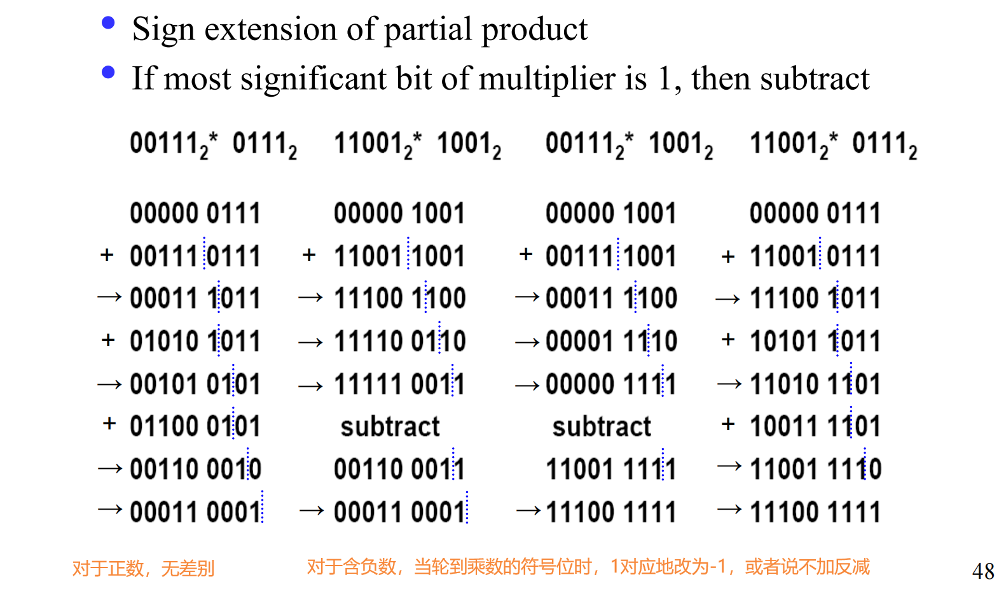

#### III.1.3 Booth’s Encoding

> [!INFO]
>
> 移位器比乘法器好实现的多

使用简单的分配律结合律，我们 ~~很容易~~ 发现：

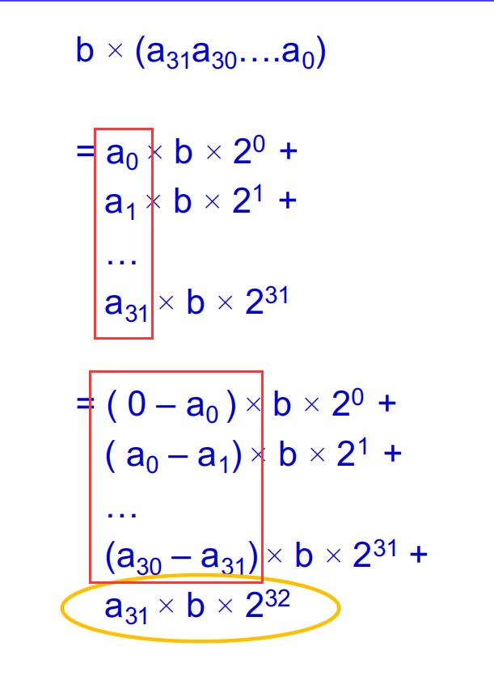

这就是 _booth encoding_ 的秘诀所在

我们将原本一一分开的 $a_{0}a_{1}\dots a_{n}$ 的乘法转为了观察相邻两位二进制数之间的关系（注意，表格中 `-1` 表示被乘数乘以 `-1` 后加给 partial product，余同）：

$$
\begin{array}{|l|l|l|}\hline\mathbf{Y_j}&\mathbf{Y_{j-1}}&\mathbf{1-bit~Encoding}\\\hline0&0&+0\\\hline0&1&+1\\\hline1&0&-1\\\hline1&1&-0\\\hline\end{array}
$$

也就是说，我们根据 $Y_{j} 与 Y_{j-1}$ 来决定下一步干什么；而二者本身就可以看作两位数的二进制数，也就达到了编码的效果；同时由上图我们可以看到我们定义 $Y_{-1} = 0$，在移位时就好比在最后补 0，如下图（当然，我们也可以先编码运算，后相加）。

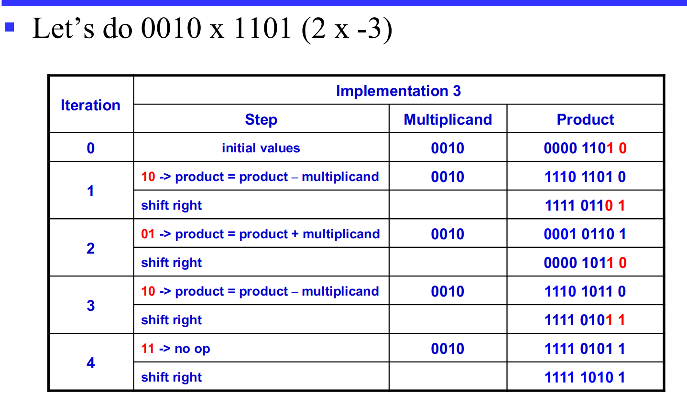

似乎没什么好处？来看下面这个 booth encoding ：

$$
\begin{array}{|l|l|l|l|}\hline\mathbf{Y_{j+1}}&\mathbf{Y_j}&\mathbf{Y_{j-1}}&\mathbf{2-bit~Encoding}\\\hline0&0&0&+0\\\hline0&0&1&+1\\\hline0&1&0&+1\\\hline0&1&1&+2\\\hline1&0&0&-2\\\hline1&0&1&-1\\\hline1&1&0&-1\\\hline1&1&1&-0\\\hline\end{array}
$$

在 _2-bit encoding_ 中，我们可以一次性移动两位，这使得我们所需的时钟周期减少；

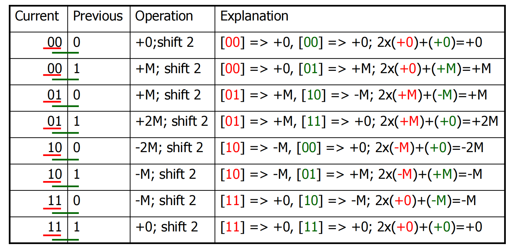

可以看见出现了乘以 `+2`，而乘/除以一个 `+2` 的幂可以等同于移位操作，这有利于电路实现；同时减少了 partial products （尤其是当乘数中连续出现 0/1 时），也就减少了相加次数。

#### III.1.4 Array Multiplier

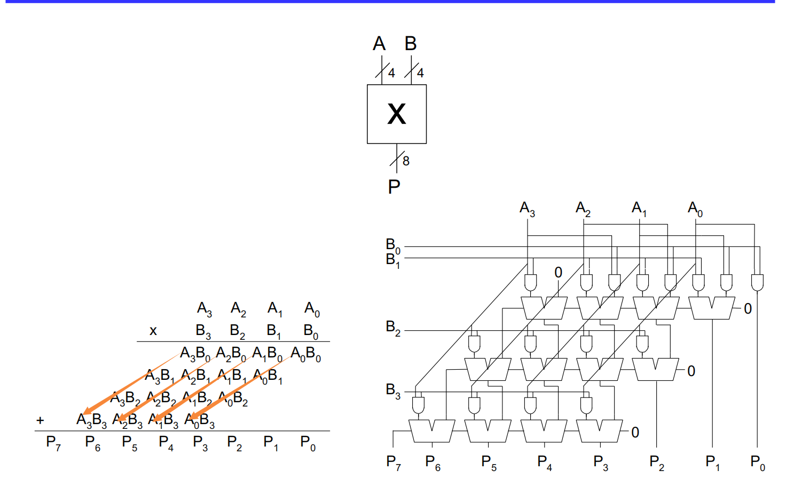

> [!HELP]
>
> help 不了，根据左图识别右图；注意到过程中每一次加法的进位都被传输给下一位

但是当位宽较大（如到 32 位时），电路开销是十分大的。

### III.2 Division

#### III.2.1 Unsigned Division

##### III.2.1.1 Restoring Division

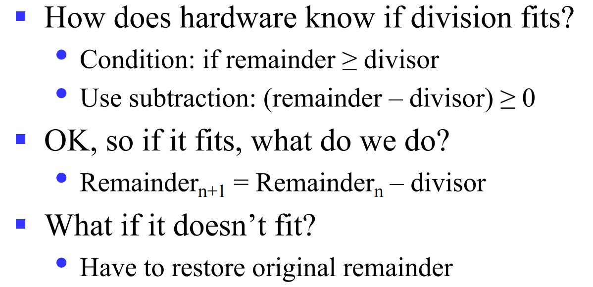

这个方法叫做 _restoring division_ （恢复余数除法），因为我们在判断时已经进行了 $remainder_{n+1} = remainder_{n} -divisor$ 操作，然后根据该值判断是否接受新的 remainder，若不接受，则恢复原来的 remainder，加回 divisor ，这无疑是很繁琐的。

##### III.2.1.2 Non-Restoring Division

> 没看懂，只知道不用恢复

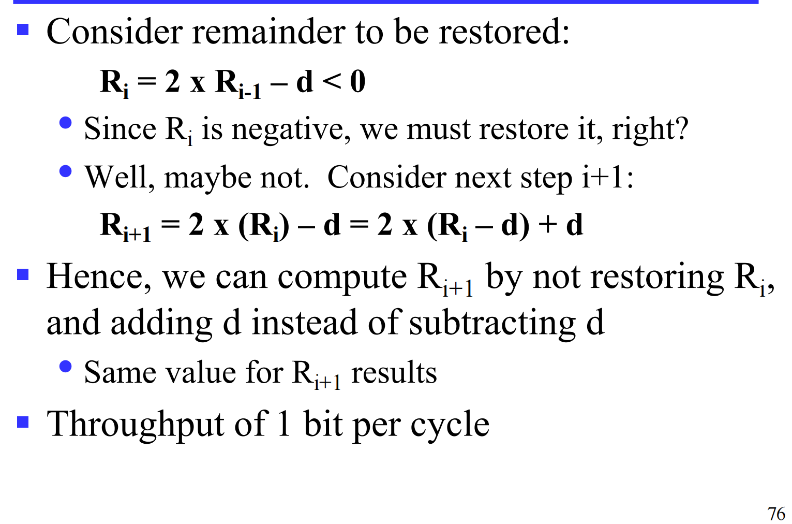

#### III.2.2 Array Divider

> 好吧，也没看懂

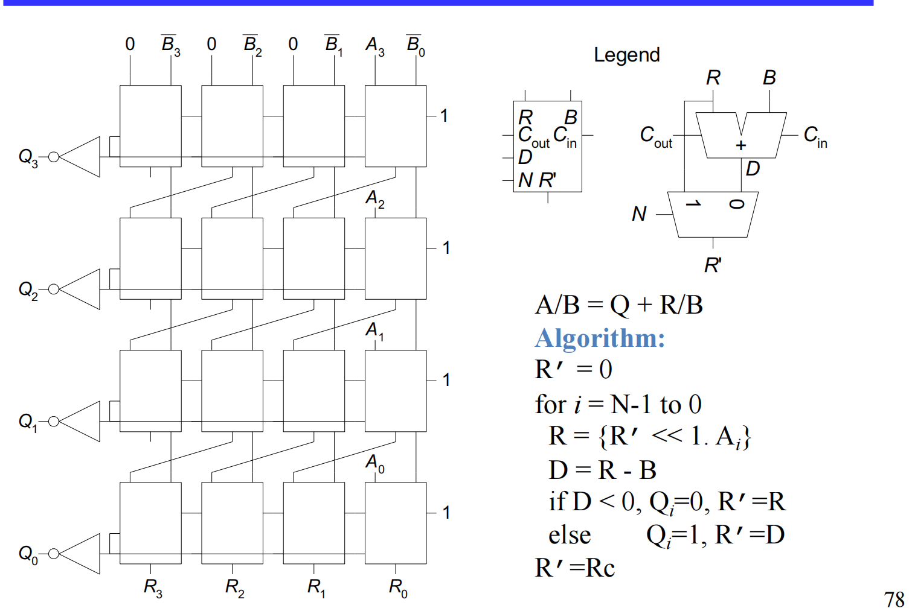

#### III.2.3 Signed Division

> [!QUESTION]
>
> 我们如何确定下面除法中商和余数的符号？
> 
> $\frac{7}{2}~\frac{-7}{2}~\frac{7}{-2}~\frac{-7}{-2}$
>
> The correctly signed division algorithm <u>negates the quotient  if the signs of the operands are opposite</u>  and makes  <u>the sign of the nonzero remainder match the dividend</u>.

