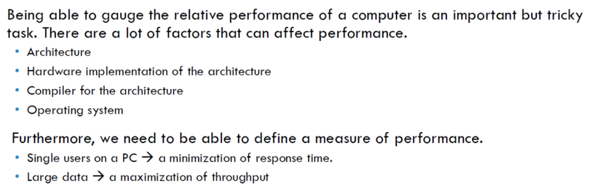
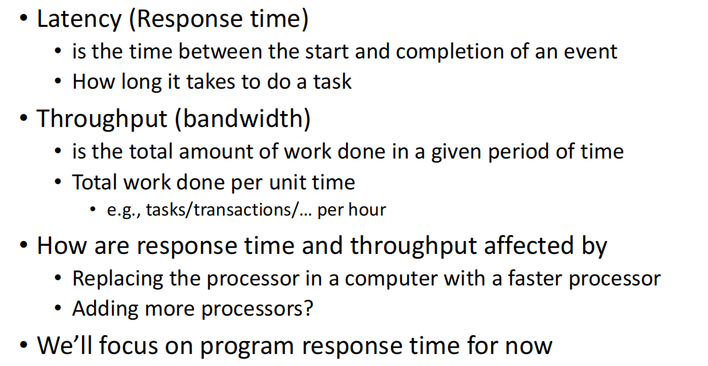
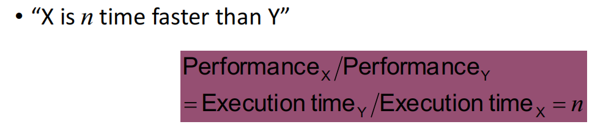
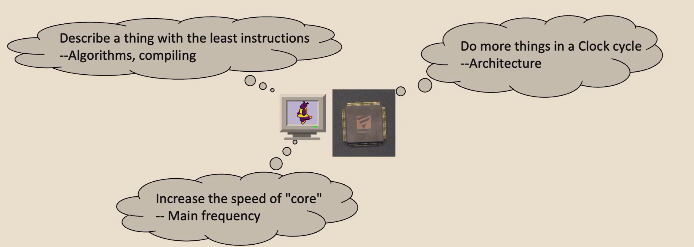
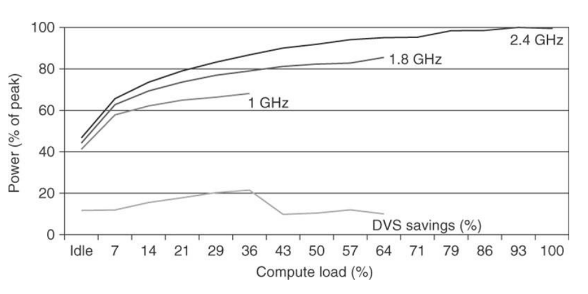
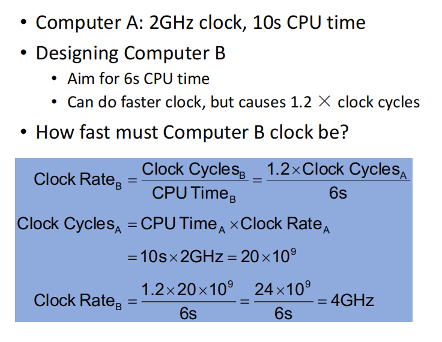
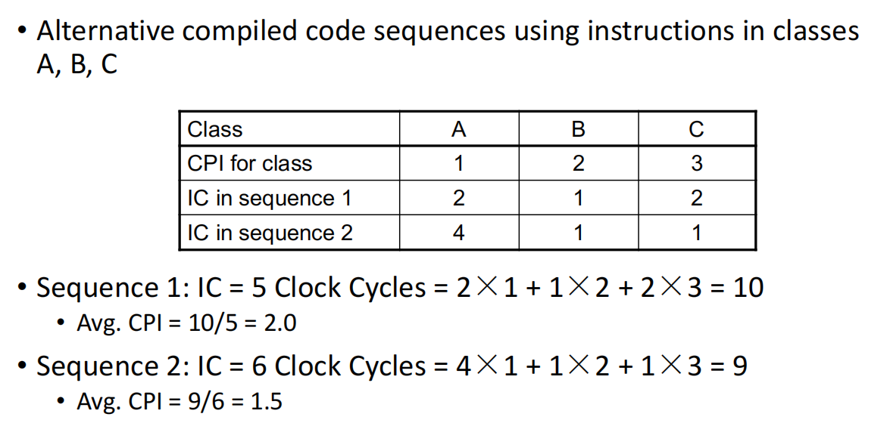
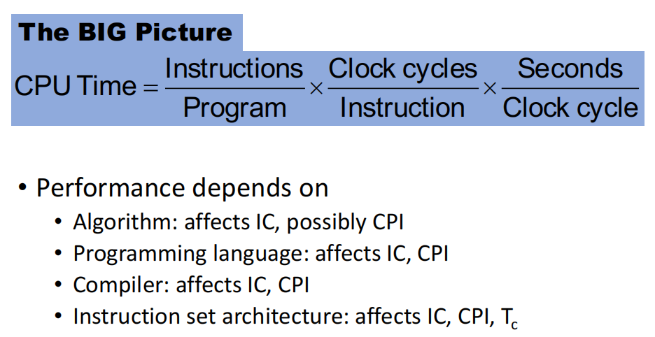

---
tags:
  - notes
  - sysI
comments: true
dg-publish: true
---

## I 杂记

What is the inside of processor (CPU) ？

- Datapath: performs operations on data
- Control Unit: is responsible for fetching and executing instructions.
- Cache memory
    - 预缓存，提高性能 

Datapath with control （重点 ）

Turing Machine  [图灵机](../../../course_notes/CS70%20DMPT/notes/18-Misc.md#图灵机)

## II Design a cpu

> 对于 sys1-sp24 实验 [project](https://zju-sys.pages.zjusct.io/sys1/sys1-sp24/project-1/) 的思路，可以看成是伪代码罢；
> 
> [!WARNING]
>
> 个人思路，不能保证其正确性，请勿抄袭 

### II.1 数据通路设计

#### II.1.1 Register File

```verilog
`include "core_struct.vh"
module RegFile (
  input clk,
  input rst,
  input we,
  input CorePack::reg_ind_t  read_addr_1,
  input CorePack::reg_ind_t  read_addr_2,
  input CorePack::reg_ind_t  write_addr,
  input  CorePack::data_t write_data,
  output CorePack::data_t read_data_1,
  output CorePack::data_t read_data_2
);
  import CorePack::*;
  integer i;
  data_t register [1:31]; // x1 - x31, x0 keeps zero
  // fill your code
endmodule
```

实现文件的读写操作

```verilog
// fill your code
assign read_data_1 = (read_addr_1 == 5'd0) ? 64'd0 : register[read_addr_1];
assign read_data_2 = (read_addr_2 == 5'd0) ? 64'd0 : register[read_addr_2];
always_ff @(posedge clk or posedge rst) begin
  if (rst) begin
    for (i = 1; i < 32; i++) begin
      register[i] <= 64'd0;
    end
  end else if (we && write_addr != 5'd0) begin
    register[write_addr] <= write_data;
  end
end
```

#### II.1.2 Cmp

```verilog
// fill your code
always_comb begin
  case (cmp_op)
    // CMP_NO:   res = 0; // 表示不是比较类型
    CMP_EQ:   res = (a == b) ? 1 : 0;
    CMP_NE:   res = (a != b) ? 1 : 0;
    CMP_LT:   res = ($signed(a) < $signed(b)) ? 1 : 0;
    CMP_GE:   res = ($signed(a) >= $signed(b)) ? 1 : 0;
    CMP_LTU:  res = (a < b) ? 1 : 0;
    CMP_GEU:  res = (a >= b) ? 1 : 0;
    // CMP7:     res = 0;
    default:  res = 0;
  endcase
end
```

#### II.1.3 Controller

> 我们需要实现的指令类型至少为 6 种，但是寻找相似点可以归类设计
> 
> 简单来说，用若干多路选择器是简单的

##### II.1.3.1 R/L/S

> 具体到时候看 5/29 日的 ppt

## III Performance





> 简而言之，是快还是多？我们更多考虑 **快** 这一方面
> [!DEFINITION ]
>
> Performance = 1/Execution Time



### III.1 Measuring Execution Time

#### III.1.1 Elapsed time

- Total response time, including all aspects
    - Processing, I/O, OS overhead, idle time
- Determines system performance

#### III.1.2 CPU time

#### III.1.3 How can computer run faster?



#### III.1.4 Power and energy consumption



在 IDLE 时依旧有较大的功耗

#### III.1.5 CPI in More Detail


### III.2 example

$$
CPUExecutionTime=\frac{CPUClockCycles}{ClockRate}
$$



---



### III.3 Performance Summary



