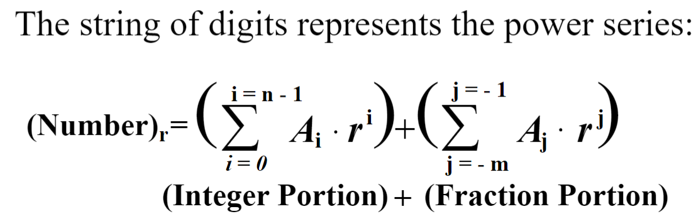
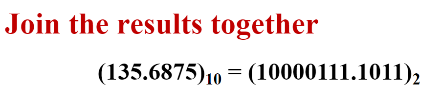
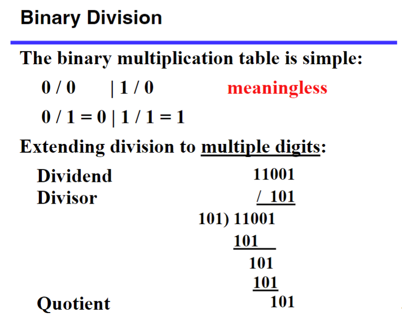
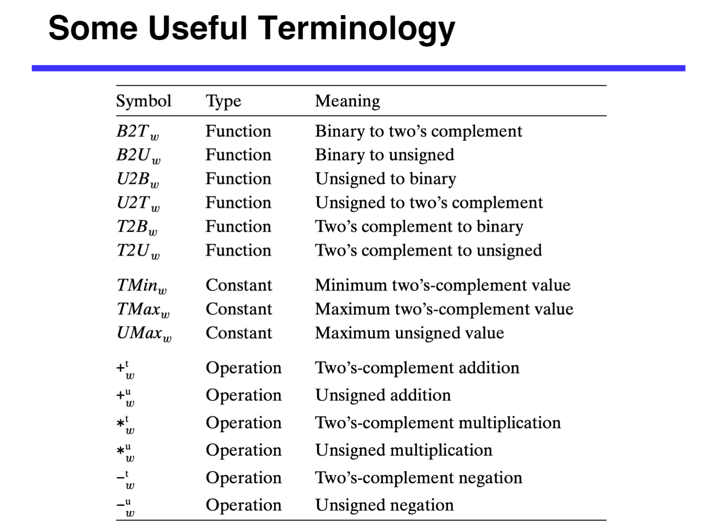
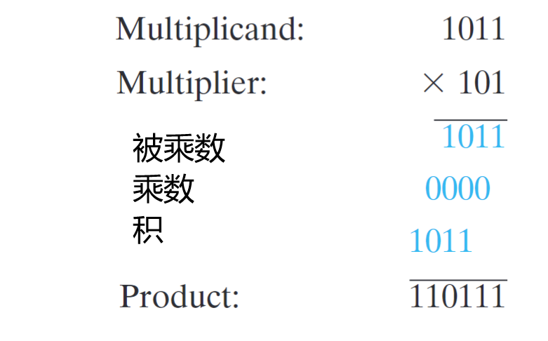
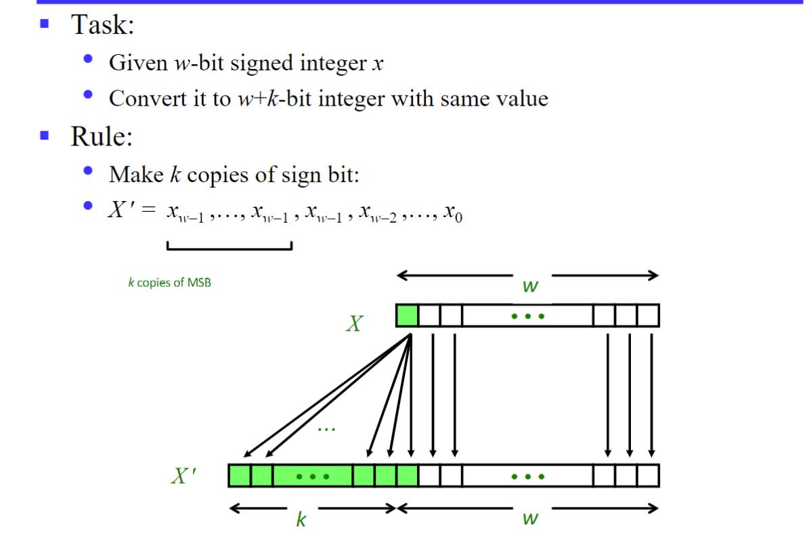
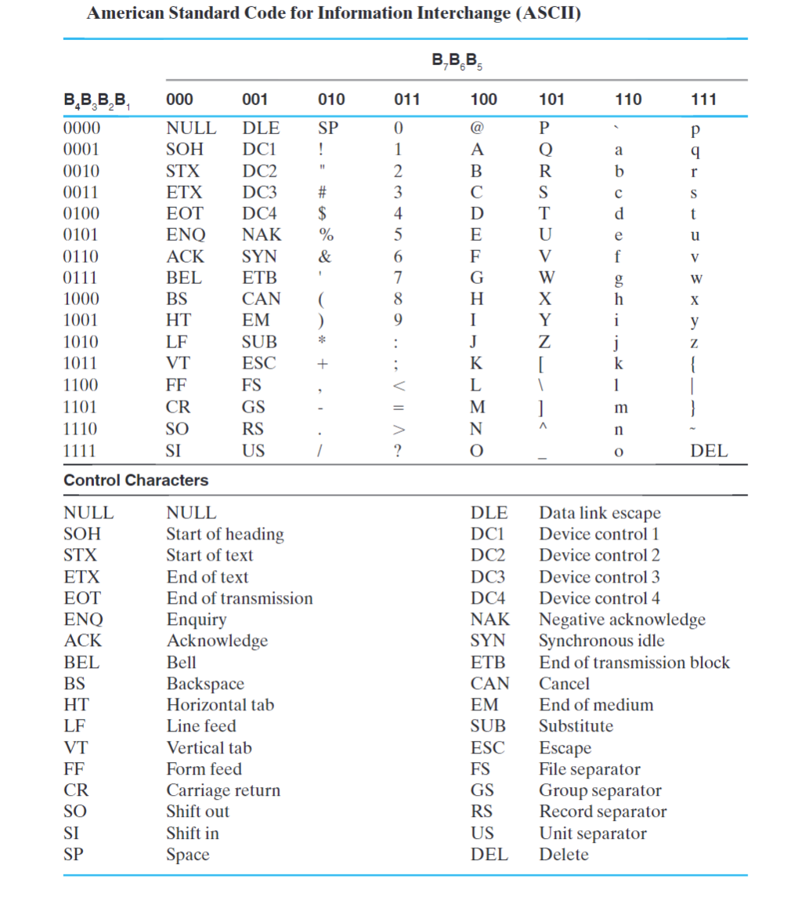

## Introduction to computer systems

**信息：** 数字系统存储、转移、处理的对象，是对物质世界与人类社会中存在的各种各样现象的表示。

模拟信号&数字信号

当前绝大多数电子数字系统的信号都采用两个离散值，称为二进制(binary),其中用到的两种离散值分别称为 0 和 1，也就是二进制系统中所用到的数字。
我们经常用两种一定范围的电压——高电平（HIGH）和低电平（LOW）（具体范围可以参考 [原书对应部分](../ebooks/Logic%20and%20computer%20design%20fundamentals.pdf#page=21&selection=57,0,64,5) )来表示两种离散值；相应的，TURE 和 FALSE 也可以用于表示。
实际上，我们经常这么干

- HIGH == 1 == TRUE
- LOW == 0 == FALSE

数字计算机其他计算机以及它们的组成元件等等不作记录，自行翻书。


计算机系统设计过程的 **基础** 是 “抽象的层次” 概念。

## 数制 

我们常常使用的是十进制计数法，但在开头我们说明了在信息表示中二进制具有其独特的优势，掌握二进制对于我们了解计算机是必不可少的。

### 数制规定

在一串数字中，数字根据其位置具有不同的权重；例如，十进制权重是 10 的幂，（radix 基底）r 进制的数权重则为 r 的幂。
通常我们这样一串数字 $$
(A_{n-1}A_{n-2}……A_{1}A_{0}.A_{-1}……A_{-m})_{r}
$$ 表示 r 进制的一串数字，以小数点决定其位置权重，下标 k 即为它们权重为 $r^{k}$ ，其值为 $\sum_{k=-m}^{n-1} A_{k}r ^{k}$ ；A 满足逢 r 进 1。

分整数部分和小数部分考虑，即：



### 数制运算与相互转换

我们主要使用二进制、八进制、十进制、十六进制（下面以二进制为例主要讲解，其余类推）。

#### 十进制

想必加减乘除无需多言。

#### 二进制 (Binary number representation)

##### 进制转换

###### 二转十

按照数制规定即可（后面八、十六不再赘述）。
###### 十转二

**整数部分**

一直除以 2 直到商为 0，余数**倒序排列**即可。


**小数部分**

一直乘以二，**顺序取整数区域**即可。


最后将两个部分相加即可。

> [!PRACTICE]
>
> 

> [!ATTRENTION]
>
> The algorithm for any radix $r >1$.

> [!TIP]
>
> 其他进制间的进制转换很简单了，根据 2/8/16 进制之间直观地关系。
> 
> 8 进制就是 3 位二进制，16 进制则是 4 位二进制。8 进制与 16 进制互相转换往往先变为 2 进制。
>
> 
>
> 不过需要注意的是，当将 8/16 进制转变为 2 进制时，可能需要补 0，尤其需要注意在小数部分后进行补 0。

##### 四则运算 (Arithmetic operations)

二进制同样需要借位。
###### 加法

基于统一性，在进行最低位相加减的时候，我们依旧需要一个 C (carry in) ，显然，这个 C = 0 。 

更多时候，我们会将更高位（高于当前加法器的下一位）设为 1 表示溢出


###### 减法 


因为 Z 是借位，所以在做减法时实际上是要比当前计算的位数要高一位的。

> 我们可以将加法器和减法器合并做成 **全加减法器** ，这在 lab 中会有所提及。

###### 乘法 

与我们手动计算的是基本一致的，而且比十进制似乎更加简单只是位数变多了一点点；这一点我们在设计乘法器时将用到


###### 除法 

对于单位数除法，只有两种合法形式，即只有被除数为 1 时才成立；

> [!useless]
>
> 如果我们把 0 作为除数会怎样？一个简单的测试是使用 python，作为一个简单的计算器十分方便，我们会发现输出如下
```python
[~]$ python
Python 3.10.12 (main, Nov 20 2023, 15:14:05) [GCC 11.4.0] on linux
Type "help", "copyright", "credits" or "license" for more information.
>>> 1/0
Traceback (most recent call last):
  File "<stdin>", line 1, in <module>
ZeroDivisionError: division by zero
```

对于多位除法如下，将被除数从最高位开始比对；减去除数后剩余部分再重复操作，这一点我们在设计除法器时将用到。



#### 八进制及十六进制

由于八进制一位所能表示的数（0 ~ 8）恰好是二进制三位所能表示的，二八互换就很方便了，看下面例子就知道了（二进制左侧 0 为凑位数加上的） 

$$
(011110010)_{2} = (362)_{8}
$$
二进制三个一体转八进制；那么十六进制也是同理了
## operations
### The Modulo Operation（模运算）

> [!definition]
> 
> If A, B, M satisfy A = B + K * M , then recorded as **A ≡ B(mod M)** , call B and A congruence modulo M.

可得补码还有另一种定义：补码 = M + X (mod M) （证明略）。
### Inverse code & Complement code（反码&补码）

设源码为 X（二进制格式，不妨有 m 位）

- 若 X >= 0 源码 = 反码 = 补码 = X
- 若 X< 0 那么
    - 源码 = X
    - 反码 = ~X
    - 补码 = ~X + 1

在计算机中数字一般以 **补码** 形式存储，这在做加减法时会有极大的优势。

为什么要加这个 1？不难发现，源码＋反码使得二进制的每一位都变为了 1，再加 1 就使得和变为了 $2^{m}$ （记为 M） ，而这恰恰使得我们使用将减法变为加负数在补码上恰好成立，证明过程略。

> [!tip]
> 
> 我们补码变源码该如何操作？
> 
> 很容易我们想到先减一再取反，毕竟这是我们来的路；
> 
> 但是有个很神奇的现象，我们依旧是先取反再加一，结果确实是源码，这很容易证明。
> 
> 总之呢，我们源码、补码相互转换只需要 **取反加一** 即可

### shift operation （移位操作）


> [!INFO]
>
> 关于 _logic right shift_ & _arithmetic right shift_ ，最大的区别在于移位后空出的地方补什么？看下面的图就理解了
> 
> 
### some useful terminology



看完这张表就可以去看看 [xg 的笔记本](https://note.tonycrane.cc/cs/system/cs1/topic1/)

> [!NOTE]
>
> The number represented by the computer‘s internal code is called machine number, and the corresponding value is called true value.

## Numeric
### Integer number (fixed-point)

- 关注数据储存形式
    - big endian
    - little endian
##### Unsigned integer

Just like what binary number do

$0 \leq X \leq 2^{n}-1$

##### Signed integer

###### Original Code

The original code representation of a number consists of the sign bit followed by the value bit, also known as sign-and-magnitude representation.


但是这样具有不少 **缺点**：

- There are two ways to represent 0!（不合直觉）
- Less range （表示的数少了一个）
- Hardware Complexity（硬件处理十分困难，如加法、乘法）

###### Inverse Code

> 反码能够解决一部分问题。

一个很好的解决办法是用补码表示，然后惊奇地发现所有问题都解决了，这也是补码存在的意义，在上一篇 [Inverse code & Complement code（反码&补码）](../../index.md#Inverse%20code%20&%20Complement%20code（反码&补码）) 的讲解也很清楚了

###### Complement Code

- Only one way to represent 0 
- Simple and correct addition 
- Implement subtraction with addition
- Remain the same after [sign extension](01-Information%20Representation.md#sign%20extension)

> 最后一条是我从后面挪过来的，也就是说在符号扩展后，表示数值不变。
>
> 例如，4 位下的 -3 的补码是 `1101`，符号扩展至 8 位后为 `1111 1101`，依旧是 -3，这也是因为 1 在取反后全部变为了 0，并不会有所影响。


对于一个 N 位二进制数来说，$M = 2^N$ 。


> [!QUESTION]
>
> 如果是 $[X_{T}]c \to [-X_{T}]c$ 呢？
> 
> 连带着符号位一起取反就好了。

#### number range


#### Floating-point number representation
#### sign change

我们在使用过程中不免碰到无符号整型和有符号整型相互转换，虽然我们可能能够实现，但是往往会存在许多安全漏洞

> [!note]
>
> 在 C 语言中我们有显式转换和隐式转换。
>
> 其中，显式转换如下：
> 
> - tx = (int) ux;
> 
> - ux = (unsigned) tx;
>
> 而对于隐式转换常出现在比较运算中，如 `>= == !=` 中，下面是一些例子，但是都遵循以下特点：
>
>> [!attention]
>>
>> If there is a mix of unsigned and signed in single expression, signed values implicitly cast to unsigned
>
> 

> [!NOTE]
>
>  "显式转换的危害"
>  
  显式转换也是强制转换，这意味着如果不怀好意就可以干一些坏事，看下面一个例子 
```c++
  #include <iostream>
  using namespace std;
  int main()
  {
    cout << (((unsigned)-5) > 12) << endl;
    cout << (unsigned)-5 << endl;
  }
```
> 结果输出为 1  4294967291
##### sign extension



上面是对于有符号数(t) 而言的，对于无符号数 (u) 则 **直接补 0**
###### example  


###### code

```c++
#include <iostream>
#include <cstdio>
using namespace std;

int main()
{
    short int x = -15213;
    cout << x << endl;
    cout << (int)x << endl;
    printf("%u\n", x); // 将x转为无符号整型输出
    printf("%x\n", x); // 将x转为十六进制整型输出
    return 0;
}
```

-15213
4294952083
ffffc493
-15213

#### addition
##### unsigned addition
###### Truncating（数据截断）

> [!DEFINITION ]
>
> 数据截断是直接将高位丢弃，其实相当于进行了模除操作

运用在机器加法上就表现在丢弃高位的进位


将其可视化：


###### Mathematical Properties

Modular Addition Forms an  [Abelian Group](../../../DMPT/notes/18-Misc.md#^11f963):


##### two's complement addition

仍旧存在高位截断的情况,并且在两个较小的负数(negover) 或者两个较大正数(posover) 相加时都会产生溢出


因此可视化如下：


###### Mathematical Properties


#### multiplication


##### example


一个简单的例子，我们知道 int 可代表的最大数为 $2^{31}-1$ ，我们让 ele_cnt \* ele_size 等于 $2^{32}$ ，由于高位截断，实际分配的空间肯定没有这么多，但是我们确确实实拷贝了这么长的数据，会发生什么？多拷贝的数据依旧是线性排列，挤入它本不该去的地方；这十分危险。

##### implement

我们可以用 [shift operation （移位操作）](../../index.md#shift%20operation%20（移位操作）) 来实现乘法

- u << k gives $u * 2^{k}$
    - 注意高位依旧会截断

- u >> k gives $\lfloor \frac{u}{2^{k}} \rfloor$
    - 相当于移位产生了小数点然后舍去了
    - 由于数据以补码存在，即使是负数，舍去小数点依旧是向下取整

> Most machines shift and add faster than multiply, so compiler generates this code automatically

> [!QUESTION]
>
> 如果我们希望更加符合直觉，取整向 0 靠齐，即正数向下取整，负数向上取整，我们可以计算
> 
> $$\left\lfloor  \frac{x+2^{k}-1}{k}  \right\rfloor $$
> 
> 验证略

#### Properties of Unsigned & Two’s Comp.Arithmetic


> 环的概念和阿贝尔群放在一起了


### Float point number

> [!CITE]
>
> _IEEE Standard 754_
>
> - Nice standards for rounding, overflow, underflow
> 
> - Hard to make fast in hardware

#### Floating Point Representation

##### form


> [!INFO]
>
>  

其中 E 也称为 **阶码**，我们下面以单精度浮点数为例进行讲解


###### Normalized Values

这一储存形式称为 _Normalized Values_（规范化形式）


在我们右移操作时，对于数据溢出，在整型数中被舍去；而在浮点数中，我们用一段内存(frac) 来将其存储，即为 M（M 范围为 $[1.0,2.0)$ ，类比科学计数法不难理解），下面是一个例子


###### Denormalized Values

而当我们需要储存一个非常接近于 0 的数（exp = 000...00）时，我们不使用 normalized values，而使用 _Denormalized Values_ （非规范化形式）

- frac = 000...00 时，显然就是 0（注意+0 和-0）

- 当 frac 不为 0 时，如下：


###### Special values

当我们去储存一个很大的数时（exp = 111...11），我们使用 special values

- frac = 000..00 时，用于表示无穷

    - Represents value $\infty$ (infinity)

    -  Operation that overflows

    -  Both positive and negative

    -  E.g., 1.0/0.0 = −1.0/−0.0 = $+\infty$, 1.0/−0.0 = $-\infty$

```c++
    float x = 1.0;
    double y = 1.0;
    cout << (x / 0.0) << endl;
    cout << (y / 0.0) << endl;
    cout << (1.0 / 0.0) << endl;
    cout << (0xff / 0.0) << endl;
// 输出全为 `inf`
```

- frac 不为 0 时，则表示这不是一个数（not a number, a.k.a. NaN, Represents case when no numeric value can be determined）

E.g., sqrt(–1), $\infty - \infty ; \infty * 0$

> [!ABSTRACT]
>
> 
>
> 有点绕，看看 [xg的笔记](https://note.tonycrane.cc/cs/system/cs1/topic1/#:~:text=x%20%3E%20k-,%E6%B5%AE%E7%82%B9%E6%95%B0%E8%A1%A8%E7%A4%BA%E6%B3%95)，详细计算的方法写的很详细，不解释了，老师也讲了（虽然看了半天才明白……）
###### example


> [!QUESTION]
>
>  how to compare integer with float point?
>
> 

> [!NOTE]
>
> _舍入（rounding_）有四种：向偶舍入（round-to-even，默认项）、向 0 舍入（round-toward-zero）、向下舍入（round-down）、向上舍入（round-up）

###### Mathematical Properties of FP Mult


## non-numeric

### Representation of logical values

#### ASCII 码

全称 _American Standard Code for Information Interchange_ ，表如下



下面这段话介绍了这张表格的构成

> [!quote]
> 
> The seven bits of the code are designated by B 1 through B 7, with B 7 being the most signficant bit. Note that the most signiicant three bits of the code determine the column of the table and the least significant four bits the row of the table.

对于控制字符我们暂且不考虑。

#### 校检位

基于 ASCII 码的七位，我们根据其中 1&0 的数量加入一个 1 / 0 (parity 1)补充成八位后发送，在接收端会同样生成校检位(parity 2)。倘若发送过程中有奇数位发生了变化，$parity_{1}\neq parity_{2}$ ，那么就发现了错误（偶数位变化另谈）

#### Gray code（格雷码）

专注于转轴的编码，大大节省了在相邻数字之间切换的开销

> 此处略讲，部分可以参看 [HobbitQia的笔记本](https://note.hobbitqia.cc/Logic/logic01/#gray-codes)进行学习

### Representation of Chinese Characters

