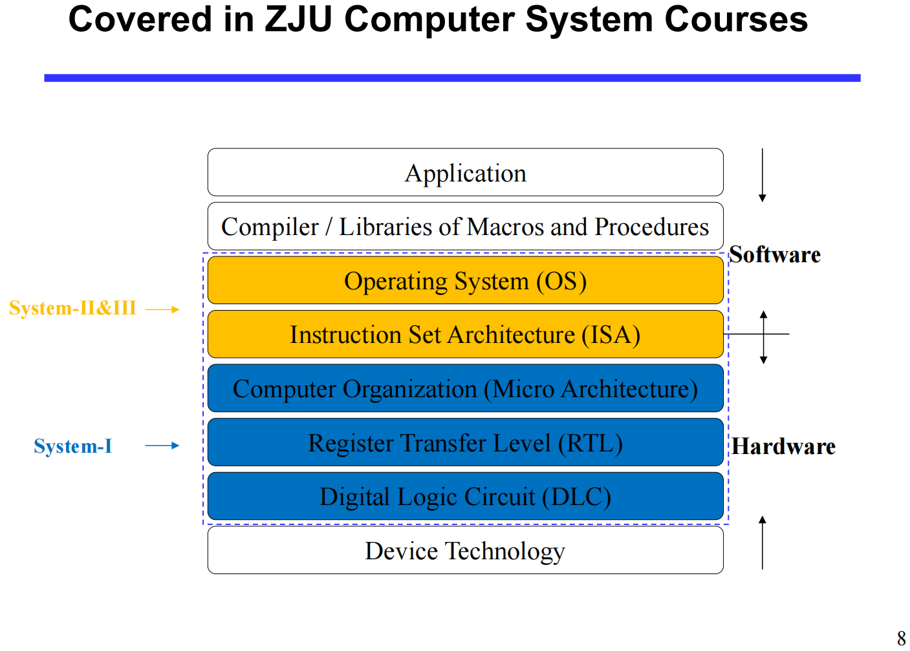
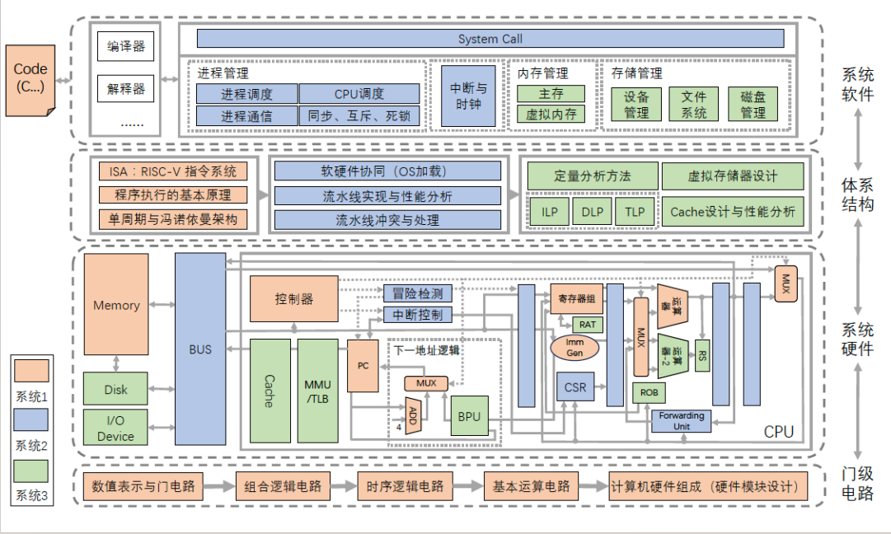
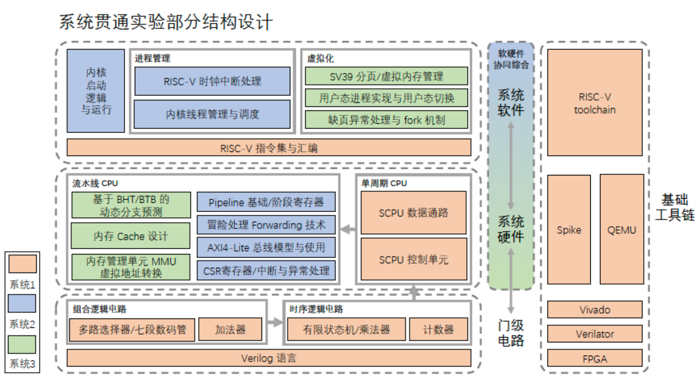
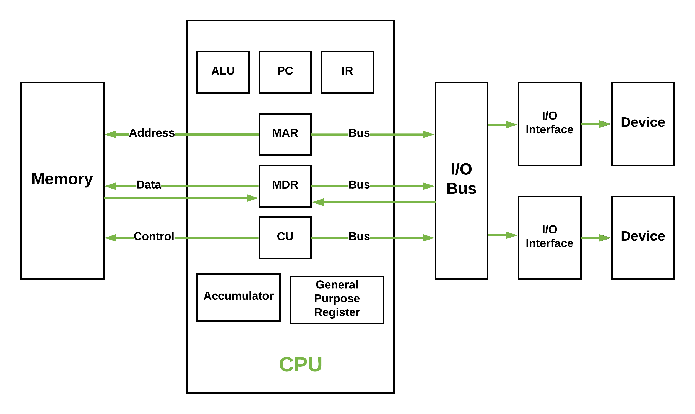

CS-I 是我个人对 **计算机系统 I (Computer System I)** 的缩写，而这里是计算机系统贯通课程的一些课程笔记；由于最开始没能够构建起框架，所以笔记比较杂乱，还请将就着看吧。

## what we have learnt?

> come from lec 00.pdf
> 
>  

### Von-Neumann Model

## 基础工具链（toolchain）

- vivado
- verilator
- FPGA

- spike
- qemu

#### RISC-V 指令集&汇编

> [!TIP]
>
> risc-v 的一些细节确实需要看手册；当然，只关心课程涉及的内容，[鹤翔万里的笔记](https://note.tonycrane.cc/cs/pl/riscv/)是一个很棒的选择。

## lab
### lab 1

- 多路选择器
- 七段数码管
### lab 2

- 加法器
### lab 3

- 有限状态机
- 乘法器
### lab 4

- 计数器
### lab 5

... todo

---

## some verilog syntax from lab guide

-  [verilog & circuit](https://zju-sys.pages.zjusct.io/sys1/sys1-sp24/lab0-2-appendix/)

- [generate & integer](https://zju-sys.pages.zjusct.io/sys1/sys1-sp24/lab2-1-appendix/#generate)

- [localparam & parameter](https://zju-sys.pages.zjusct.io/sys1/sys1-sp24/lab2-1-appendix/#_1)

- [start-finish](https://zju-sys.pages.zjusct.io/sys1/sys1-sp24/lab3-3/#start-finish)

- [reg initial](https://zju-sys.pages.zjusct.io/sys1/sys1-sp24/lab3-1-appendix/#_5)

- [Trigger Signal in @always](https://zju-sys.pages.zjusct.io/sys1/sys1-sp24/lab3-1-appendix/#_8)

- [more @always](https://zju-sys.pages.zjusct.io/sys1/sys1-sp24/lab3-1-appendix/#always_1)

- [valid-ready](https://zju-sys.pages.zjusct.io/sys1/sys1-sp24/lab4-1/#valid-ready)

- [typedef & struct](https://zju-sys.pages.zjusct.io/sys1/sys1-sp24/lab4-1-appendix/#typedef)

- [package & queue & interface](https://zju-sys.pages.zjusct.io/sys1/sys1-sp24/lab4-1-appendix/#package)