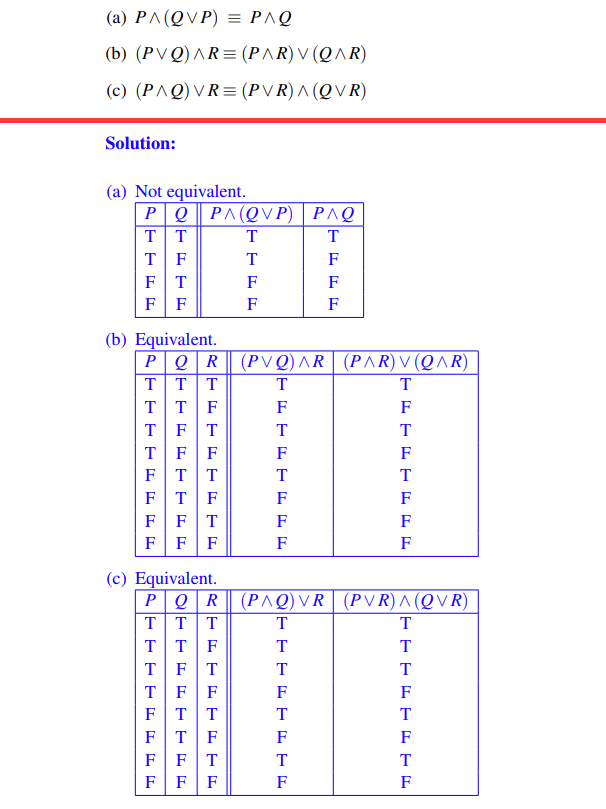
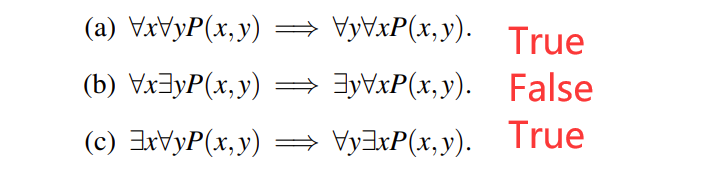

复习 PPT 补全笔记
## I Introduce
### I.1 truth tables

> Determine whether the following equivalences hold, by writing out truth tables.

Here are some examples:
  
 (we can also use **Boolean algebra** which is convenient)
### I.2 base notations

Our first building block is the notion of a **proposition**, which is simply a statement which is either true or false.
For example

What we should know:
1. **Conjunction**: P∧Q (“P and Q”). True only when both P and Q are true.
2. **Disjunction**: P∨Q (“P or Q”). True when at least one of P and Q is true.
3. **Negation**: ¬P (“not P”). True when P is false.
4. **Implication**: P ⇒ Q (“P implies Q”). This is the same as “If P, then Q.”**
 (Detailed reason omission)
 
 
5. **quantifiers**: The universal quantifier ∀ (“for all”) and the existential quantifier ∃ (“there exists”).

> We often write a proposition in the form of something like **(∀x ∈ Z)(∃y ∈ Z)(x < y)**

6. when we think of two kinds of writing as equivalent, we say something like
- ¬(P∧Q) ≡ (¬P∨ ¬Q)
- ¬(P∨Q) ≡ (¬P∧ ¬Q)
Of course, these two formulas should be remembered since they tell us how to negate conjunctions and disjunctions

7. about **P→Q**, the truth table is shown below:(`0` stands for **F** while `1` stands for **T**)

| P   | Q   | P→Q |
| --- | --- | --- |
| 0   | 0   | 1   |
| 0   | 1   | 1   |
| 1   | 0   | 0   |
| 1   | 1   | 1   |
8. about **P↔Q**, the truth table is shown below:(`0` stands for **F** while `1` stands for **T**)

| P   | Q   | P↔Q |
| --- | --- | --- |
| 0   | 0   | 1   |
| 0   | 1   | 0   |
| 1   | 0   | 0   |
| 1   | 1   | 1   |
### I.3 priority of operations

1. **括号 ()**：无论在哪个领域，括号始终具有最高的优先级，用于改变默认的优先级顺序。
2. **非 ~  !**：在逻辑运算中，否定（逻辑非、位非）通常具有较高的优先级。
3. **与 ∧**：这包括逻辑与（AND）、位与（&）。在没有括号改变顺序的情况下，它们通常在否定之后立即评估。
4. **异或 ⊕**：在某些情况下，需要考虑异或运算（XOR），它可能在与运算和或运算之间。
5. **或 ∨**：这包括逻辑或（OR）、位或（|）。它们在逻辑与之后进行评估。
6. **条件 →**：如蕴含（→）通常优先级较低。
7. **双条件↔**：双条件（↔）通常具有最低的优先级

### Must memorize formula

### logical implication
## II Practice

> We need a lot of insight into propositions rather than just grasping concepts

> For every real number k, there is a **unique** real solution to $x^{3}$ = k.
> (∀k ∈ R) (∃x ∈ R)(x 3 = k)∧(∀y,z ∈ R)(((y 3 = k)∧(z 3 = k)) ⇒ (y = z)) .

