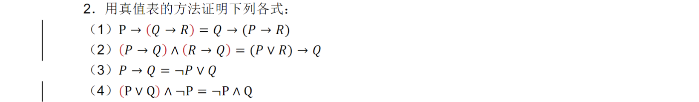
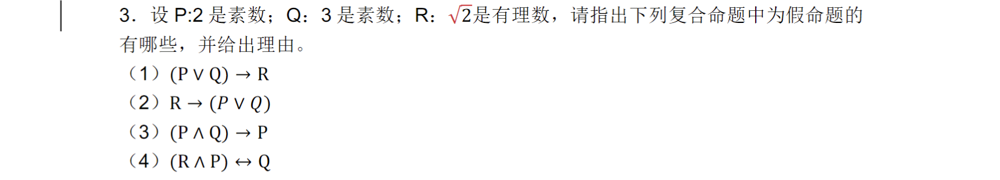

(1)
- P 表示明天晴到多云。
- Q 表示西北风四级。 
- 这个句子可以表示为 P∧Q。
(2)
- R 表示共产党存在。
- S 表示新中国存在。 
- 这个句子可以表示为 R→S。
(3)
记 P(x)当且仅当 x 是素数时为真
这个句子可以表示为 ¬ ( ¬ ( P(2)∧P(4)))

---

 依次如下所示，由真值表知均成立
(1)P→(Q→R)=Q→(P→R)

| P   | Q   | R   | Q→R | P→(Q→R) | P→R | Q→(P→R) |
| --- | --- | --- | --- | ------- | --- | ------- |
| T   | T   | T   | T   | T       | T   | T       |
| T   | T   | F   | F   | F       | F   | F       |
| T   | F   | T   | T   | T       | T   | T       |
| T   | F   | F   | T   | T       | F   | T       |
| F   | T   | T   | T   | T       | T   | T       |
| F   | T   | F   | F   | T       | F   | T       |
| F   | F   | T   | T   | T       | T   | T       |
| F   | F   | F   | T   | T       | T   | T       |

(2)(P→Q)∧(R→Q)=(P∨R)→Q

| P   | Q   | R   | P→Q | R→Q | (P→Q)∧(R→Q) | P∨R | (P∨R)→Q |
| --- | --- | --- | --- | ------ | --- | --- | --- |
| T   | T   | T   | T   | T      | T                      | T      | T              |
| T   | T   | F   | T   | T      | T                      | T      | T              |
| T   | F   | T   | F   | T      | F                      | T      | F              |
| T   | F   | F   | F   | T      | F                      | T      | F              |
| F   | T   | T   | T   | T      | T                      | T      | T              |
| F   | T   | F   | T   | T      | T                      | F      | T              |
| F   | F   | T   | T   | F      | F                      | T      | F              |
| F   | F   | F   | T   | T      | T                      | F      | T              |

(3)P→Q=¬P∨Q

| P   | Q   | P→Q | ¬P∨Q |
| --- | --- | ------ | -------- |
| T   | T   | T      | T        |
| T   | F   | F      | F        |
| F   | T   | T      | T        |
| F   | F   | T      | T        |

(4)(P∨Q)∧¬P=¬P∧Q

|P|Q|P∨Q|¬P|(P∨Q)∧¬P|¬P∧Q|
|---|---|---|---|---|---|
|T|T|T|F|F|F|
|T|F|T|F|F|F|
|F|T|T|T|T|T|
|F|F|F|T|F|F|

---

不难得知：P Q 为真命题；R 为假命题，那么：
（1）假命题，由 P∨Q 为真、R 为假得（1）为假
（4）假命题，由 R∧P 为假、Q 为真得（4）为假

---

1. ¬(P∨¬Q)

|P|Q|¬Q|P∨¬Q|¬(¬(P∨¬Q)|
|---|---|---|---|---|
|T|T|F|T|F|
|T|F|T|T|F|
|F|T|F|F|T|
|F|F|T|T|F|

成真赋值：当 P 为假， Q 为真时
成假赋值：当 P 为真， Q 为假时

2. P∧(Q∨R)

| P   | Q   | R   | Q∨R | P∧(Q∨R) |
| --- | --- | --- | ------ | -------------- |
| T   | T   | T   | T      | T              |
| T   | T   | F   | T      | T              |
| T   | F   | T   | T      | T              |
| T   | F   | F   | F      | F              |
| F   | T   | T   | T      | F              |
| F   | T   | F   | T      | F              |
| F   | F   | T   | T      | F              |
| F   | F   | F   | F      | F              |

成真赋值：当 P 为真且 Q 或 R 之一为真时
成假赋值：当 P 为假或 Q 和 R 均为假时

3. ¬(P∨Q)↔(¬P∧¬Q)

|P|Q|P∨Q|¬(P∨Q)|¬P|¬Q|¬P∧¬Q|¬(P∨Q)↔(¬P∧¬Q)|
|---|---|---|---|---|---|---|---|
|T|T|T|F|F|F|F|T|
|T|F|T|F|F|T|F|T|
|F|T|T|F|T|F|F|T|
|F|F|F|T|T|T|T|T|

所有的赋值都是成真赋值