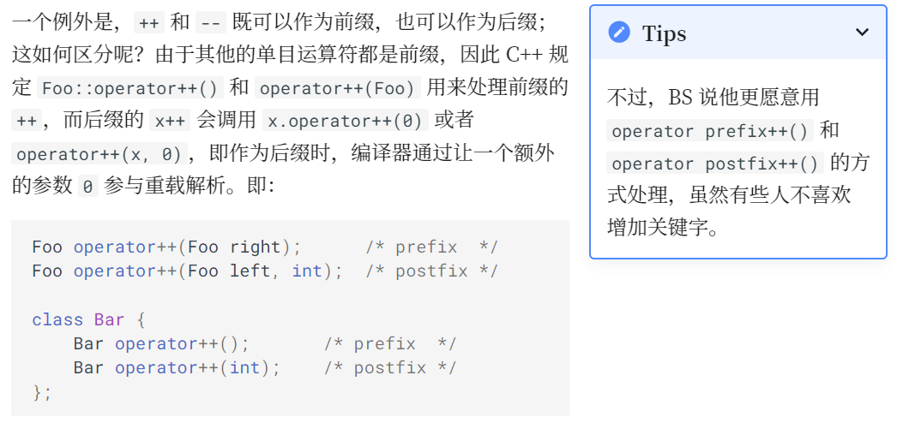
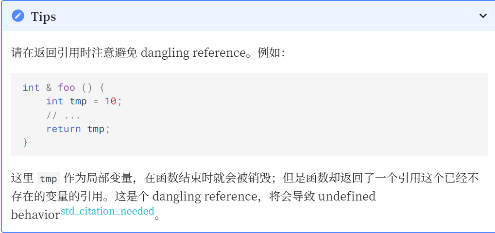

# Class(II)

## I 拷贝赋值运算符

在类中，如果其中有指针形成员，并且进行了赋值操作如下：

    class Container {
        elem* val;
        // ...
    }c1, c2;
    c1 = c2;

由先前的知识我们知道那么c1.val == c2.val，导致了一个问题：当我们释放c2.val时，c1.val同时也被释放了，那么析构函数就不知道该怎么办了

为了解决这个问题，C with Classes 开始就允许用户 **重载赋值运算符** 。实现的方法是，在类内声明一个称为 `operator=` 的成员函数（注意，这就是一个函数的名称！）
```C++
  class Container {
        elem* val;
        unsigned size = 0, capa;
        // ...
    public:
        Container(unsigned capa) : val(new elem[capa]), capa(capa){}
        ~Container() { delete[] val; }

        void operator=(Container from) {
            if (from->val != val) { // 判断二者原本是否指向同一内存
                if (from->capa != capa) { // 判断是否有必要重开一块内存
                    delete[] val;
                    val = new elem[from->capa];
                }
                for (unsigned i = 0; i < from->size; i++) {
                    val[i] = from->val[i];
                }
                size = from->size;
                capa = from->capa;
            }
        }
    };
```
  

作为函数，`operator=` 同样有重载解析；在一个有运算符的表达式中，如果 **至少一个操作符是某个类的对象** ，则由重载解析查找对应的函数。
例如`x = y;`就会被视为`x.operator=(y);`进行查找（注意，这是函数调用）[`test-09.cpp`](test/test-09.cpp)
与之前的讨论类似，如果用户没显式地给出`operator=`，那么编译器会生成一个 public 的默认拷贝赋值运算符的声明；如果它被使用，则编译器生成它的定义；<u>它完成的内容即为将各个成员变量用它们的 operator= 拷贝一遍</u>

或者这么说：

- 如果有 Container 的实例c1、c2，那么`c1=c2;`等同于`c1.operator=(c2);`，调用编译器自动生成的类似于上述的`void operator=(Container from){}`函数
- 如果有 Container 的实例 c 和一个 elem * 类型的 ptr，那么 c = ptr; 是合法的，因为它实际上会被解释为 c.operator=(ptr);
- [test-10.cpp](test/test-10.cpp) 

用户也可以将 `operator=` 设置为 **= default** ; 或者 **= delete**;
同样的，如果 `operator=` 是 **private** 或者 **delete** ，那么调用就是非法的

## II 运算符重载

C++ 允许用户重载大多数的运算符从而提高代码的简洁性和可维护性

考虑一个存放 M * M 大小矩阵的类 Matrix：

```c++
const int M = 100;
    class Matrix {
        int data[M][M];
        // ...
    };
```
  
那么我们希望这个矩阵能够完成矩阵的一些运算，例如加法，数乘，乘法……
那么你想，赋值的是`operator=`
`operator+`、`operator*`能不能是个东西(X)？还真是！

据我们之前处理 `operator=` 的经历，我们容易写出如下的代码：

```c++
    #include <iostream>
    using namespace std;

    const int M = 100;
    class Matrix {
        int data[M][M];
    public:
        Matrix operator+(Matrix mat) { cout<< "func 1" << endl; return *this;}
        Matrix operator*(int x) {cout<< "func 2" << endl; return *this;}
        Matrix operator*(Matrix mat) {cout<< "func 3" << endl; return *this;}
    };
    Matrix operator*(int x, Matrix mat) {cout<< "func 1" << endl; return mat;}
```

此时，如果我们写 m1 * m2，其实就等价于 m1.operator*(m2)，就调用我们写的重载了

这样的实现方式确实能够实现上述操作，但是它限制了我们只能写出 Matrix * int 而不能写出 int * Matrix，因为后者被解释为 int::operator*(Matrix)，但是 int 中并没有这样的重载（C++ 也不希望支持给内部类型增加新的运算）

如何解决这个问题呢？事实上，注意到运算符重载也可以 **放在全局** ，那么当 `x * y;` 的操作数中有类实例时，则重载解析会尝试将它解释为 x.operator*(y) 和 operator*(x, y)，即 x 对应类中的成员 operator* 和全局的 operator* 都会被纳入候选函数集，然后再根据实际的参数列表完成重载解析：[`test-11.cpp`](test/test-11.cpp)

问题来了，放在全局的运算符重载如何访问class下的private的data?

### II.1 友元

C++ 允许一个类的定义中给一个外部的函数「授予」访问其 private 成员的权限，方式是将对应的函数在该类的定义中将对应的函数声明为一个 友元 (friend)：

```c++
    const int M = 100;
    class Matrix {
        int data[M][M];
    public:
        Matrix operator+(Matrix mat) { /* */ }
        Matrix operator*(int x) { /* */ }
        Matrix operator*(Matrix mat) { /* */ }
        friend Matrix operator*(int x, Matrix mat); // Designates a function as friend of this class
    };
    Matrix operator*(int x, Matrix mat) {
        Matrix tmp = mat;   // copy mat
        for (int i = 0; i < M; i++)
            for (int j = 0; j < M; j++)
                tmp.data[i][j] *= x; / / can access private member Matrix::data
        return tmp;
    }
```

问题解决

>  友元只是一种权限授予的声明，友元函数并非类的成员。因此它并不受 access-specifier 的影响

当然，不想用友元怎么办？函数嵌套！

```c++
const int M = 100;
    class Matrix {
        int data[M][M];
    public:
        Matrix operator+(Matrix mat) { /* */ }
        Matrix operator*(int x) { /* */ }
        Matrix operator*(Matrix mat) { /* */ }
    };
    Matrix operator*(int x, Matrix mat) {
        return mat * x;
    }
```
    
是不是很妙？全局函数不能调用private部分，但能调用类本身public部分的函数

**其他大多数运算符也能重载！** 

对于一元运算符（如作为正负号的 +, -，以及 !, ~, ++, -- 等）

- @x 会调用 x.operator@() 或者 operator@(x)

- -x 会调用 x.operator-() 或者 operator-(x)



其他的一些限制（跳转[学长的讲解](https://xuan-insr.github.io/cpp/cpp_restart/5_class_2/#-%E5%BC%95%E7%94%A8:~:text=operator%2B%2B(int)%3B%20%20%20%20%2F*%20postfix%20*%2F%0A%7D%3B-,%E4%B8%80%E4%BA%9B%E9%99%90%E5%88%B6,-%E8%BF%99%E4%BA%9B%E8%BF%90%E7%AE%97%E7%AC%A6)）

## III 引用 (reference)

### III.1 引用的引入

容易发现，这个类的对象占据的内存是非常大的，因此我们将对象作为参数传递时会有很大的开销。
我们在 C 语言中学习过，可以通过传递指针的方式来减少不必要的拷贝。例如有函数 int getSum(Matrix mat); 就可以改为 int getSum(Matrix * mat);，调用时通过 getSum(&m)，就可以只传递指针而不必拷贝整个对象了。
但是，对于上面的 Matrix::operator-(Matrix);，我们如何解决这个问题呢？C++ 并不希望要求程序员在这种情况下将 m1 - m2 改为 &m1 - &m2 去写。一方面是不自然，另一方面是指针相减在语言中已有定义。于是乎引入了 **引用 reference** 

一个引用是一个已经存在的对象或者函数的 **别名(alias)** 。例如：

    int x = 2;
    int & y = x;    // y is an alias for x
    
这样，对 y 的所有操作都和对 x 的操作一样了；y 不是 x 的指针，也不是 x 的副本，而**是x本身**（包括获取它的地址——&y 和 &x 的值相同）

也是因此，我们无法重新约束一个引用所绑定的变量。因为：

    int z = 3;
    y = z;
上面的 y = z 实际上是给 x 赋值为 z，而非将 y 重新绑定到 z

还可以看看[`test-12.cpp`](test/test-12.cpp)

### III.2 引用作为参数

显然，在同一个作用域内，给一个变量起一个别名并不会有太多的现实意义。引用最广泛的用法是作为参数传递：

    void swap(int& i, int& j) {
        int tmp = i;
        i = j;
        j = tmp;
    }
    int main() {
        int x, y;
        // ...
        swap(x,y);
        // ...
    }

我们知道，C 和 C++ 的函数参数传递都默认是按值传递 (pass-by-value) 的，而引用机制使得 C++ 中可以实现类似上面的按引用传递 (pass-by-reference)。在调用 swap 之后，i 成为了 x 的别名，<u>对 i 做的一切操作事实上就是作用于 x 了</u>

这样，我们就能简易地解决[前面的问题](#引用的引入)了：我们只需要让 Matrix 传递时传递引用即可

    const int M = 100;
    class Matrix {
        int data[M][M];
    public:
        Matrix operator-(const Matrix & mat) {
            Matrix res;
            for (int i = 0; i < M; i++)
                for (int j = 0; j < M; j++)
                    res.data[i][j] = data[i][j] - mat.data[i][j];
            return res;
        }
    };

> 我们这里使用了 const Matrix & 而不只是 Matrix &，从而说明 mat 是只读而不可修改的。虽然后者也能实现我们需要的效果，但是这样能够保证函数中只会读取 mat 的值，而不会意外修改它。
>就像我们可以用一个 const int * 保存一个 int 的地址一样，这种「给出更强保证」的隐式类型转换对于引用也显然是合法的。即，如果有一个 int，我们可以给它一个类型为 int & 或者 const int & 的别名：

下面是关于`const`在引用中的使用

    void foo() {
        int x = 1;
        const int y = 2;

        int & rx1 = x;  // OK
        rx1 = 3;        // OK, now x is 3

        const int & rx2 = x;    // OK
        rx2 = 4;        // Error: assignment of read-only reference 'rx2'

        int & ry1 = y;  // Error: binding reference of type 'int' to value of type
                        // 'const int' drops 'const' qualifier
        const int & ry2 = y;    // OK
    }
相信不难发现规律：**只能加限制const，不能去限制**

### III.3 引用作为返回值

引用也可以作为函数的返回值。看下面的例子：

    class Container {
        elem* val;
        unsigned size = 0, capa;
        // ...
    public:
        elem & operator[](unsigned index) {
            return val[index];// 这个函数返回了val[index]这一变量的引用
        }
        // ...
    };
这样，如果有一个 Container 对象 c，我们就可以通过 c[i] 的方式访问容器中的值，如读取：x = c[i] 或者写入：c[i] = x
> 由于其返回的是一个引用，我们可以通过这个引用来修改其值。这使得我们不再需要写 c.getVal()[i] = x 之类的丑陋代码（getVal()[i]表示我们本可能需要使用函数来访问到那个变量）



> 关于自定义矩阵的 `operator[]`的进阶用法，在[xyx学长的讲解](https://xuan-insr.github.io/cpp/cpp_restart/5_class_2/#%E5%BC%95%E7%94%A8%E4%BD%9C%E4%B8%BA%E8%BF%94%E5%9B%9E%E5%80%BC:~:text=%E5%AF%BC%E8%87%B4%20undefined%20behaviorstd_citation_needed%E3%80%82-,%E5%85%B3%E4%BA%8E%E8%87%AA%E5%AE%9A%E4%B9%89%E7%9F%A9%E9%98%B5%E7%9A%84%20operator%5B%5D,-%E5%81%87%E5%A6%82%E6%88%91%E4%BB%AC%E6%9C%89)中也做了较为详细的讲解

### III.4 引用类似于包装了的指针

#### III.4.1 const与指针

> 对于`const`，我们可以大致这样区分`const int *, int const *, int * const, const int * const`
> 若用`a`表示变量，`pa`表示指向a的指针
> - `const`在`*`前，表示`a`不可修改，`pa`可
> - `const`在`*`后，表示`pa`不可修改，`a`可
> - `const int * const`自然就是两个都不可修改

#### III.4.2 const与引用

自然地，const & const 是不存在的，因为引用本身不能被重新约束
结合上面的讨论，我们容易理解：引用变量必须被初始化

    int & bad; // error: declaration of reference variable 'r' requires an initializer
而且，引用应当被初始化为一个有效的对象或函数的引用

    int * p = nullptr;
    int & r = *p;   // Undefined Behavior
> 没有对引用的引用、没有引用的数组，也没有指向引用的指针

### III.5 引用和临时对象

#### III.5.1 临时对象の引入

我们如果写了这样一个表达式：

    m1 - m2;
它会调用 `Matrix::operator-` 并返回一个 Matrix 类型的值。问题是：这个对象会在什么时候被析构？

答案很简单——在这个表达式结束之后立刻被析构。这么做的原因是直观的：我们此后再也无法访问到这个对象，因为它是一个没有名字的**临时对象 (temporary object)**。

#### III.5.2 临时对象生命周期

临时对象会在它所在的 完整表达式 (full-expression) 结束时被销毁
> 所谓完整表达式结束时，大多数情况下就是下一个`;`所在的位置（可以理解为临时对象只在该语句发挥作用）

那如果我们写了这个一个表达式：

    Matrix m = m1 - m2;
m1 - m2 得到一个临时对象，这个临时对象会在所在表达式结束时被销毁。而在这个语句中，我们又用这个临时对象构造了一个新的 Matrix 对象 m。
这有些浪费——我们析构了一个对象，同时构造了一个跟它一模一样的对象；如果我们能够延长这个临时对象的生命周期，就可以节约一次构造和一次析构的开销。

因此，C++ 规定：可以将一个临时对象绑定给一个**const &**，这个临时对象的生命周期被延长以匹配这个 const 引用的生命周期

可以看看[`test-13.cpp`](test/test-13.cpp)

#### III.5.3 临时对象与 non-const 引用

我们能否将一个临时对象绑定给一个 non-const 引用呢？答案是不能
我们考虑这样一个情形：

```c++
void incr(int & rr) { rr++; }
    void g() {
        double ss = 1;
        incr(ss);       // error since Release 2.0
    }
```
    
  
如果我们允许临时对象绑定给一个 non-const 引用，那么上面的代码会发生这样的事情：ss 被隐式转换成一个 int 类型的临时对象，这个临时对象被传递给 incr 并在其中 ++ 变成 2；incr(ss); 结束后临时对象被销毁——这时 ss 的值仍然是 1.0 而不是 2.0，这与直觉不符。
因此，允许将一个临时对象绑定给一个 non-const 引用并没有太多的好处，但是会带来一些不慎修改了临时对象引发的错误，这些错误通常十分隐晦。
> BS 在 Release 2.0 的时候将它修复了——临时对象不允许被绑定给 non-const 引用。

### III.6 引用于重载解析

在Class(I)的function overloading中，我们提到：通过一定规则比较这些函数，只有**能够选出一个最适于匹配的函数**才能继续运行，否则编译错误
在引用中，我们如何定义比较的规则呢?

大致遵循以下几点：（以 int 类型为例，其他类型与此类似）[`test-14.cpp`](test/test-14.cpp)
- 将一个 int或者const int类型的变量传递给 int 类型的参数和int & / const int &类型的参数的优先级是一样的
- 如果有两个重载，它们在某一个参数上的唯一区别是 int & 和 const int &，那么优先级就是：无 const 找 int &，有 const 找 const int &

### III.7 类的引用成员和 const 成员

引用和 const 变量都需要在定义时给出初始化。
如果一个类中有引用或者 const 成员就像没有默认（无参）构造函数的子对象一样，必须由 member initializer list 或者 default member initializer 提供初始化。如：

```c++
    int global = 10;

    class Foo {
        const int x = 4;    // OK
        const int y;        // must be initialized by member initializer list
        int & rz = global;  // OK
        int & rw;           // must be initialized by member initializer list
    public:
        Foo(int m, int & n) : y(m), rw(n) {}  // OK
        Foo() : y(0), rw(global) {}           // OK
        Foo() : y(0) {}         // Error: uninitialized reference member in 'int&'
        Foo() : rw(global) {}   // Error: uninitialized const member in 'const int'
    };
```

> 学长还讲到了method chaining，不过看不太懂，放着先

## IV const和static

### IV.1 const成员函数

来看这么一段

    class Complex {
        // ...
    string toString() const;
        // ...
    };
其中，`string`是一个关键字 `toString()`是一个函数，我们暂且不管，来看const
声明为 const 的成员函数称为 **const 成员函数**，它保证不会修改 `*this` 的值；即<u>调用这个成员函数的对象不会被更改</u>

> 声明为 const 的成员函数中，this 的类型是 const Complex *；而如果没有声明为 const，则 this 的类型是 Complex *

如果没有这个保证，会出现什么问题呢？考虑这样的情形：

    struct Foo {
        string toString();
    };

    void bar(Foo & a, const Foo & b) {
        a.toString();   // OK
        b.toString();   // Error: 'this' argument to member function 'toString' has type 'const Foo', but function is not marked const
    }
我们要求 b 不能更改，但是函数 toString() 没有保证自己不会修改 `*this` 的值，因此调用这一函数是不安全的。

从语言实现的角度来说，我们取调用者 b 的指针，得到的是 `const Foo *`；但是 toString() 不是 const 成员函数，因此它的 this 是 `Foo *`；用 `const Foo *` 去初始化 `Foo * `会丢失 cv-qualifier，这是 C++ 不允许的，这样的调用不合法。

显然，在 const 成员函数中，试图调用其他非 const 成员函数，或者更改成员变量都是不合法的：

```c++
    struct Foo {
        int a;
        void foo();
        void bar() const {
            a++;    // cannot assign to non-static data member within const member function
            foo();  // 'this' argument to member function 'foo' has type 'const Foo', but function is not marked const
        }
    };
```

> 然而，让对象的一部分是可变的这种需求仍然是比较普遍的。为了满足这种需求，C++ 引入了一个关键字 mutable；用 mutable 声明的类成员，即使包含它的对象是 const 的也能够修改：
> 
>     struct Foo {
>         mutable int a;
>         void foo() const {
>             a = 2;  // OK
>         }
>     }
> 显然，mutable 成员不应声明为 const 的

>对于 **有无 const 能否构成重载** ，[C++ 加const能不能构成重载的几种情况](https://blog.csdn.net/qq_38408573/article/details/116061377)一文中谈及的比较详细，在此将结论概括一番
>
> - 值传递 不构成（这在test-14.cpp中也可以发现）
> 
> - 引用、指针、类成员函数 构成

我们回顾之前的对 operator[] 的重载。事实上，通常的设计会这样重载：

```c++
class Container {
        elem * data;
        // ...
    public:
              elem & operator[](unsigned index)       {     return data[index]; }
        const elem & operator[](unsigned index) const {     return data[index]; }
        // ...
    }
```
    
即，当调用者是 const Container 时，第二个重载会被使用，此时返回的是对第 index 个元素的 const 引用；而如果调用者是 Container 时，第一个重载会被使用，此时返回的是对第 index 元素的 non-const 引用

### IV.2 static

#### IV.2.1 static 成员变量

我们想给每个用户编号

```c++
int tot = 0;
    struct User {
        int id;
        User() : id(tot++) {}
    };
```
    
即，我们有一个全局变量 tot 用来表示当前的 id 分配到第几号了；当构建一个新的 User 实例时，用 tot 当前值来初始化其 id，然后 tot++。

显然这个 tot 逻辑上属于 User 这个类的一部分；但是我们不能把它当做一个普通的成员变量，因为这样的话每个对象都会有它的一个副本，而不是共用一个 tot；但是，放成全局变量的话又损失了封装性。怎么办呢？

C++ 规定，在类定义中，用 **static** 声明没有绑定到类的实例中的成员；例如：

```c++
struct User {
        static int tot;
        int id;
        User() : id(tot++) {}
    };
    int User::tot = 0;
```
    
这个 tot 虽然从全局移到了类内，但是它仍然具有 static 的生命周期。
它的生命周期仍然从它的定义 int User::tot = 0; 开始，到程序结束为止（由于它是类的成员，因此访问它的时候需要用 User::tot）

如我们刚才所说，static 成员不被绑定到类的实例中，也就是上面 User 类的每个实例里仍然只有 id 而没有 tot。不过，语法仍然允许用一个类的实例访问 static 成员，例如 user.tot。静态成员也受 access specifier 的影响。

> 注意：default member initializer 和 member initializer list 是针对 non-static 成员变量的，它们对于 static 成员变量不适用；也就是说，在类中的 static 成员变量 只是声明 class.static.data；也就是说，我们必须在类外给出其定义，才能让编译器知道在哪里构造这些成员

```c++
class Foo {
        static int a;
        static int b;
        //写在这里只是进行了声明而非定义，直接使用会报错
    };

    int Foo::a = 1;
    int Foo::b;//默认b的值初始化为0
```
    
> 作为一个例外，如果一个 const static 成员变量是整数类型，则可以在类内给出它的 default member initializerclass.static.data:

```c++
 struct Foo {
        const static int i = 1; // OK
    };

    int main() {
        cout << Foo::i << endl;
    }
    另外，自 C++17 起，static 成员变量可以声明为 inline；它可以在类定义中定义，并且可以指定初始化器：

    struct Foo {
        inline static int i = 1; // OK since C++17
    }
```
   
> 在这种情况下，C++ 要求程序员保证各个编译单元内的这个变量的初始值是同一个，因为链接器在这种情况下会把多个定义合并为一个定义
> 事实上，在现代的 C++ 中，inline 不再表示「请把这个东西内联」，而是表示「这个东西可以有多个定义；程序员负责保证这些定义是一致的，因此链接时可以把它们合并」

#### IV.2.2 static 成员函数

static 函数的动机和 static 变量一致，都是「属于类，但不需要和具体对象相关」的需求；在这两种情形下，类被简单地当做一种作用域来使用。

由于 static 成员函数不与任何对象关联，因此它在调用时<u>没有 this 指针</u>
我们可以使用 User::funcName() 来调用这个函数，当然也允许通过一个具体的对象调用这个函数；但是调用时不会有 this 指针。下方调用 non-static 成员函数 get() 的时候传入了 ff 的地址，而调用 getTot() 时并没有：

```c++
class User {
        int id;
    public:
        inline static int tot = 0;
        int get(){return 1;}
        static int getTot() { return tot; }
    };
    void f(User * ff){
        ff->get();
        ff->getTot();
    }
```
    
> static 成员函数不能设为 const。原因很简单：static 说明函数没有 this，而 const 说明函数的 this 是 const X *，这两个说明是互相矛盾的

## V 隐式类型转换(Implicit Conversion)

通俗地说，隐式转换就是自动的类型转换；而我们使用的`(数据类型)`转换则是主动的类型转换

### V.1 标准转换(Standard Conversion)

（学长说后面会更加详细地讲解，等补充了来给个链接）

### V.2 用户定义的转换(User-Defined Conversion)

我们重载了运算符，来实现两个复数之间的加法、减法和乘法。那么问题来了！将复数和实数混合运算是非常正常的事情，比如我们有：

```c++
void foo() {
        Complex c;
        double d;
        // ...
        Complex c2 = c + d; // Complex + double
        Complex c3 = d + c; // double + Complex
    }
```
    
为了解决这个问题，C++ 允许从类型 A 到类型 B 的隐式转换；也就是说，用户还可以自定义转换规则`user-defined conversion`

User-defined conversion 有两种：**转换构造函数(converting constructor)** 和 **用户定义的转换函数(user-defined conversion function)**

#### V.2.1 转换构造函数(Converting Constructor)

转换构造函数<u>不是一种特殊的构造函数，而是构造函数的一种性质</u>
> 简单来说，凡是没有 explicit 说明符的构造函数 都是 转换构造函数（explicit后面解释发）

如果我们有构造函数 `Complex::Complex(double r);`，这其实就提供了一种 隐式转换 的规则：double 类型的变量可以隐式转换成一个 Complex。也就是说：

```c++
void g(Complex z, double d) {
        Complex z1 = z + d;     // OK, calls operator+(z, Complex(d));
        Complex z2 = d + z;     // OK, calls operator+(Complex(d), z);
    }
```
    
即，编译器看到现在有一个 Complex 和一个 double 调用 operator+，但是没有找到精确匹配的函数；这时候编译器发现：有一个接收两个 Complex 的函数，而又有一个转换构造函数 Complex::Complex(double r); 允许我们把 double 隐式地转换为 Complex，所以编译器决定：先完成这个隐式转换，然后调用。<u>实际上调用的就是 operator+(z, Complex(d))</u> 了

##### V.2.1.1 将运算符重载设为成员还是全局？

有了这种隐式转换，我们意识到一个问题：如果 operator+ 是 Complex 的一个成员函数，那么上面代码中 z + d 仍然可以被当做 z.operator+(Complex(d)) 来调用，但是 d + z 就不能调用 d.operator+(z)，因为 double 类型中没有这样的函数。如我们之前所说，C++ 不希望给内部类型增加新的运算。

从这里我们可以知道：如果我们将一个运算符重载设为**全局函数**能够有更强的逻辑对称性（可以理解为两个操作数都是可能隐式转换的）而将其定义为**成员函数**则能够保证第一个操作数不发生转换。根据我们之前的讨论，转换得到的是一个临时对象；因此对于那些赋值运算符之类的要求<u>第一个操作数是一个实际存在的对象</u>的运算符，设为成员是比较好的。

作为一个好的例子：

```c++
class String {
        // ...
    public:
        // ...
        String& operator+=(const String &);
    };

    String operator+(const String &s1, const String &s2) { // 强逻辑对称性
        String sum = s1;
        sum += s2;
        return sum;
    }
```
    
> 作为一个回顾和提示，Complex operator+(Complex, Complex); 也可以定义为 Complex operator+(const Complex &, const Complex &);，但是不适合定义为 Complex operator+(Complex &, Complex &);，因为后者不能支持我们说的隐式转换

#### V.2.2 explicit

根据我们之前所说，假如我们有一个函数接收一个 const Container &，而我们不慎传进去了一个整数 1，则编译器会帮我们生成一个隐式转换 Container(1) 构造出了一个临时的 Container；又或者我们写出了 Container c = 1; 这样的语句，编译器把它解释为 Container c = Container(1); 即 Container c(1);。
这些隐式转换并非我们的本意，它们会给我们带来一些意料之外的情况，而且会让我们 debug 变得困难。

为了解决这个问题，C++ 引入了说明符 **explicit**。如果一个构造函数有 explicit，那么它就不是 converting constructor，不能用作隐式类型转换，而只能用作显式类型转换：

```c++
    class Foo {
    public:
        explicit Foo(int i) {}
    };

    class Bar {
    public:
        Bar(int i) {}
    };

    void foo(Foo f);
    void bar(Bar b);

    int main() {
        Foo f = Foo(1); // OK, explicit conversion
        Foo g = 1;      // Error: no valid conversion
        foo(1);         // Error: no valid conversion
        Bar b = Bar(1); // OK, explicit conversion
        Bar c = 1;      // OK, implicit conversion
        bar(1);         // OK, implicit conversion
    }
```

因此，如果不希望前述隐式转换的发生，请将构造函数（尤其是单个参数的构造函数）标记为 explicit。

##### V.2.2.1 隐式转换的限制

>隐式转换限于：首先按一定要求完成 0 次或若干次 standard conversion，然后完成 0 次或 1 次 user-defined conversion；如果完成了 user-defined conversion，还可以完成 0 次或若干次 standard conversion。
也就是说，隐式转换**不会触发两次** user-defined conversion。作为一个例子：

```c++
class Bar {
    public:
        Bar(int i) {}
    };

    class Foo {
    public:
        Foo(Bar b) {}
    };

    void foo(Foo f);

    int main() {
        foo(Bar(1));    // OK, foo(Foo(Bar(1))), only Foo(Bar) used
        foo(1);         // Error: no conversion from int to Foo
    } // 如果想要执行foo(1);大概就是foo(1)->foo(Bar(1))->foo(Foo(Bar(1)))，两次implicit，不被允许 
```
    
> 在 C++11 之前，只有单个参数且没有 explicit 的构造函数才是 converting constructor；但是自 C++11 开始引入了 braced-init-list 即 {}，有 0 个或多个参数且没有 explicit 的构造函数也是 converting constructor 了。参看[`test-15.cpp`](test/test-15.cpp)

#### V.2.3 用户定义的转换函数(User-defined Conversion Function)

前面的 conversion constructor 给定了从一个其他类型到当前类进行隐式或显式转换的方式。不过，有时我们可能也会希望能够将当前类转换为其他类型从而参与计算或者函数调用等。例如：

```c++
class Complex {
    // ...
    public:
        std::string to_string() const;
        double to_double() const;
        bool to_bool() const;
    };
```
    
实际上，C++ 提供了机制能够实现从一个类到其他类型的转换，这称为 user-defined conversion function。例如：

```c++
class Complex {
    // ...
    public:
        operator std::string() const;
        operator double() const;
        operator bool() const;
    };
```
    
事实上，当我们写 function-style cast bool(c)时，这是一个cast operator（强制操作运算符），因此 operator bool() 其实就是重载了 cast operator。
这种重载并不需要写出返回值类型，因为它的返回值类型就是它的 operator 名字，例子：[`test-16.cpp`](test/test-16.cpp)
上面的例子中也显示了 explicit 的意义，即当 opeator type() 为 explicit 时，这种转换只能用于显式转换而不能用于隐式转换，这和前面的转换构造函数是一致的。

##### V.2.3.1 Contextual conversions

在一些上下文中（包括 if, while, for 的条件、内置逻辑运算符 !, &&, || 的操作数、三元运算符 ?: 的第一个操作数等），类型 bool 是被希望的
此时，即使 operator bool 是 explicit 的也会被使用

## VI The End
