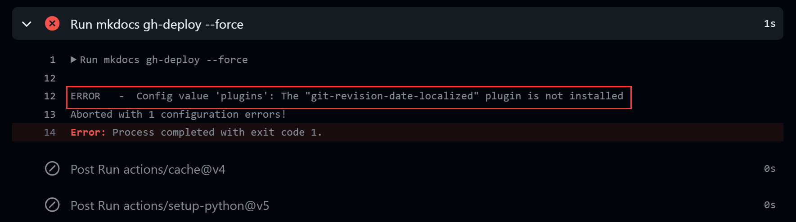

> A fall into the pit, a gain in the wit.
> 吃一堑，长一智

建站过程几多艰辛，有愚蠢的错误，有我认为官方文档有所不足之处……

我将尽可能地将所遇见的错误记录在这里以供参考。

当然，请先阅读官方文档，推荐配合 **沉浸式阅读** 浏览器插件食用

<!-- more -->

（我就是好几次理解错意思导致错误频频）

---

> 工作环境：
> 
> - WSL(ubuntu 22.04，请对基本 linux 命令有了解)
> - VScode (需要在 wsl 有安装，在 wsl 中使用命令 `code file_path` 打开你想用 vscode 打开的文件夹)
> - github(请对 repository/branch/workflow 有基本了解)
> - git(对git与github的关系应有一定了解)


> 知识条件：
>
> - Markdown 是什么？
> - HTML 是什么？
> - 什么是 `pip` ？

---


## Error 1

(这是很后面才出现的一个 bug, 但是很有必要放第一个)

ERROR - Config value 'plugins': The "xxx" plugin is not installed


**push** 到 github 后发现找不到插件`plugins`

其实是缺少一个 **requirements.txt**，我们可以在[这里](https://www.freecodecamp.org/news/python-requirementstxt-explained/)看见对于这个文件的作用介绍。

简单来说，我们可以通过执行
```bash
pip freeze > requirements.txt
```
来获取当前所使用的 python 依赖，写入到 requirements.txt 中去

注意，如果你想我第一次一样执行后出现这种情况

说明你把当前环境依赖全都搞进来了，这是我们建站所不需要的

因此，我们选择开辟虚拟环境来屏蔽不必要的依赖：
```bash
// 开辟环境
python -m venv venv
source venv/bin/activate
// 退出环境
deactivate
```
这也是为什么官方文档在开头就说明要开启虚拟环境，否则，你现在开，你会发现是空的，那你需要啥 requirements.txt 也不知道了

万一你真碰到这个问题才发现怎么办？重来（）

下面这个命令可以列出你所安装的插件的依赖项，基本可以拷贝过去就够用了
```shell
mkdocs get-deps
// Show required PyPI packages inferred from plugins in mkdocs.yml
```

或者找个你参考的人的仓库去拷贝一下 requirements.txt 呗，还真重开啊……
什么报错自己加什么，也是可以的

还是不行？别急，少了一句（我就漏了一次呜）
```bash
pip install -r requirements.txt
```
可别急着拷贝去 wsl 执行，错误的；我们需要明白为什么要 requirements.txt

**.txt** 文件我们很熟悉，存储字符串的，然后呢？没有了
他在建立网页什么的过程中只是提供一些字符串，那上面的语句什么意思？
把 requirements.txt 中的语句一个一个放到 `pip install` 后面执行

那为啥我让你别急着去 wsl 执行？先想想你的 requirements.txt 怎么来的？
就是获取了你当前环境有的依赖嘛，还装什么？
我们应该怎么做？

来看看我们建立 ci.yml 干了什么

不难发现，workflow 其实有运行 `pip install mkdocs-material` ，干什么？安装依赖啊
那为什么我们需要的没安装？你也妹写啊
现在明白了，加上图中那句话即可 🆗