***

> [!AI_SUMMARY]-
> 
> Git 是一款分布式版本控制系统，可以记录、管理和回溯文件的修改历史。
>
> - **Git 模型：** 工作区、暂存区、提交历史、仓库。
> - **基础操作：** 初始化仓库、查看状态、添加修改、删除文件、提交修改、查看历史、切换分支、合并分支。
> - **进阶操作：** 修改提交历史、使用远程版本库、子模块、Git 结构、项目合作。

<!-- more -->

在“计算机系统” 系列课程中，我们不可避免地使用到课程仓库，而期间频频发生的错误让我绝望（例如将写了一整天的 lab3 保存不当在 `git pull` 后全部丢失 QWQ），亦或是在修改后出现因未提交修改而不能够 `git pull` 等情况……故决定相对系统地学习一番

> 虽然放在 MIT 系列中，但是本文是学习 [鹤翔万里](https://note.tonycrane.cc/) 等学长学姐们根据 MIT 改编的更适合中国宝宝体质的 Git 教程的笔记，原文链接放在文末

> 如果中途出现了类似于下面这种界面（在 `git commit` 时）不要慌，看看 [nano](https://www.labno3.com/2021/04/15/guide-to-the-nano-text-editor/)
> 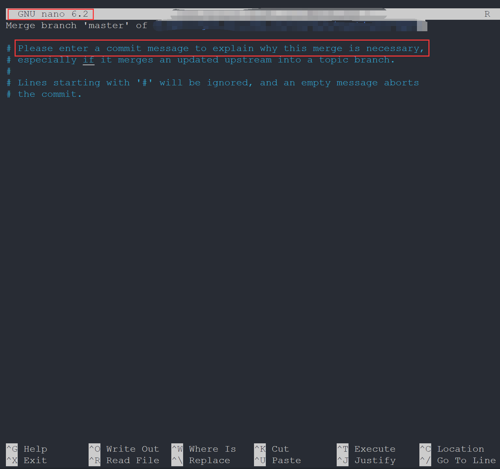

## 什么是 Git？

> [!INFO]
>
> 官网地址：[https://git-scm.com/](https://git-scm.com/)
> 
> 分布式版本控制系统（DVCS，Distributed Version Control System）
> 
> - 分布式：不需要联网，在自己的机器上就可以使用
>
>- 版本控制：记录、管理、回溯文件的修改历史 

### git 模型

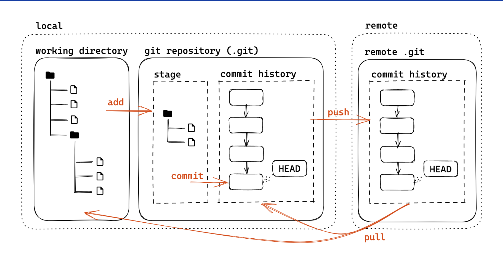

上图中，我们平时进行修改的部分正是工作区 **working directory** ，在我们完成修改后，我们一般使用 `git add --all` 来将我们的修改移入暂存区 **stage** ，之后 `git commit` 提交为 **commit history** （这代表着一次又一次的版本，也就是 VCS 的含义了），最后 `git push` 更新仓库。

## 基础操作

### git init

- git init：让当前文件夹变成 git 仓库（创建 .git 文件夹）
- git init _folder_：创建一个新的文件夹并初始化为 git 仓库

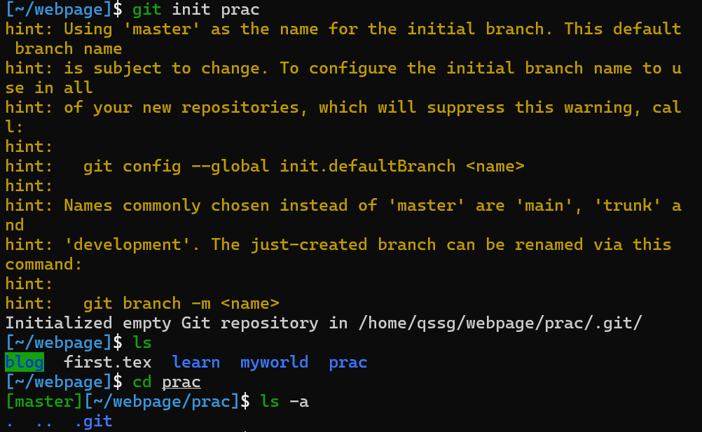

出现 **.git** 表示成功

### git staus

查看工作区&暂存区状态，我们在下面会大量使用到。

- 文件三个类别：未跟踪（Untracked，新建）、已追踪（Tracked，版本库中已经存在）、被忽略（Ignored）

对于 Ignored 部分可以看 [这里](https://slides.tonycrane.cc/PracticalSkillsTutorial/2023-spring-cs/lec2/#/2/2)

### git add

首先创建一个新文件用于测试

> [!TIP]
>
> 如果不理解如何创建可以转看 [1-0-linux shell](1-0-linux%20shell.md)

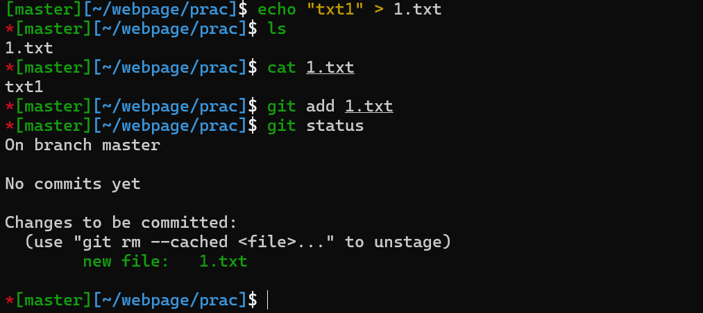

可以看见 **1.txt** 已经放入了 stage 中

> [!TIP]
>
> 一个个加自然是十分麻烦的，所以我们可以用 `git add .` 将当前路径下文件全部加入， `git add -a 或者是 --all` 就将所有修改都存入 stage 中啦

### git rm

我们都知道 `rm` 用于删除一个本地文件，而 `git rm` 则可以删除本地和版本库中的文件，`git rm --cached` 则用于删除暂存区中的文件

### git commit

直接 `git commit` 我们会发现进入了一个编辑器，比较麻烦，我们可以选择 `git commit -m "message"` 来进行提交，其中 message 中可以任意填写，但是为了以后看见能知道干了什么还是留有一定信息比较好。

> [!TIP]
>
> 关于 `git commit -m "message"` 中的 message，为了提高其记录修改的能力，我们最好是遵循一些规范(Angular)；当然，在 `""` 放入如此多信息太不雅观了，我们一般选择 `git commit` 后在其中添加
>
> 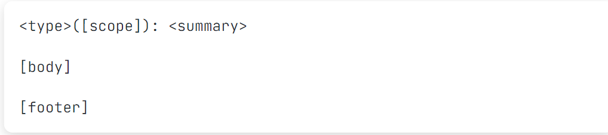
> 
> 更加详细的规范可见 [angular](https://github.com/angular/angular/blob/main/CONTRIBUTING.md)
> 
> - type：更改类型（fix/feat/docs/refactor/perf/test/ci/...）
>    - 重大更改可以写 BREAKING CHANGE 或 DEPRECATED（全大写）
> - scope：影响范围（可选，比如具体影响的模块等）
> - summary：更改的简要描述，英文一般现在时，首字母小写句末无句号
> - body：详细描述，可选
> - footer：解决 issue 了可以写 Fixes #_id_ 或 Closes #_id_

### git log

输入 `git log` 可以看到修改历史

> [!INFO]
>
> 这里我们进入了 vim 编辑模式，不熟悉没关系，我们以看为主，想要退出需要输入 `:q` 即可

  - --oneline：每一个提交一行
  - --graph：显示分支结构
  - --stat：显示文件删改信息
  - -p：显示详细的修改内容

可以看到在 **commit** 后面跟了一串 40 位的哈希值，是每个提交唯一的 **sha-1 标识符** ，我们可以用 `git show id` 来显示详细信息，在不引起歧义情况下前几位即可，例如输入 `git show 6b26` 

### git checkout && git branch

> 准备工作
>
> 我们先分两次提交修改 2.txt 文件
> 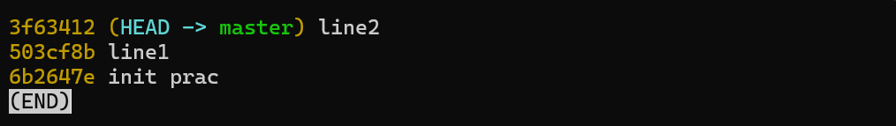

可以看见包括最开始的一次共有三次提交，我们只关注 line 1 line 2 即可

那么我们想要放弃第二次的修改，即删除 line 2 的 commit，（使用 `git rm --cached` 自然是一个好办法，但是想要放弃的修改很多该怎么办？ ）我们使用  `git checkout id` 来回到某次提交历史时的状态即可

可以看到我们的状态分支变为了 `503cf8b` （使用 `git status` 也能看到）

使用 `git checkout master` 切换回来，当然修改也又会回来

我们回到了 master，可以说丢失了 503cf8b  这一提交历史的修改。

> [!INFO]
>
> 什么是 HEAD：当前工作区在提交历史中的 **指针**

当然，我们可 `git checkout 503cf8b` 回去，但是一般人们不会记这一串感觉毫无意义的哈希值，再者请看：

他向我们发出提示，当前处于 "detached HEAD" state ，也就是说我们当前做的任何修改将不属于任何分支，当我们切换回 master 或者其他分支时，我们将会丢失这一修改（毕竟你明天八成不记得 503 cf 8 b 是什么鬼意思）

但是从最后一行我们可以看到，`HEAD is now at 503cf8b line1` 于是我们可以通过 `git checkout -b branch` 来在建立一个新的分支，其中 _branch_ 为新分支的名字

> [!NOTE]
>
> **分支**
> 
> - 创建分支
>     - git branch _name_：基于当前 HEAD
>     - git branch _name_ _id_：基于 _id_ 提交
> - 查看分支
>     - git branch（带 -a 显示远程分支）
>     - git show-branch 更详细
> - 切换分支
>     - git checkout _name_
>     - git checkout -b _name_：创建并切换
> - 内容比较
>     - git diff _branch1_ _branch2_：比较两个分支
>     - git diff _branch_：比较工作区和分支
>     - git diff：比较工作区和暂存区
> - 删除分支
>     -  git branch -d _branch_ 
>
>> 在两个分支上修改，在合并前二者互不干扰，有利于多人合作
>
> - 什么是分支名：和 HEAD 一样，也是一个指针（实际上叫引用 ref）
> - 可以基于 ref 使用 ~ 或 ^ 定位父提交
>     - ~ 表示第一个父提交，~2 表示第一个父提交的第一个父提交
>     - ^ 表示第一个父提交，^2 表示第二个父提交
> - 一个提交可能会有多个父提交（merge commit）
> 
> 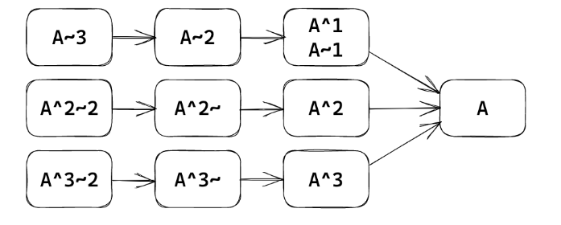
> 

### git merge

我们在想要保留的分支上键入 `git merge branch` 后可以将 branch 这一分支的修改内容合并到当前分支

> [!EXAMPLE]
>
> 键入 `git branch -a` 我们可以看到当前处于 change1 分支上（这一点我们以后不在赘述）
> 
> 
> 
> 接下来将 change 1 合并至 master 上
> 
> 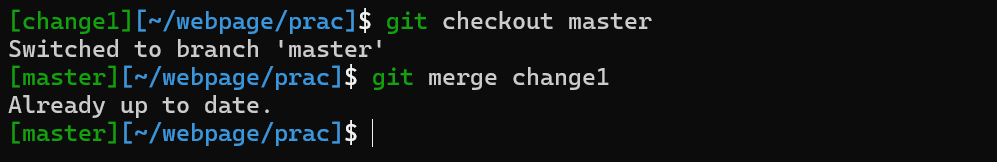
> 
> 可以看到返回了 `Already up to date.`

合并结果一般分为三种

??? 两种特殊 merge 方法

    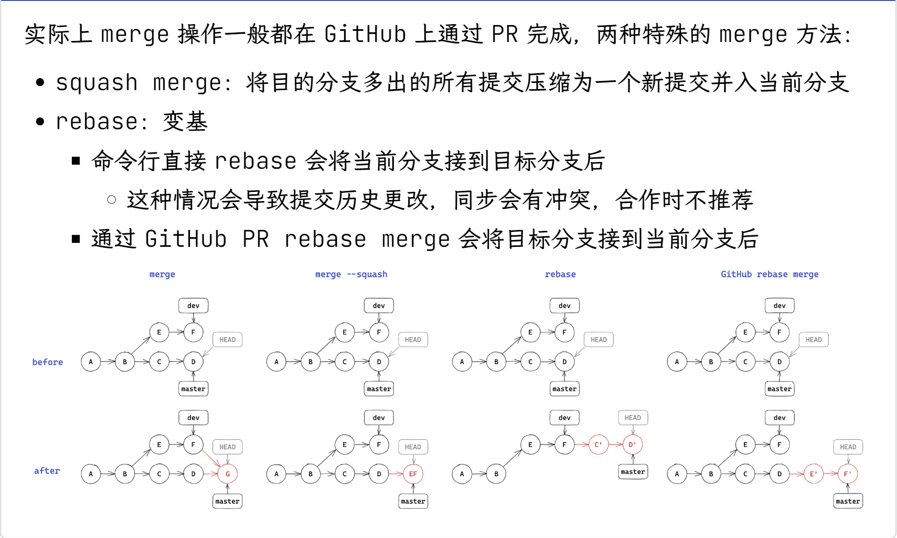

### git tag

git 使用 tag 来控制版本号，例如我们键入 `git tag v0.0.1` 后回车，啥都没有，但是再次 `git tag` 可以发现

`git show tag` 可以展示某版本的修改内容等

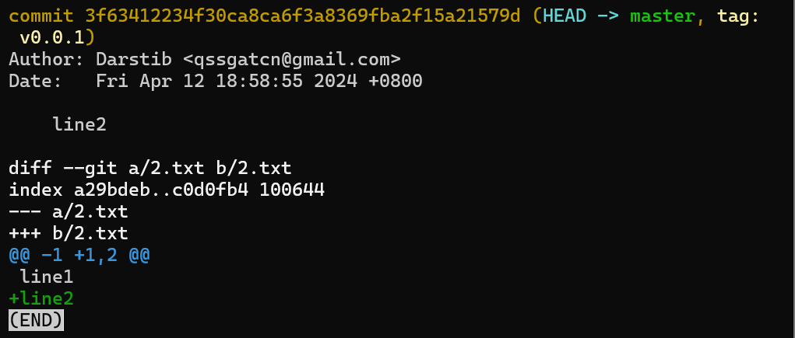

详尽的规则可查看 [语义化版本 2.0.0](https://semver.org/lang/zh-CN/)

## 进阶操作

### 修改提交历史

略，有兴趣可看看原文

### 远程版本库

> [!INFO]
>
> git 这类的 DVCS 通过使用一个“权威”的远程版本库 (remote repository) 来实现协作，但是远程版本库也是一个普通的 git 版本库。

#### git push

git push 会将本地的提交推送到远程版本库，但是无法直接 push 到远程版本库检出的分支中

当我们将远程版本库更换检出分支既可以了

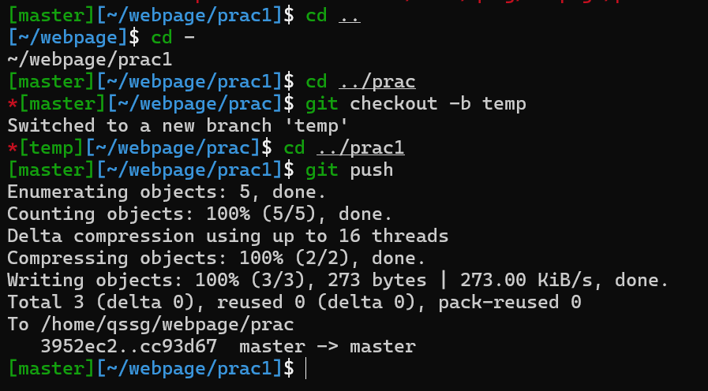

因此远程一般使用裸版本库（--bare）

可以看到主要是将 .git 文件夹中部分内容放过来了

#### git pull

git pull 会将远程版本库的提交拉取到本地，包含 git fetch 和 git merge 两个步骤

下面的图很好地演示了远程版本库的工作流

#### git remote set-url

一次 ssh 连接失败了，可以用下面的命令来更改远程仓库的 URL：

`git remote set-url origin https://github.com/username/repo.git`

### submodule

> [!QUESTION]
>
> 一个 git 版本库中包含另一个版本库会发生什么？
>
> git 会不允许正常 add/commit，警告这样 clone 时不会包含子版本库
>
> 

我们通过 **git submodule** 来解决

根据 hint ，键入 `git submodule add ./sub sub` ，但是发现报错 `fatal: 'sub' already exists in the index`，这需要我们把之前暂存区的内容先清空

看到多了一个 **.gitmodules** 文件，打开看看

再回头看 hint 第六行就明白了 path 和 url 的意思了

> [!INFO]
>
> 如果仓库托管在 GitHub 上，url 是对应链接，这样才能在克隆仓库时带上 submodule 

### Git 结构

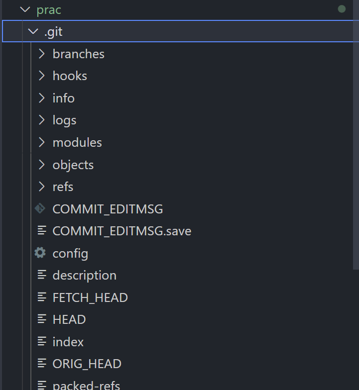

在 vscode 中我们可以很清楚看到这些文件（夹）

- .git/hooks：钩子脚本，可以在特定的操作时 **自动执行**
- info logs 存放信息、日志
- .git/objects：存储的所有东西都在这里❗️
    - 文件名是对象的 sha1，且头一个字节作为一层目录（加速文件系统）
    - 通过 git cat-file -p id 可以查看对象内容（-t 查看类型）
    - 三种对象类型：commit、 tree、 blob（Binary Large Object），图解如下
    -  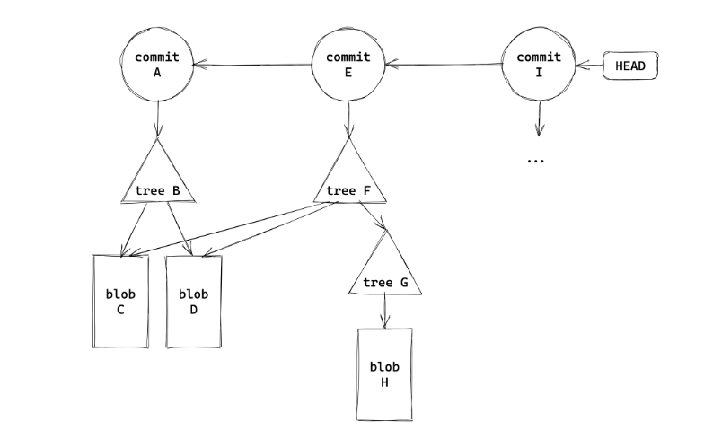

### 项目合作

一些内容略过

#### pull request(PR)

对于他人的 repo，你是没有办法直接 push 的，向其中添加代码更改都是通过 pull request 进行的，一般流程如下

[其他规范](https://slides.tonycrane.cc/PracticalSkillsTutorial/2023-spring-cs/lec2/#/4/4)

## 参考文档

 [鹤翔万里——实用技能拾遗漏](https://www.bilibili.com/video/BV1og4y1u7XU?spm_id_from=333.1245.0.0) 

 [配套slide](https://slides.tonycrane.cc/PracticalSkillsTutorial/2023-spring-cs/lec2/#/) 文中截图除命令行演示均来自其中，转载请注明原出处。

