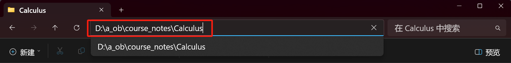

***

一个水平比较低的 python 入门指北。

<!-- more -->

## 参考自学资料

python 资料真是太多了，下面是我用过的。

- 如果有编程基础，或者学了一些些关于 python 的内容了，可以试试 [codechef](https://www.codechef.com/learn/course/python-beginner-v2-p1) 上的教程，好处在于步骤十分细致，配套了基础练习题和在线打分平台；虽然只有开始一小部分是免费的，但是足够让你理解到大多数的代码提交平台如何使用。
- 对于适应他人讲解的同学，适合视频教学，[B 站上黑马程序员](https://www.bilibili.com/video/BV1qW4y1a7fU?p=1&vd_source=0a037c4dd2becee04d2b1ccafdc1862e)的还可以；如果厌烦于“开场白”，可以 B 站找其他的，都大差不差吧，毕竟 python 其实非常普及了。
- 对于自学能力强，有耐心的同学，文本文档中[菜鸟教程](https://www.runoob.com/python3/python3-tutorial.html) 也不错；但是 IDE 推荐还是使用 vscode（因为以后往往不只是写 python，其他通用 IDE 也是不错的选择），安装使用自行搜索。
- 当然还有[官方教程中文版](https://docs.python.org/zh-cn/3/tutorial/index.html) ，官方原教程全英文的，估计没多少人开始就有耐心看。
- 在之后，遇见不会的应该更多查询[官方文档](https://docs.python.org/zh-cn/3/)了。
## 开始干题？

学了一些之后，个人觉得开始使用才是巩固和学会使用的最好办法；而最简单的考察代码水平的方式之一就是刷题。下面的题个人认为由简单到难：

- [codechef](https://www.codechef.com/learn/course/python-beginner-v2-p1)
    - 边教边学，适合没写过题的入门（部分免费，所以仅用于从没有写过题的人入门）
- [洛谷入门题单](https://www.luogu.com.cn/training/list)
    - 可以自己切换语言，适合没写过题的入门
    - 但是个人感觉测试评判不太友好，所以很早转了 LeetCode
- [LeetCode 算法通关指南](https://algo.itcharge.cn/)
    - 基于 python 的数据结构入门，配套 LeetCode 上的入门题
    - 懂了数据结构，才会更加明白算法是什么
- [LeetCode 略进阶指南](https://leetcode.cn/circle/discuss/WMD02i/view/cpLrhM/)
- 再后面，感觉该做什么应该有自己的理解了吧

> PS：LeetCode 上的题目基于对 Class 应当有所理解；不需要太多，只要明白，我们应该给出一个用于解决问题的 Class 即可；再不济，看几个题解也会明白的吧。
> 
> [LeetCode Night](https://chromewebstore.google.com/detail/leetcode-night/aaokgipfeeeciodnffigjfiafledhcii) 深色模式

---

> 对于下面描述的所有东西，如果有不明白的，我相信搜索引擎或者是 [GLM](https://chatglm.cn/main/alltoolsdetail) 等一定能够回答你。对于下划线中的内容，很可能就是需要你去查询。其中为了方便理解，可能会有所不严谨之处，敬请指出。
> 
> 建议使用 PC 端阅读，因为其中有不少超链接可能需要我们查看。
>
> 对于标注 **Useless** 的内容，不重要，只是更加深入地介绍。

## 编程初理解

什么是 python？

> [!DEFINITION ] 维基百科
>
> Python is [dynamically typed](https://en.wikipedia.org/wiki/Type_system#DYNAMIC "Type system") and [garbage-collected](https://en.wikipedia.org/wiki/Garbage_collection_(computer_science) "Garbage collection (computer science)"). It supports multiple [programming paradigms](https://en.wikipedia.org/wiki/Programming_paradigm "Programming paradigm"), including [structured](https://en.wikipedia.org/wiki/Structured_programming "Structured programming") (particularly [procedural](https://en.wikipedia.org/wiki/Procedural_programming "Procedural programming")), [object-oriented](https://en.wikipedia.org/wiki/Object-oriented_programming "Object-oriented programming") and [functional programming](https://en.wikipedia.org/wiki/Functional_programming "Functional programming"). It is often described as a "batteries included" language due to its comprehensive [standard library](https://en.wikipedia.org/wiki/Standard_library "Standard library").

看不懂？我也不完全能够理解里面的所有词（暂且只需要知道，它是一种 <u>编程语言</u> 即可），所以我们暂且抛开这些，直接看下面一些例子。


首先，我们看左侧，在 <u>IDE</u> （此处使用 <u>vscode</u> ）中写代码。在图中，我写了最为简单的 python 语句之一：

```python
print(1)
```

首先，前面是英文，后面是括号，你想到了什么？函数。在高中，你见过的函数是 `f(x)` `g(x)` 对吧，但是

- 函数多了，一个字母作为函数名就不够用了，也不具有 <u>可读性</u> 。所以我们往往把英文单词作为函数名；当然不止于此，具体需要自行了解。
- 其中的 `x` 是参数，称为  <u>参数</u> ；函数的参数不只有一个，这点在微积分/高等数学/离散数学等中都会涉及，具体自行了解。

这句话的意思很简单，调用 `print` 函数——打印，`1` 就是打印的内容。

> 什么是调用函数？
> 
> 举个例子，我问你 $\sin \frac{\pi}{2}$ 等于多少？你在回答之前就在脑中调用了 sin 这个函数，根据我的输入，你给出了输出，这就是调用了函数。

对于初学编程，需要明白一个道理：**给了什么输入，应该有怎样的输出；对于函数本身是怎么做到这样的？管他呢！** 学着学着我们就会知道自己该管的地方在哪；实际上 `print` 函数涉及到的地方太底层了，很难去写。

来看右侧右侧是 vscode 内置的 <u>终端</u> ，是实际 **执行程序** 的命令发出点；在命令执行后，执行结果为“输出 `1` ”。注意，输出的“内容”不是执行结果，“输出内容” 才是执行结果。

> [!useless]
>
> - 对于 `[main]` ，这是 zsh 的 git 工具，暂且不必理会。
> - 对于 `[~/code]`，这是  <u>WSL</u> 这一  <u>Linux 系统</u> 的  <u>文件路径</u>。
>    - 其实在 Windows 系统中的资源管理器也是有文件路径的
>    - 但是因为具有  <u>图形化界面</u> ，我们使用鼠标就能够完成这些任务，所以平时注意的比较少罢了
> - 看后面，我们输入命令 `python3 test.py` ，这里我们执行了一条基本的 [linux 命令](https://darstib.github.io/blog/2024/03/15/1-0-linux-shell/)，`python3` 可以看作我们调用了 **python3** 这个函数，其实是使用了我们提供的 <u>python compiler</u> （python 编译器）；`test.py` 是这个文件的名字，它作为函数参数。
> 
> - 那么终端中命令的语句就是让编译器去将我们写的文本代码编译成机器能够看懂的二进制语言，最后让电脑在终端打印出我们想看到的内容。