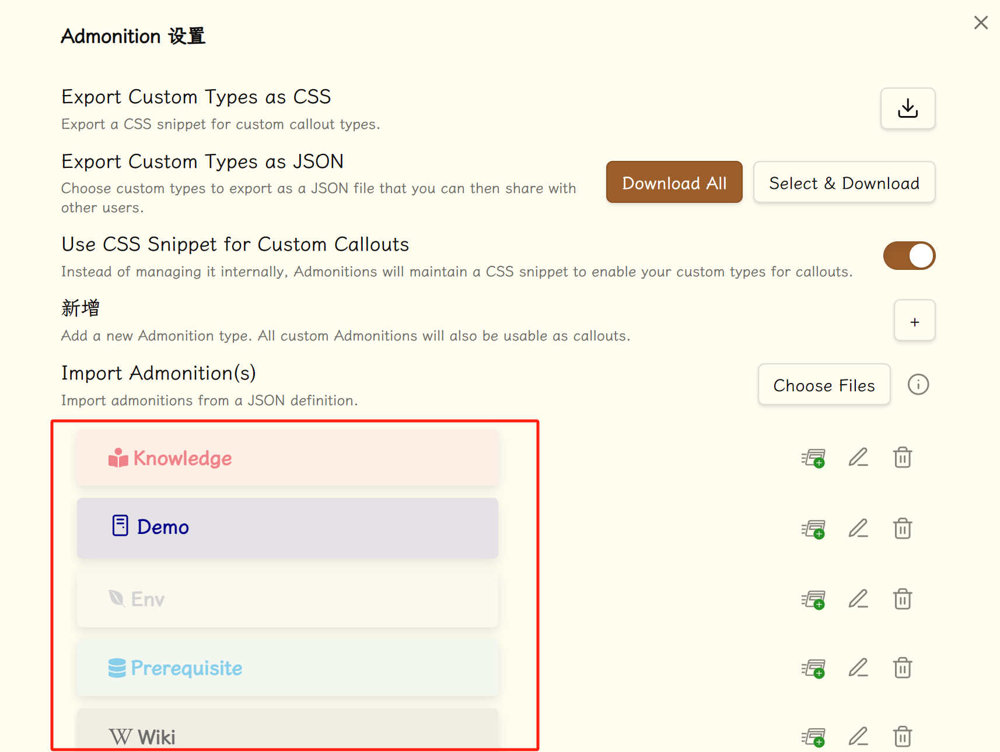

---

> 由于部分 obsidian 的格式在 mkdocs 上无法很好地显现出来，可以移步[这里](https://note-darstibs-projects.vercel.app/other/Obsidian_begin/)获得更好地阅读体验；挂在了 vercel 上，可能访问需要魔法。

## I 引言

这是我的第一篇笔记，基于 [Begin from here](https://publish.obsidian.md/help-zh/%E7%94%B1%E6%AD%A4%E5%BC%80%E5%A7%8B) 写就，下面是一些常用功能，结尾附带了个人使用的插件及简单介绍；

由于 Obsidian 是一个基于 Markdown 进行记录的知识库软件，因此掌握一定的 Markdown 语法是较为必要的，不妨看看 [Markdown官方教程](https://markdown.com.cn/)，学习一些基本的格式化手段和表格构建。

> 部分在 Mkdocs 上不能够实现，可以自己在 Obsidian 中查看效果。

<!-- more -->

- *倾斜*
- **加粗**
- ==高亮==
- ~~删除~~
- <u>下划线</u>

## II 链接

最让我惊喜的是这里显示文件并不考虑大小写、不讲究路径，它会在全库中按名字搜索（当然考虑到移植性，能加当加），也可在左下角 `设置>文件与链接` 中如下设置，这样拖进来的文件就会给出相对路径（当然也可以设置绝对路径，但是考虑到文件可能移动，相对路径往往是一个比较好的选择）


### II.1 内部链接

在 Markdown 中我们使用  `[]()`  来构成链接，而在 Obsidian 中我们可以使用 Wiki 链接，如下，也是在 `设置>文件与链接` 中


通过 `[[]]` 我们可以构造一个内部链接（即链接到库内部的文件的链接）

例如：输入两个 `[` ，**我们就可以在弹出的文件名中选择文件再敲击**`enter`即可

详细用法敲两个 `[` 在下方能看见，不再赘述

此外， `[[文件名#标题名]]` 可以将超链接指向具体段落

`[[文件名#标题|显示内容]]` 可以将显示出来的内容做出修改

> 但是仍建议使用标准 markdown 以提高移植性，而 `[[]]` 的快捷方式依旧适用，ob 会自动进行转换；后面的教程仍使用 `[[]]` 也无妨，等同于 `[]()`。

### II.2 外部链接

通过 `[文本](url)` 我们可以很容易地构建一个外部链接，例如我们上面已经见过的 [Markdown官方教程](https://markdown.com.cn/) 。

### II.3 反向链接

开启了 `核心插件-反向链接` 后，会默认在文章底部给出当前引用该文章的来源，你可以看看那里引用了这篇文章。

### II.4 嵌入文件

^id

#### II.4.1 图片&音频

可以将图片或者音频等附件嵌入到你的笔记中

嵌入文件的语法为 `![[文件名.文件扩展名]]`


拖动图片到笔记中时，图片会自动嵌入笔记，并且 Obsidian 会将图片文件复制到默认的附件文件夹中；配合 Paste image rename 插件，我们可以更加好的去整理图片附件。

一般的嵌入，使用 `![[image.png|100x100]]` 这样的语法可以控制大小

如果要根据图像的宽高比例进行缩放，请省略高度，如 `![[image.png|100]]`。

一个好用的插件是 **mousewheel image zoom** 让我们可以滚动鼠标滚轮放缩图片


#### II.4.2 PDF

可以通过相同的语法将 PDF 文件嵌入到笔记中

除此之外，可以通过 `![[My File.pdf#page=number]]` 这样的形式直接指定嵌入 PDF 文件的页码

#### II.4.3 嵌入笔记

`` 效果如下（Mkdocs 中无法展示，可以在 Obsidian 中自己尝试）：


#### II.4.4 链接笔记

[Obsidian URI](https://publish.obsidian.md/help-zh/%E9%AB%98%E7%BA%A7%E7%94%A8%E6%B3%95/%E4%BD%BF%E7%94%A8+obsidian+URI) 可以让你在其他应用或 Obsidian 的其他库中打开当前库的某篇笔记。

比如，你可以通过以下方式跳转到某个库中的某篇笔记（请注意 [URI 的编码](https://publish.obsidian.md/help-zh/%E6%89%A9%E5%B1%95+Obsidian/Obsidian+URI)）：

`[打开某篇笔记](obsidian://open?path=D:%2Fpath%2Fto%2Ffile.md)`

#### II.4.5 iframe

由于 Markdown 兼容 HTML，因此你可以使用“iframe”将网页嵌入到笔记中，效果如下

> [!ATTENTION]
>
> 我认为在 obsidian 中，更好的方法还是直接放超链接，并且按住 `Ctrl` 将鼠标放在链接上就能预览。

<iframe
	Border=0
	Frameborder=0
	Height=250
	Width=550  
	src="https:/darstib.github.io/myworld">
</iframe>

一些网站并不允许你直接嵌入它们的页面。比如，你就不能通过 YouTube 视频页面的 URL 来嵌入该页面。但是，这些网站一般都提供了用于嵌入的 URL，比如你可以通过 `https://www.youtube.com/embed/VIDEO_ID` 这样的专用 URL 来嵌入 YouTube 的视频页面。

如果你想嵌入一个网站，可以尝试在搜索引擎上 `{网页名} 嵌入 iframe` 等关键词，这样能帮助你更快速的嵌入某个网站。

比如，你可以利用搜索结果给出的代码快速插入 Twitter：

```html
<iframe
	border=0
	frameborder=0
	height=250
	width=550  
	src="https://twitframe.com/show?url=https%3A%2F%2Ftwitter.com%2Fjack%2Fstatus%2F20">
</iframe>
```

## III 创建表格

`Ctrl+T` 创建表格，`ctrl+方向键` 增加表格（这是自己设置的）其余慢慢探索

| Header1 | Header2 |
| ------- | ------- |
| Content | Content |

## IV 标签

加上标签无疑能使的我们寻找笔记更加方便

既可以随时随地 `#标签` （注意无空格）设立标签，又可以像本文一样在开头加上 **文档属性**

同时可以 `#tag/subtag` 的形式构建子标签，还是很方便的

由于我换掉了快捷键，只能 `ctrl+shift+p` 呼出面板后搜索放出标签列表了

## V 关系图谱

在笔记多了后文章之间相互链接形成的图谱，左侧类似于 `fork` 的图标既是，还可在右上方三点出打开与本文直接相关的局部图谱

## VI 任务列表

```md
- [x] 支持 #标签 ，[链接]()，**样式**
- [x] 要求包含列表标志（有序表无序表均可，比如 `1.[x]` 同样可以）
- [x] 这是一个已经完成的项目
- [?] 这也是一个已完成的项目（实际上你可以在其中使用任何字符）
- [ ] 这是一个未完成的项目
- [ ] 在预览模式下单击选框可以切换项目完成状态
```

- [x] 支持 [#tag](https://publish.obsidian.md/#%E6%A0%87%E7%AD%BE) ，[链接](https://publish.obsidian.md/#)，**样式**
- [x] 要求包含列表标志（有序表无序表均可，比如 `1.[x]` 同样可以）
- [x] 这是一个已经完成的项目
- [x] 这也是一个已完成的项目（实际上你可以在其中使用任何字符）
- [ ] 这是一个未完成的项目
- [ ] 在预览/阅读模式下单击选框可以切换项目完成状态

我发现有更加花哨的用法（最后两个我看符号猜测不出其含义）：

```
- [*] 这是一个较有意义的项目 
- [x] 这是一个已经完成的项目
- [/] 这是一个有待继续的项目
- [?] 这是一个存在问题的项目
- [!] 这是一个十分重要的项目
- ["] 这是一个有所受益的项目
- [-] 这是一个无关紧要的项目
- [<] 这是一个公事公办的项目
- [>] 这是一个休闲娱乐的项目
- [ ] 这是一个尚未开始的项目
```

- [*] 这是一个较有意义的项目 
- [x] 这是一个已经完成的项目
- [/] 这是一个有待继续的项目
- [?] 这是一个存在问题的项目
- [!] 这是一个十分重要的项目
- ["] 这是一个有所受益的项目
- [-] 这是一个无关紧要的项目
- [<] 这是一个公事公办的项目
- [>] 这是一个休闲娱乐的项目
- [ ] 这是一个尚未开始的项目

## VII 脚注

脚注的用法很简单，只需要在段落中需要插入脚注的地方标注一个符号，再在段落后对这个符号进行解释即可。比如这是一个简单的脚注，[^1] 这是一个长一些的脚注。[^长脚注]

[^1]: 脚注很有用！

[^长脚注]: 这是一个可以写长段落或者代码的地方。
		你可以使用缩进在脚注中纳入其他段落
		`{ 代码 }` 这样你就可以在脚注中添加任意数量的段落了。

## VIII 文件大纲（目录）

设置为 `ctrl+o` 打开本文大纲（outline），顺便也能看看标签

## IX 模板

首先我们在核心插件 `模板` 中可以看见我们模板的文件夹名（我设置为 `templates`）

接着在其中设立可能会常用的模板。

例如我创建博客模板：

```Markdown title="blog"
---
date: "{{date:YYYY-MM-DD}}"
tags:
- begin
---
***
<!-- more -->
```

那么当我写博客文章时，就可以点左边的 `模板` 引入，引入后就会将模板中的代码复制到此处。

## X 日记

点击左方的 `日记` ，选择模板，就可以开始记下日记了。

## XI 笔记重组

主要用途就是将笔记进行合并、部分移植等操作，具体看 [官方的教程](https://publish.obsidian.md/help-zh/%E6%8F%92%E4%BB%B6/%E7%AC%94%E8%AE%B0%E9%87%8D%E7%BB%84) 。

## XII PPT

> 不过当前版本似乎没有这些东西

<iframe
	Border=0
	Frameborder=0
	Height=250
	Width=550  
	src="https://publish.obsidian.md/help-zh/%E6%8F%92%E4%BB%B6/%E5%B9%BB%E7%81%AF%E7%89%87#:~:text=%E5%B9%BB%E7%81%AF%E7%89%87%E6%8F%92%E4%BB%B6%E8%83%BD%E8%AE%A9%E4%BD%A0%E9%80%9A%E8%BF%87%20obsidian%20%E5%81%9A%E4%B8%80%E4%BA%9B%E7%AE%80%E5%8D%95%E7%9A%84%E5%B9%BB%E7%81%AF%E7%89%87%E6%BC%94%E7%A4%BA">
</iframe>

## XIII 块链接与块引用

### XIII.1 块链接

链接某个笔记文件中的块，你首先需要输入 `[[文件名` 来唤起弹窗，在选择相应的文件后，通过输入 `^` 进入块选择界面。随后，你需要继续输入关键词来选择你所需要链接的块。

选择好了以后，按下回车键，对于该块的链接就创建好了。块链接会以 `[[filename#^dcf64c]]` 的形式出现，其中 `dcf64c` 则是你所链接的块的 ID。

如果你忘了想链接的块在哪个文件里，你可以通过输入 `[[^^` 在库的所有笔记文件中查找该块。由于这种查找方式涉及库中所有笔记文件，当你的库很大时，查找就需要花费一些时间。

比如，[点击这里](Obsidian_begin.md#^id) 可以链接到前文的段落。

### XIII.2 块引用

与[嵌入文件](https://publish.obsidian.md/help-zh/%E4%BD%BF%E7%94%A8%E6%8C%87%E5%8D%97/%E5%B5%8C%E5%85%A5%E6%96%87%E4%BB%B6)一样，你可以通过在块链接前加上 `!` 来进行块引用，即块的嵌入。

比如前面用的 ``。

一个块可以是一个段落、一个引用、一个列表等等。一般来说，前后有空行包围的东西就是块。

### XIII.3 手动创建块 ID

如果你想手动创建可读性强的块 ID，你可以在块的末尾手动加上 `^你的-id` 这样的语法。需要注意的是，对于一般的段落，手动创建的 ID 和块最后一个字符（即段落最后一个字符）间需要有一个或多个空格。

如果想为表格这样比较复杂的块手动创建 ID，你需要将手动创建的 ID 放置在该块之后，同时确保手动创建的块 ID 前后都是空行。

比如：

| header1 | header2 |
| ------- | ------- |
| 1       | 2       |

^table1


当你手动创建了块 ID 后再链接或引用该块时，Obsidian 会自动使用你手动创建的块 ID 而不是随机生成的块 ID。

需要注意的是，手动创建的块 ID 仅支持字母、数字、破折号。

## XIV LaTeX

我们使用 `$ $` 包裹数学公式来让其更加美观

例如，`$a^2 + b^2 =c^2$` 的效果就是

>  $a^2 + b^2 =c^2$  注意，空格会被忽略

下面我们将放置一些基本的 LaTeX 语法

### XIV.1 符号类

- `%` 表示注释，相信不难理解注释是什么意思
- `$` 包裹数学公式
- `^` 表示上标，类指数
- `_` 表示下标，类底数
- `{}` 用于将内容包裹，便式将公式一体化

    （例如，`$F_n = F_{n-1} + F_{n-2}$` 就是 $F_n = F_{n-1} + F_{n-2}$ 样的）

### XIV.2 命令

LaTeX 为了更好地输出键盘上所没有的符号（例如 α、β （此处使用微软输入法打出来的），就像我们使用的中文输入法一样给它们定义了一套命令

比方说，我们在 LaTeX 中只需用类似于 `\mu` 的命令即可输出 `μ` 这一符号并且可与上述的上下角标相兼容

在 [List_of_LaTeX_mathematical_symbols](https://oeis.org/wiki/List_of_LaTeX_mathematical_symbols) 中可以看到几乎详尽的命令，此处列出微积分中常用的符号；[这里](https://www.cmor-faculty.rice.edu/~heinken/latex/symbols.pdf) 是一个 PDF 版。

$$
-\alpha
-A
-\beta
-B
-\gamma
-\Gamma
-\delta
-\Delta
-\epsilon
-\varepsilon
-\zeta
-\eta
-\theta
-\vartheta
-\iota
-\kappa
-\Theta 
-\lambda
-\Lambda
-\mu
-\nu
-\xi
-\Xi
-\pi
-\Pi
-o
-O
-\rho
-\sigma
-\Sigma
-\tau
-\phi
-\varphi
-\Phi
-\chi
-\psi
-\Psi
-\omega
-\Omega
$$

$$
-\triangle
-\pm
-\mp
-\int  \, dx
-\sin
-\cos
-\arcsin
-\arccos
-\infty
-\to
-\lim_{ n \to \infty } 
-\int_{-\infty}^{\infty}  \, dx  \, dx 
-\ln
-\lg
-\log
$$

### XIV.3 （不）等式

如果我们想要输出大且复杂的（不）等式，我们可以借助`\begin{equation} & \end{equation}` 包裹，使之更为突出

这是行内公式  $x = \frac{-b \pm \sqrt{b^2 - 4 ac}} {2 a}$ （经验证明，在 obsidian 中 `$` 符号与数学公式紧贴，与周边文字空一格为佳）

这是行间公式

$$
x = \frac{-b \pm \sqrt{b^2 - 4ac}} {2a} 
$$

> [!ATTRENTION]
>
> 不同场合触发条件有所不同，例如在 obsidian 中我们可能需要用 `$$……$$` 将公式包裹而可以忽略 `\begin` 之类的
> 
> Caution: LATEX mostly ignores your spaces in mathematics, but it can’t handle blank lines in equations — **don’t put blank lines in your mathematics.**
>
> 我们需要特殊命令，见 14.5

### XIV.4 插件-latex suite

每次都手打命令自然也是挺累的，obsidian 中有这么一个插件可以帮助我们快速输出

例如：一个比较复杂的一阶线性非齐次方程的通解我们可以比较快的写出来

$$
y=e^{ -\int p(x) \, dx  }\left[ \int q(x)e^{ \int p(x) \, dx  } \, dx  \right]
$$

`LaTeX suite` 具体使用教程甚多，不加赘述（值得一提的是，这个插件本质是一个关键词替换，我们可以自定义更换的对象，甚至可以在数学公式之外使用）

### XIV.5 空格

直接敲空格会被自动忽略


## XV 标注 (Callouts)

### XV.1 基本使用

使用标注可以在不打乱笔记行文的情况下添加额外内容，将 `[!title]` 加入到引用开头。

一个简单的用法如下：

```markdown title="example"
> [!TIP] 小技巧
>
> 这里将介绍一些小技巧。
```

但是在 Mkdocs 中只有这样的效果：

> [!TIP] 小技巧
>
> 这里将介绍一些小技巧。

所以……当你在看我其它的笔记时，就当用这个来判断注释块的内容吧。

除了 `TIP` ，callout 还支持许多图标；

|    Type  |      Aliases                |
| :------: | :-------------------------: |
| note     | note, seealso               |
| abstract | abstract, summary, tldr     |
| info     | info, todo                  |
| tip      | tip, hint, important        |
| success  | success, check, done        |
| question | question, help, faq         |
| warning  | warning, caution, attention |
| failure  | failure, fail, missing      |
| danger   | danger, error               |
| bug      | bug                         |
| example  | example                     |
| quote    | quote, cite                 |

> 你可以在 [这里]([https://squidfunk.github.io/mkdocs-material/reference/admonitions/#supported-types](https://publish.obsidian.md/help-zh/%E7%BC%96%E8%BE%91%E4%B8%8E%E6%A0%BC%E5%BC%8F%E5%8C%96/%E6%A0%87%E6%B3%A8)) 看到各自的效果；

此外，还可以：

> [!INFO]-
>
> 这里是一些信息。

注意看 `[!INFO]-` 中多了一个 `-` ，表示折叠；如果希望初始为展开状态，使用 `+` 即可。

当然，支持嵌套：

> [!question] 标注可以嵌套吗？
> > [!todo] 可以。
> > > [!example]  你甚至可以使用多层嵌套。

### XV.2 自定义

```css title="custom"
.callout[data-callout="custom-name"] {/* 自定义，你可以自选一个英文或中文词，英文要全部小写*/
    --callout-color: 0, 0, 0; /* RGB 色号，一个可找的地方 https://www.zhongguose.com/ */
    --callout-icon: lucide-icons ID|SVG;/* 建议使用ID，简洁且一目了然 */
}
```

其中 ID 呢就是图标名称，SVG 就不必说了，他们都可以在 [Lucide](https://lucide.dev/icons) 上找到：


下面是一个测试样例：

```css title="democase"
.callout[data-callout="democase"] {
    --callout-color: 0, 123, 255; /* 蓝色 */
    --callout-icon: tv; /* 建议使用，简洁且一目了然 */
    /* --callout-icon: <svg xmlns="http://www.w3.org/2000/svg" width="24" height="24" viewBox="0 0 24 24" fill="none" stroke="currentColor" stroke-width="2" stroke-linecap="round" stroke-linejoin="round" class="lucide lucide-tv"><rect width="20" height="15" x="2" y="7" rx="2" ry="2"/><polyline points="17 2 12 7 7 2"/></svg>; */
}
```

> [!demo] 
> 
> 这里是一个演示用例。

> 值得注意的是，截止 2024/08/11，目前实际使用的 Lucide 版本为 v0.268.0；在此之后创建或者修改的图标都可能出现问题。

### XV.3 Admonitions （插件）

这个插件据说是在官方的标注方式出来前制作的，而且达到上述效果更加简单：


但是一个很大的问题……Mkdocs 上看起来更加奇怪了：

`````ad-example
title: 下面是一些例子

````ad-note
title: 这是一个笔记 

我们定义一个欢迎函数

~~~py
def welcome(name: string):
    print(f"welcome to here, {name}.")
~~~

```c
void welcome(string name){
    cout << "welcome to here, " << name << " ."<< endl;
}
````

```ad-help
icon: bars
title: 这是一个设置内容

↑这个位置的图标可以自定义

- aaa
- bbb
- ccc
```

```ad-info
title: $e^{i \pi}+1=0$
icon: brain

你可以在名称中使用 latex 数学公式。
```

`````

但是，还有反转：


Admonition 允许我们自定义，而其又支持官方的 Callout 格式；所以我们在这里进行自定义更方便，也更不容易出问题。

---

到此，我们已经掌握了这个软件的绝大多数功能了，并发现可以做一些日常事务了。现在，开动吧！

## XVI 参考文档

- https://publish.obsidian.md/help-zh/%E7%BC%96%E8%BE%91%E4%B8%8E%E6%A0%BC%E5%BC%8F%E5%8C%96/%E6%A0%87%E6%B3%A8
- https://publish.obsidian.md/chinesehelp/01+2021%E6%96%B0%E6%95%99%E7%A8%8B/%E8%87%AA%E5%AE%9A%E4%B9%89Callouts%E6%A0%B7%E5%BC%8F+by+%E8%BD%AF%E9%80%9A%E8%BE%BE

## XVII 【补】个人使用的插件：

### XVII.1 Admonition

在官方支持 callouts 之前的服务，现在也可以用于加强观感等，如支持展开收纳；
支持自定义，如：



### XVII.2 Calendar

支持日历（倒是用处不大）；支持日记：写日记确实坚持不下来，但是可以每天用无序列表记录一下干了什么，下面是一个模板参考（其中的特殊格式可以看[XV 标注 (Callouts)](Obsidian_begin.md #XV %20 标注%20(Callouts))部分噢）：

```markdown title="diary template"
---
time: {{time:HH:mm}} 
---

---

- [*] 这是一个较有意义的项目 
- [x] 这是一个已经完成的项目
- [/] 这是一个有待继续的项目
- [?] 这是一个存在问题的项目
- [!]  这是一个十分重要的项目
- ["] 这是一个有所受益的项目
- [-] 这是一个无关紧要的项目
- [<] 这是一个公事公办的项目
- [>] 这是一个休闲娱乐的项目
- [ ] 这是一个尚未开始的项目
```

### XVII.3 Easy Typing

内容还挺多的，总结来说就是增强编辑体验，具体可看 [easy-typing-obsidian](https://github.com/Yaozhuwa/easy-typing-obsidian) 。

### XVII.4 Latex Suite

本意是让我们写 latex 格式的内容更加方便；但是因为其实现本质是关键词替换（如将 pi=>\\pi），所以仿照其自带的内容，我们可以有更多地自定义的可能：

```js title="Latex_suite.js"
// Callouts
{trigger: ">note", replacement: "> [!NOTE]\n>\n> $0", options: "tA"},
{trigger: ">abs", replacement: "> [!ABSTRACT]\n>\n> $0", options: "tA"},
{trigger: ">sum", replacement: "> [!SUMMARY]\n>\n> $0", options: "tA"},
{trigger: ">tldr", replacement: "> [!TLDR]\n>\n> $0", options: "tA"},
{trigger: ">info", replacement: "> [!INFO]\n>\n> $0", options: "tA"},
```

例如，当我们键入 `>note` 时，会自动将其替换为后面的内容，效果如下：


个人使用的 [Latex_Suite.js](attachments/Latex_Suite.js){:download}（点击下载，如果失败了可以看 [GitHub 仓库 ](https://github.com/Darstib/blog)，在 docs/posts/begin/attachments 中）。

### XVII.5 Minimal theme settings

如果你使用的主题是 Minimal ，这个会比较有用。

### XVII.6 Mousewheel Image zoom

使用鼠标滚轮放缩图片。

### XVII.7 Number Headings

标题自动加序号，比较建议写完了再加，而不是让它自动加；自动加有点不太聪明的样子……

### XVII.8 Paste image rename

粘贴图片自动重命名；注意，如果是拖进来的图片不会，应当是你从剪贴板中粘贴下来的图片。

### XVII.9 Paste URL into selection

选取一段文字，粘贴的如果是一段链接就变为超链接的格式，比较方便。

### XVII.10 PDF++

按照它的文档去看吧，比较适合看 pdf 时做笔记。

### XVII.11 Style Settings

便捷设置样式，用过就知道了，直接讲也难说清楚。

### XVII.12 Typewriter Mode

让你的编辑的那一行始终在屏幕的固定位置，不用跟着抬头低头了。

> 这个插件在编辑表格时有一些故障，体现在会自动贴到顶端去。