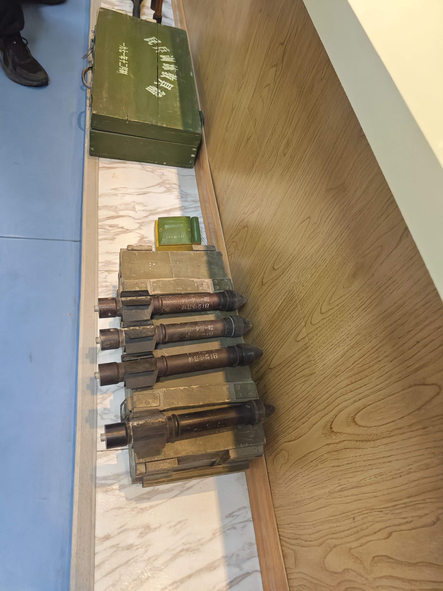
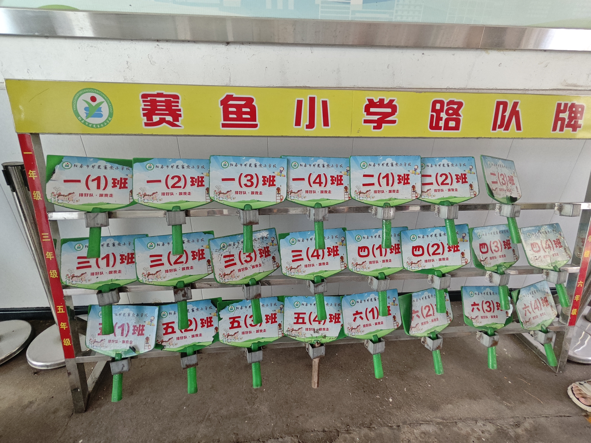

***

直到今天，我才知道[刘慈欣先生在山西阳泉长大](https://baike.baidu.com/item/%E5%88%98%E6%85%88%E6%AC%A3/142084#reference-37:~:text=%E5%90%8D%E8%AA%89%E9%99%A2%E9%95%BF%20%5B64%5D%E3%80%82-,%E5%88%98%E6%85%88%E6%AC%A3%E5%9C%A8%E5%B1%B1%E8%A5%BF%E9%98%B3%E6%B3%89%E9%95%BF%E5%A4%A7,-%5B37%5D%E3%80%821981%E5%B9%B4) ；而在山西阳泉的[矿区赛鱼小学](attachments/lcx0.jpg) 建有一个刘慈欣展览馆，支教之余，我们成功申请进入参观。

<!-- more -->

> 首先解释一下此“矿区”非彼“矿区”，阳泉市有一块区域叫“城区”，一块叫“矿区”（当然还有其它的，比如“郊区”……，可能是历史遗留问题），但是都是有楼有路的居民区 😂。

> mkdocs 原生似乎是不支持 gif/mp4 本地嵌入的，好像有插件能搞，但是有点麻烦，算了。

## 刘慈欣展览馆

赛鱼小学是刘慈欣先生的母校，而其中有一个刘慈欣展览馆。

当然，说是展览馆，但毕竟是小学中，主体只是一个小房间。

这里有各种各样的《三体》《流浪地球》：

    

        
        

    

    

        
        

    

	  

	      
	      

	  

虽然知道每次见到的《三体》/《流浪地球》都感觉不同，也知道其畅销海外，但一次性看见如此之多的版本还是有所震撼的。

当然还有刘慈欣先生的其他著作，照片多而杂，就不放出来了；其他的更多是刘先生在赛鱼小学……留下的痕迹[^1]？

[^1]: 太久没写作了，笔墨甚少……

    
    

## 科学宫

如果说刘慈欣展览馆还在我的意料之中，那么赛鱼小学内的[科学宫](attachments/lcx2.jpg)则是让我们大吃一惊。

---

[斜屋](attachments/lcx10.jpg)，大致就是一个地板倾斜，而内部装修向反方向倾斜的一个小屋。一个比较经典的实验就是滚筒向上滚动，下面是我们在里面拍摄的情况：

    
    
这是GIF的标题

不过实话说，斜屋利用眼睛欺骗大脑，在里面待久了可能感觉不适。

---

下面 [这个](attachments/dcgy.gif) 原谅我除了“尖端放电”想不到其它的相关词汇了：

电流会产生热量，稍微放久一点是会烫的（不然我们放手又抬手是在干什么😇）。

---

恐怖的是，居然还有[地震屋](attachments/lcx8.jpg)。这里不是什么宣讲[地震知识](attachments/lcx17.jpg)的房间；而是一个模拟房间！房间有横波和纵波模式，震级可调；我们尝试了下 7 级（应该），抓着栏杆脑浆摇匀了（不抓估计已经在地上了），恐怖。其实后面还有模拟火山喷发的震动，可惜当时来的比较突然，没来得及留影。

---

最后一部分比较有意思的是一些[遗留装置](attachments/lcx14.jpg)，比如这个[早期警报器](attachments/jbq.mp4)[^2]？

[^2]: 不太确定，讲解员讲解时没太听清

警报什么？这个：（应该是已经去除了火药的/或者只是纺织品）

最后离开时才发现门口那熟悉又陌生的“班牌”：

原来小学毕业已经 7 年过去了。