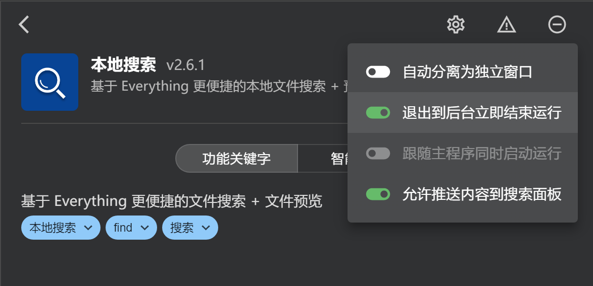
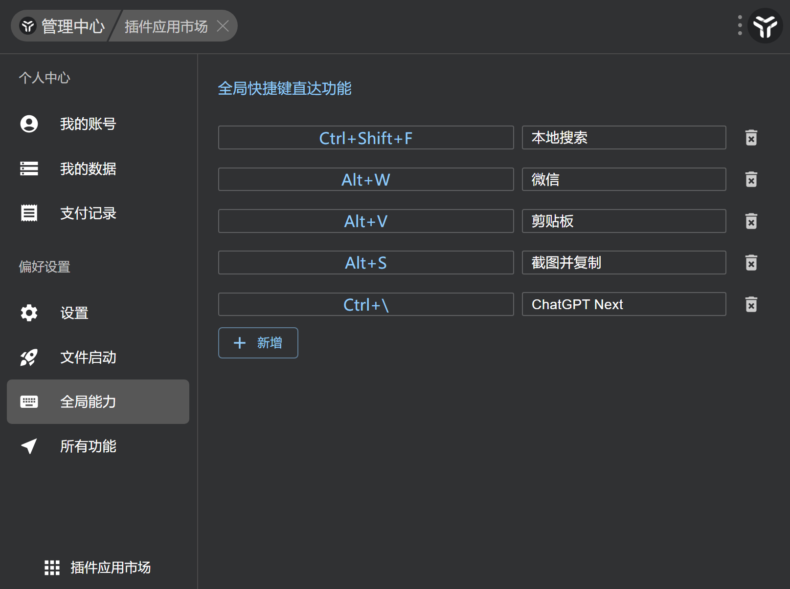

***

> [!SUMMARY]-
> 
> uTools 是一款功能强大的 PC 端系统工具，强调快捷高效。
>
> - **安装/初使用：** 下载安装 uTools，设置快捷键为 `Ctrl + space`。
> - **进阶推荐：** 关闭悬浮球，使用长按鼠标右键弹出面板。
> - **插件推荐：** 本地搜索、剪贴板、网页快开、讯飞 OCR、超级文本编辑器、截图工具、ChatGPT Next。
> - **全局快捷键推荐：** 设置常用功能的全局快捷键，避免与常见热键冲突。

<!-- more -->

[utools](https://u.tools/?c=5idqadr0ht) 是一个在 PC 端的强大系统工具，“呼之即来，即用即走”是其信条。

## 安装/初使用

[utools](https://u.tools/?c=5idqadr0ht) 

[官方入门](https://www.u.tools/docs/guide/about-uTools.html)

## 进阶推荐

> 这里可能与上面有所重合，问题不大，主要介绍我个人的使用。

### 一些修改

右上角头像/管理中心 > 个人中心 > 设置中：

- 呼出快捷键：`Ctrl + space`
    - `Alt + space` 离得太近了，不方便一个手按。
- 悬浮球：`关闭`
    - 我们期望减少鼠标的使用，快捷键就够了。
- 弹出面板：`长按鼠标右键`
    - 我们在浏览器中可以长按中键来滚动屏幕，所以个人认为不要占据中键；
    - 当然鼠标比较高级的可以用侧键。
- 开机启动：`打开`
    - 如果像我一样确实重度依赖了，建议打开；
    - 不急，看完下面再决定也不迟。

### 插件推荐

> 在之前的官方文档中也提及了热门插件应用，这里做一些修改和补充。

- [本地搜索](https://www.u.tools/docs/guide/plugin-local-search.html)
    - 可以跟随指引集成 everything，使用体验更佳；
    - 对于每次开机后的文件索引，我这是一般不到 5s，且每次开机索引一次即可；
    - 记得开下面最后一个，其他不妨自己尝试感受一下。
- [剪贴板](https://www.u.tools/docs/guide/plugin-clipboard.html)
- [网页快开](https://www.u.tools/docs/guide/plugin-open-web.html)
- Latex 公式编辑&识别
    - 告别手打 Latex 公式；似乎是用额度的？ ~~好久之前开始用的，忘了。~~
- 易翻翻译
    - 感觉比 “聚合翻译” 好用；
    - 搞个有道什么的 api，够用了。
- 万能文件浏览器
    - 放在超级面板中还是挺方便的，可以预览压缩包、音频等等。
- 书签与历史记录
    - 按照提示配置好即可；
    - 个人添加了：
        - Google Chrome
        - Visual Studio Code
        - Obsidian （我自己是只有一个 vault，不知道多 vaults 会不会出错）
- 超级文本编辑器
    - 类似于 vscode 的编辑器，抛弃丑陋的记事本；
    - 可以选中文件后在超级面板中打开；
    - 可以当作临时一段文字，固定在屏幕上。
- 截图工具 Plus
    - 可以直接保存，或者进行标注，悬浮置顶。

### 全局快捷键推荐

如下，常用功能更加推荐加入全局快捷键，注意不要和常见的热键冲突即可：

除此之外，utools 上还有不少热门的文档，如果正在做什么，不妨找找有没有文档可以随手查。
