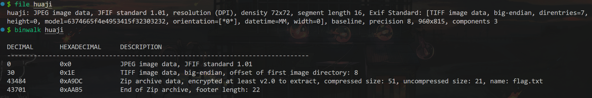

---
tags:
  - notes
comments: true
dg-publish: true
---

## Moectf2024

### The upside and down

## NISACTF2022

### huaji？

> [题目](https://www.nssctf.cn/problem/2049)

拿到没有扩展名的[^1]，直接上照妖镜 `file` ，再上 `binwalk` :

[^1]: 其实有我们也不能全信。

使用 binwalk 分离，分别对应其文件类型，发现 flag.txt 为空，但是 A9DC.zip 里面有一个 flag.txt ，只是加密了。其他两个文件没找到什么内容，检查是否伪加密，同样不是。

其实在 binwalk 分离花费一些时间时，我会看下文件属性；但是没发现什么东西，直到看了下讨论区……我以为[相机型号](attachments/img-1.png)就是这样奇怪呢……16 进制解码，得 `ctf_NISA_2022`，这就是压缩包密码，得：

> [!FLAG]
>
> `NSSCTF {Nls@_FumYEnnOjy}`

