---
tags:
  - notes
comments: true
dg-publish: true
---

## Introduction

### Compiler basics - Behind gcc main.c

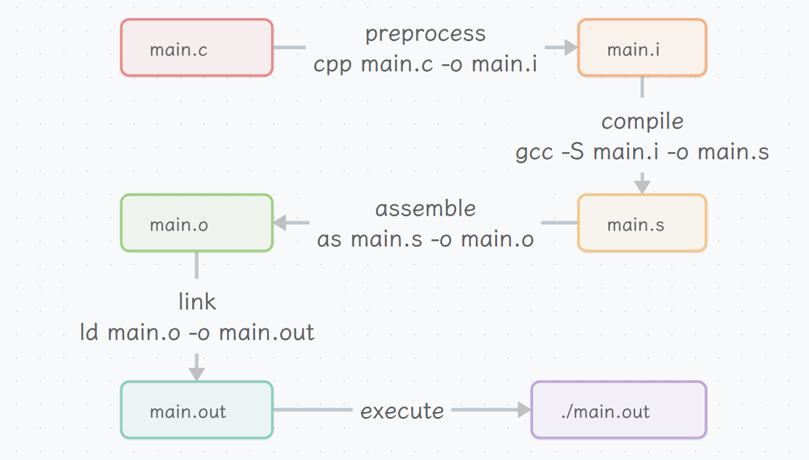

**CRT**: C runtime (Startup routines before main function)

### ELF binary basics

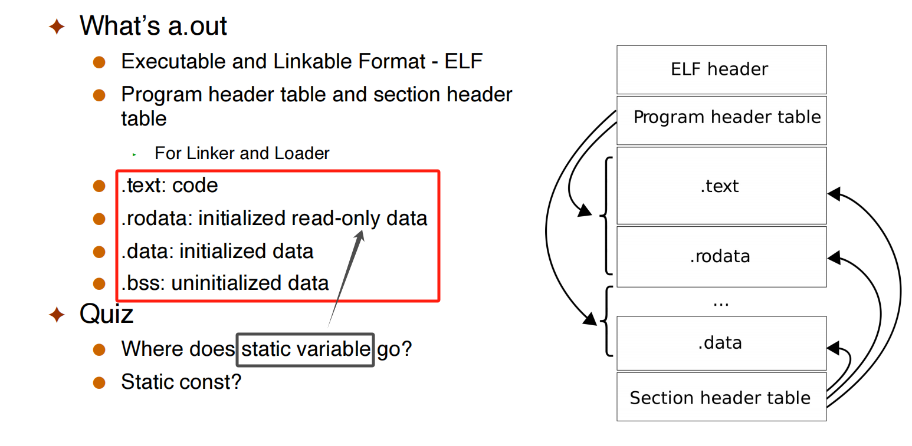

> 内存中不会存储数据的“类型”，只存储 bytes。

### Running a binary - Behind ./a.out

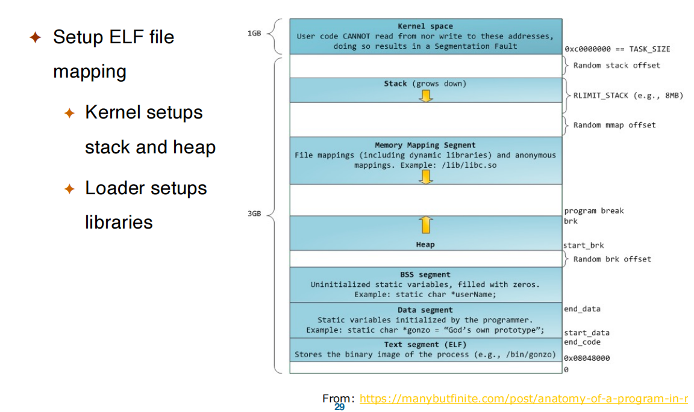

## Overview
### What is an OS?

> [!QUESTION]
>
> What is an OS?

- **software layer between the applications and the hardware because the hardware would be too difficult for users to use** .
    - Or: it’s “all the code you didn’t have to write” when you wrote your application
- **It’s a resource abstractor and a resource allocator** (this one)
    - The OS defines a set of logical resources that correspond to hardware resources, and a set of well-defined operations on logical resources
        - e.g., physical resources: CPU, Disks, RAM
        - e.g., logical resources: processes, files, arrays
    - The OS decides who (which running program) gets what resource (share)

### OS is complex

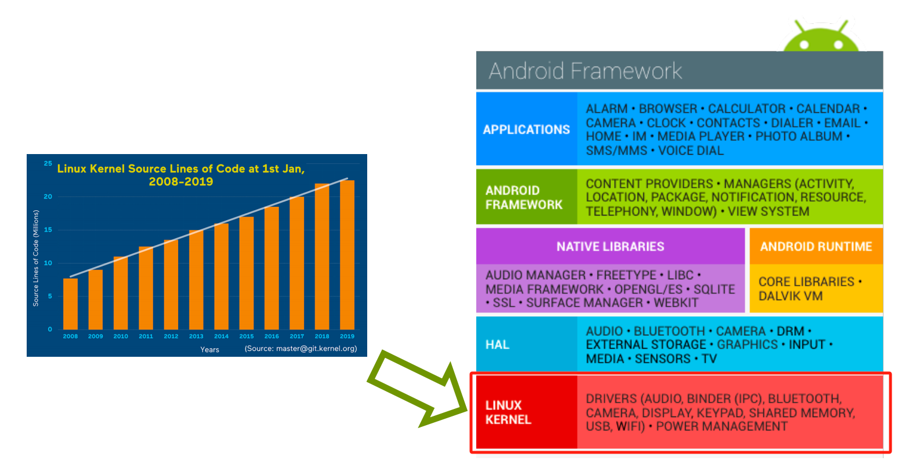

### start an OS

- When a computer boots, it needs to run a first program: **the bootstrap program**
    - Stored in Read Only Memory (ROM)
    - Called the “firmware” or bootloader
    - We use OpenSBI (Supervisor Binary Interface) for our labs
- The bootstrap program initializes the computer
    - Register content, device controller contents, etc.
- It then locates and loads the OS kernel into memory
- The kernel starts the first user-mode process (called “init” on Linux, “launchd” on Mac OS X).. let's see it...
    - first user process runs /sbin/init
    - systemd on newer Linux
    - ps –eaf
- And then, nothing happens until an **event** occurs
    - event: system call, interrupt(timer), hardware instruction ...
    - more on events in a few slides

### Multi-Programming

**Multi-Programming**: Modern OSes allow multiple “jobs” (running programs) to reside in memory simultaneously

- The OS picks and begins to execute one of the jobs in memory
- When the job has to wait for “something”, then the OS picks another job to run
- This is called a <u>context-switch,</u>  and improves productivity

### Time-Sharing

**Time-Sharing**: Multi-programming with rapid context-switching.

In modern OSes, jobs are called **processes**
- A process is a **running program**

### The Running OS

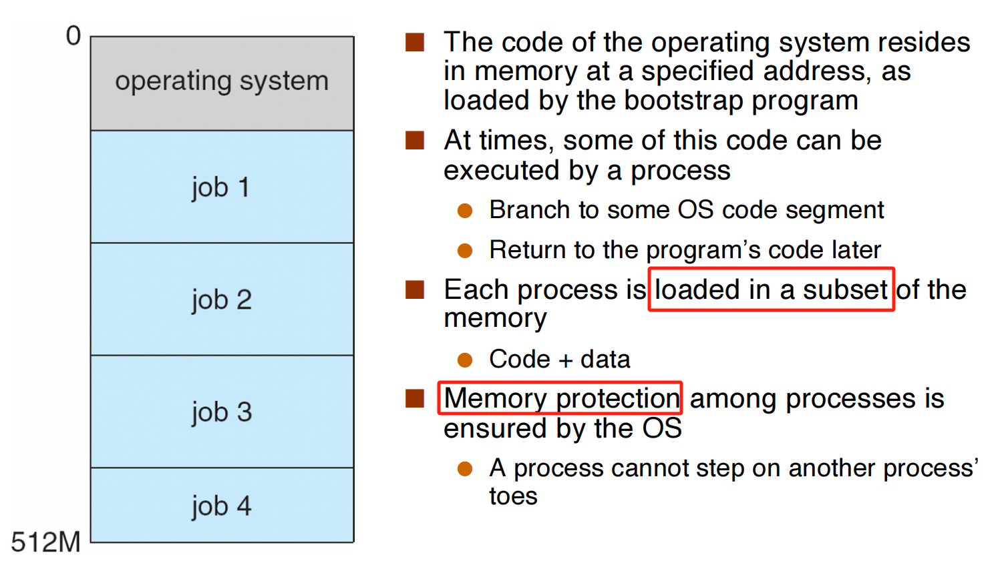

### A Note on Kernel Size

As a kernel designer you want to be careful to **not use too much** 
**memory!**
- Hence the need to write **lean/mean** code
    - **lean** a nothing more
    - **mean** a single-minded

Furthermore, there is **no memory protection within the kernel**
- The kernel’s the one saying to a process “segmentation fault”
- <u>Nobody’s watching over the kernel</u> 
- So one must be extremely careful when developing kernels

### Protected Instructions

A subset of instructions of every CPU is restricted in usage: only the OS can execute them, known as **protected (or privileged)** instructions

### User vs. Kernel Mode

All modern processors support (at least) two modes of execution:
- **User mode**: In this mode **protected instructions cannot be executed**
- **Kernel mode**: In this mode all instructions can be executed  

- User code executes in user mode
- OS code executes in kernel mode 

- The mode is indicated by a status bit in a protected control register
    - The CPU checks this bit before executing a protected instruction
    - Setting the mode bit is, of course, a protected instruction

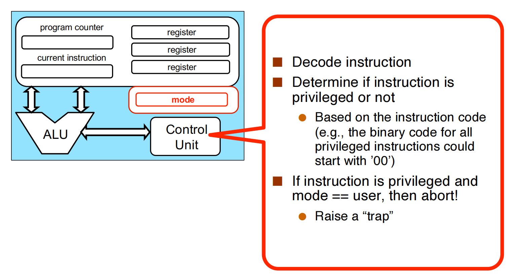

> [!KNOWLEDGE]
>
> There can be multiple modes, e.g., multiple levels in ARM64
>
> 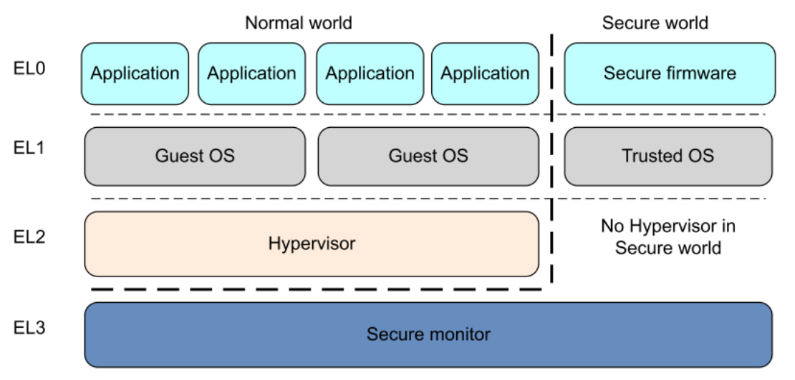
>
> RISCV mode
> 
> 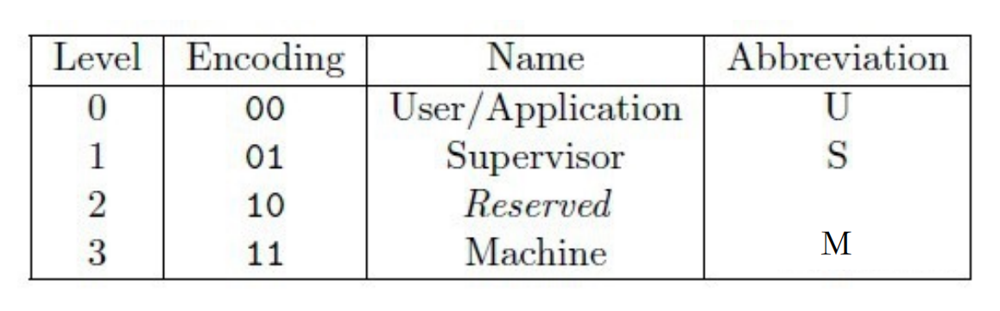


### OS Events

- **An event is an “unusual” change in control flow**
    - A usual change is some “branch” instruction within a user program for instance
- **The kernel defines a handler for each event type**
    - i.e., a piece of code executed in kernel mode
- Once the system is booted, all entries to the kernel occur as the result of an event
    - The OS can be seen as a huge event handler

There are two kinds of events: **interrupts** and **exceptions** (or traps or 
faults)
- The two terms are often confused (even in the textbook)
- The term **fault** often refers to unexpected events
- Interrupts are caused by external events
    - **Hardware-generated**
    - e.g., some device controller says “something happened”
- Exceptions are caused by executing instructions
    - **Software-generated**
    - e.g., the CPU tried to execute a privileged instruction but it’s not in kernel mode

```c title="processEvent"
void processEvent(event) {
    switch (event.type) {
        case NETWORK_COMMUNICATION:
            NetworkManager.handleEvent(event);
            break;
        case SEGMENTATION_FAULT:
        case INVALID_MODE:
            ProcessManager.handleEvent(event);
            break;
        ...
    }
    return;
}
```

### Timers

The OS must keep control of the CPU
- OS must have a **concept of “time”**
- Programs cannot gain an unfair share of the computer
- One way in which the OS (or kernel) retrieves control is when an interrupt occurs

To make sure that an interrupt will occur reasonably soon, we can 
use a **timer**.
- The timer interrupts the computer regularly
- The OS always makes sure the timer is set before turning over control to user code
- Modifying the timer is done via privileged instructions, of course.

### Main OS Services

- Process Management
- Memory Management
- Storage Management
- I/O Management
- Protection and Security

### Privileged Instructions

Only privileged instructions can:

- [x] Set value of the system timer
- [ ] Read the clock
- [x] Clear memory
- [ ] Issue a system call instruction
- [x] Turn off interrupts
- [x] Modify entries in device-status table
- [x] Access I/O device

> https://www.cs.cornell.edu/courses/cs414/2007sp/homework/hw1_soln.pdf
> 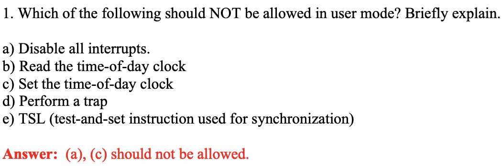

## Structures

### User Operating System Interface

- **Command line interface (CLI)** or command interpreter allows direct command entry
- **Graphical User Interface (GUI)** User-friendly desktop metaphor interface
- **Touchscreen Interfaces**

### system call

#### concept

When a user program needs to **do something privileged**, it calls a system call (e.g., to create a process, write to disk, read from the network card)

**System Call**: A system call is a special kind of trap. 

> 是 OS 给 user mode 的 interface；例如，调用 "printf" 时。这也说明 system call 本身不是 privated ，因为 user mode 无法调用 privated code.

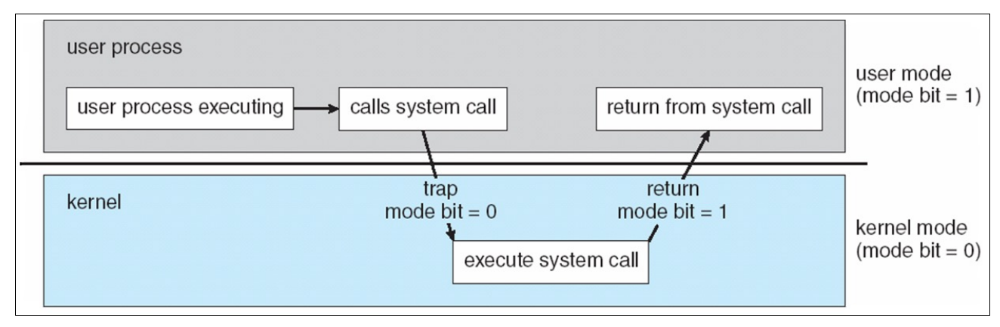

#### Implementation

System-call interface maintains a table indexed according to numbers associated with each system call. The system call table is different in different architecture.

> [!KNOWLEDGE]
>
> 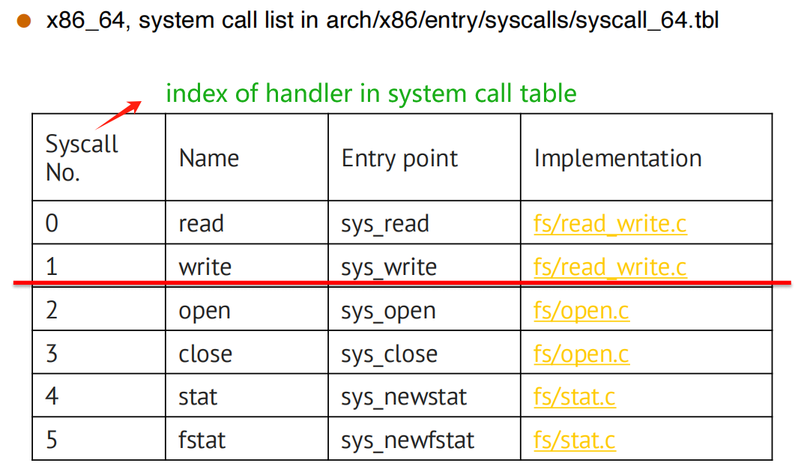

When we use "printf" (a wrapper of the write system call), actually `mov $0x1, %eax` and `system call` :

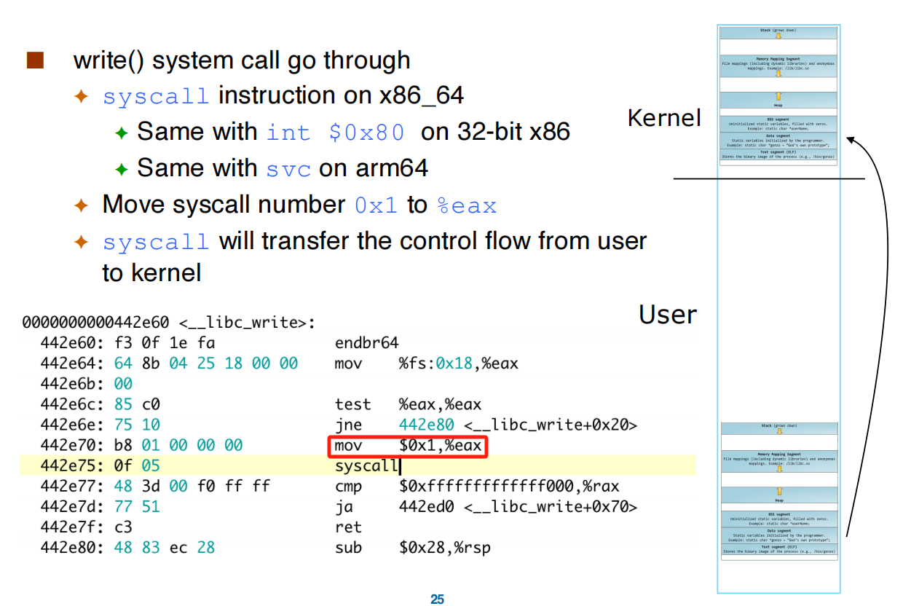

Finishing "printf" the content, it will return to user mode, and continue.

#### example (cp in.txt out.txt)

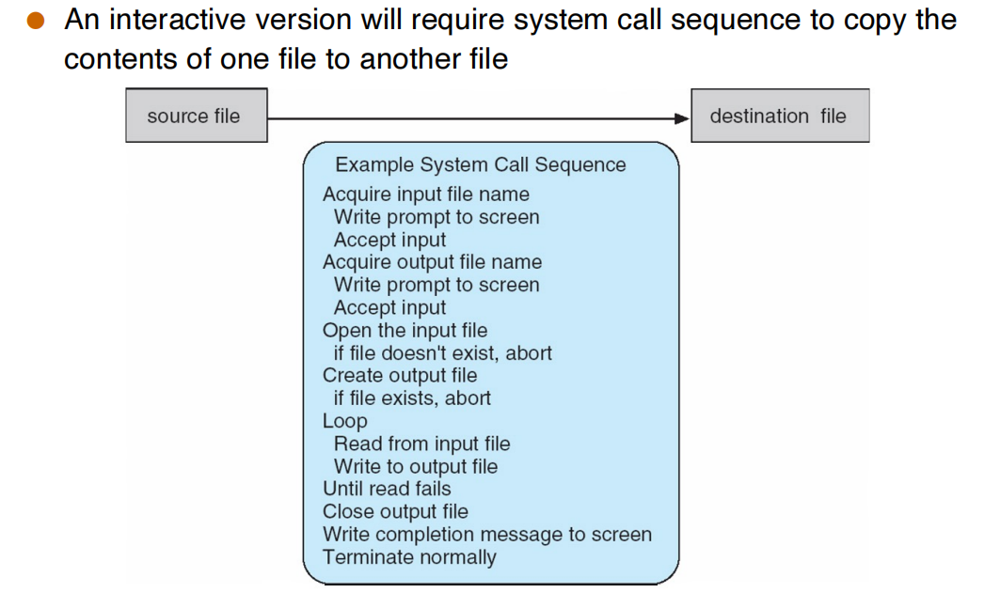

> [!QUESTION]
>
> On Linux there is a “command” called **strace** that gives details about which system calls were placed by a program during execution. What happens if we copy a large file ?

调用的 system call 数量增加，但是种类不变。主要在于 read 等 system call 一次能够操作的内存大小有限，需要反复执行。

#### Time Spent in System Calls

The time command is a simple way to time the execution of a program (used like strace).

It reports three times:
- “real” time: wall-clock time (also called elapsed time, execution time, run time, etc.)
- “user” time: time spent in user code (user mode)
- “system” time”: time spent in system calls (kernel mode)

#### System Call Parameter Passing

- direcly from register
- from a table

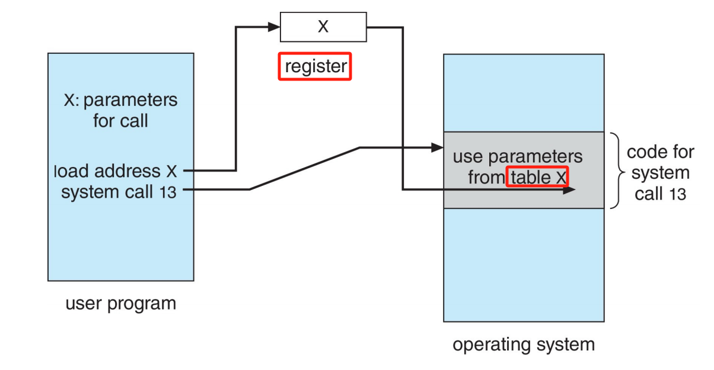
#### Types of System Calls

- Process control
- File management
- Device management
- Information maintenance
- Communications
- Protection

### ELF binary basics

#### Linkers and Loaders

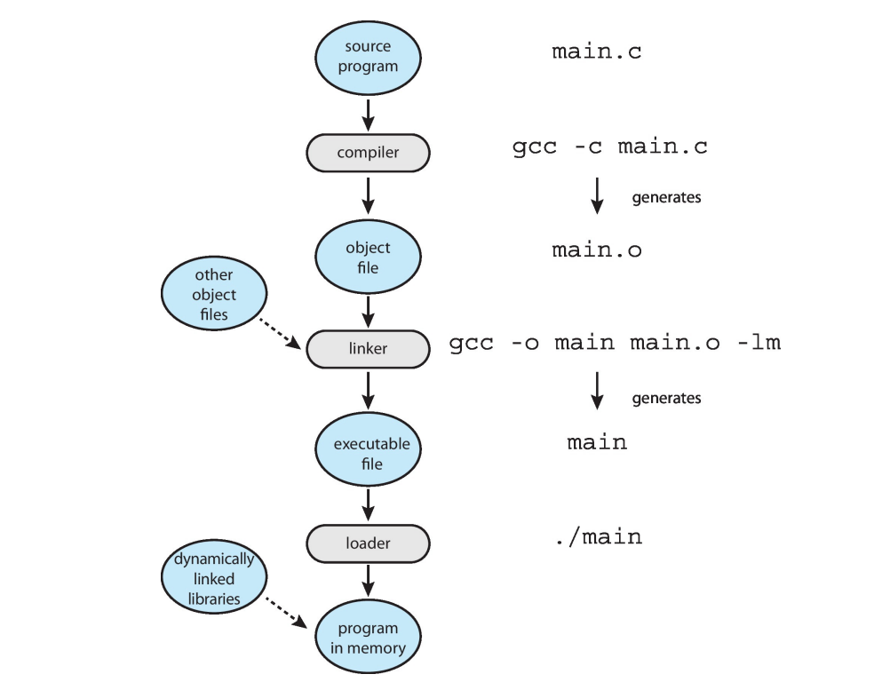

#### Static link vs dynamic link

- Statically-linked ELF has no .interp section
- Dynamically-linked ELF has .interp section
    - need loader

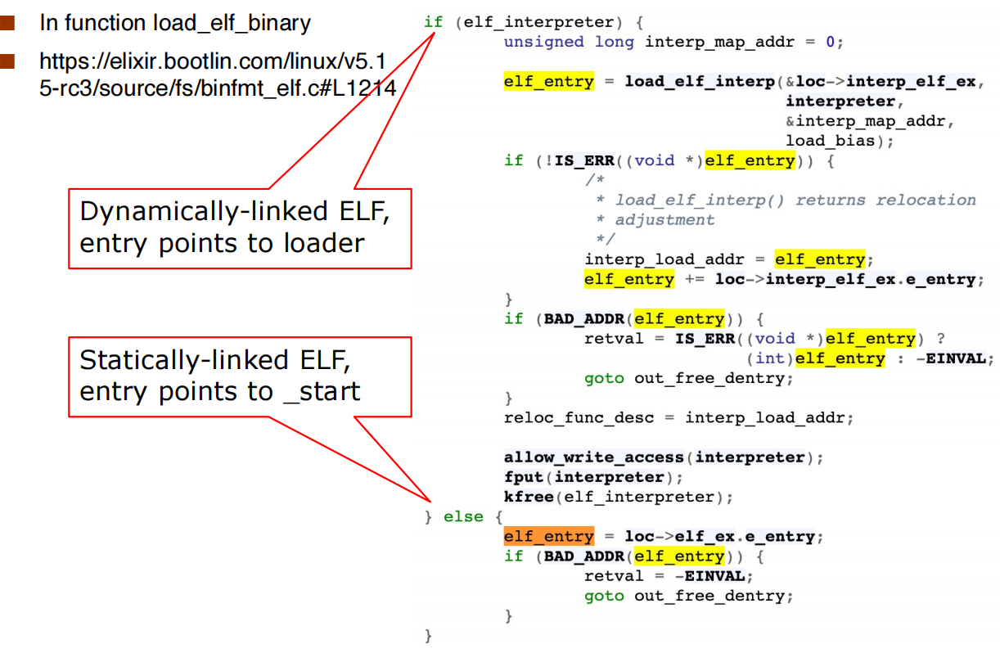

## Operating System Design and Implementation

### User goals and System goals:

- User goals – operating system should be convenient to use, easy to learn, reliable, safe, and fast
- System goals – operating system should be easy to design, implement, and maintain, as well as flexible, reliable, error-free, and efficient

### Important principle to separate: 

(Allows policy changes without changed implemented mechanism)

- Policy: What will be done?
- Mechanism: How to do it?

### Implementation

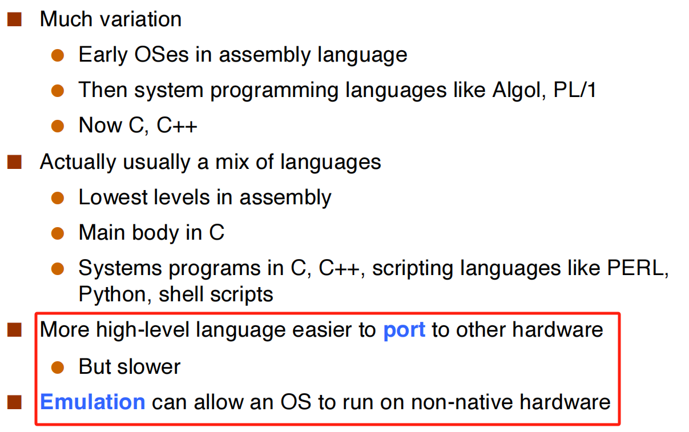

### Microkernels

Moves as much from the kernel into user space.

Benefits:
- Easier to extend a microkernel
- Easier to port the operating system to new architectures
- More reliable (less code is running in kernel mode)
- More secure

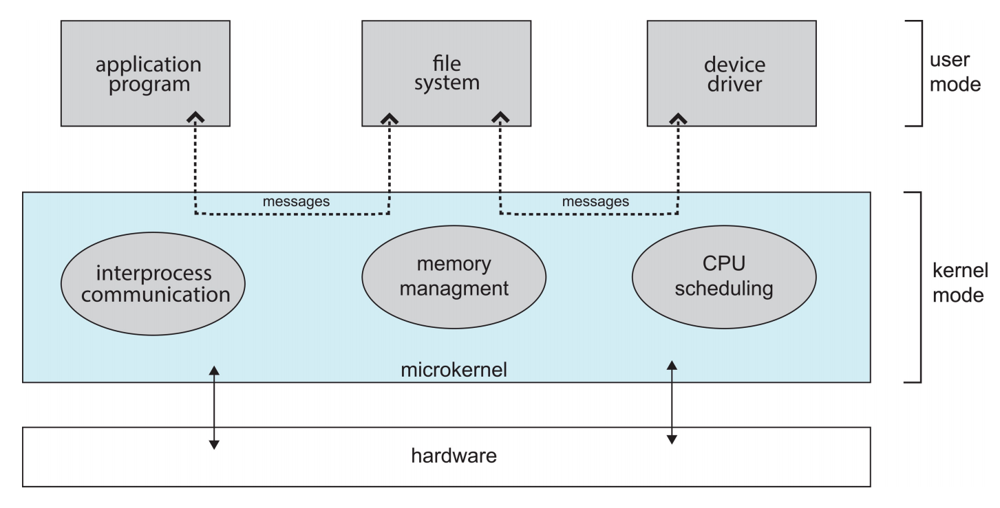

### module

Many modern operating systems implement **loadable kernel modules** (LKMs):

- Uses object-oriented approach
- Each core component is separate
- Each talks to the others over known interfaces
- Each is loadable as needed within the kernel

### Hybrid Systems

macOS and iOS Structure & Android

### other

> [!QUOTE] Kernighan's Law
>
> "Debugging is twice as hard as writing the code in thefirst place. Therefore, if you write the code as cleverly as possible, you are,by definition, not smart enough to debug it."


> [!SUMMARY]
>
> progress -> scheduling -> IPC -> threads -> synchronization -> deadlock