---
tags:
  - notes
comments: true
dg-publish: true
---
## Some definitions

> [!DEFINITION] CPU Scheduling
>
> the decisions made by the OS to figure out which ready processes/threads should run and for how long
>
> - Necessary in multi-programming environments
> - Maximizes CPU utilization so that it’s never idle

### CPU-I/O Burst Cycle

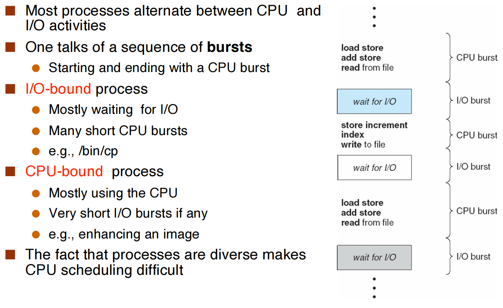

Rationale: non-CPU-intensive jobs should really get the CPU quickly on the rare occasions they need them, because they could be interactive processes

> https://www.cs.cornell.edu/courses/cs414/2007sp/homework/hw1_soln.pdf
> 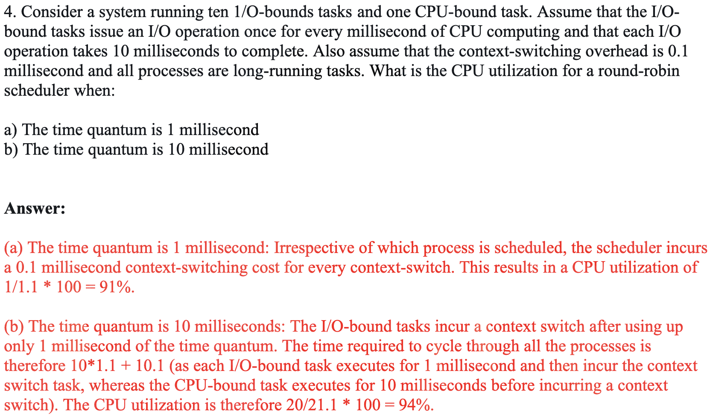

### CPU Scheduler

- **Non-preemptive** scheduling: a process holds the CPU until it is willing to give it up
    - Also called “cooperative” scheduling
- **Preemptive** scheduling: a process can be preempted even though it could have happily continued executing
    - e.g., after some “you’ve had enough” timer expires

### Scheduling Decision Points

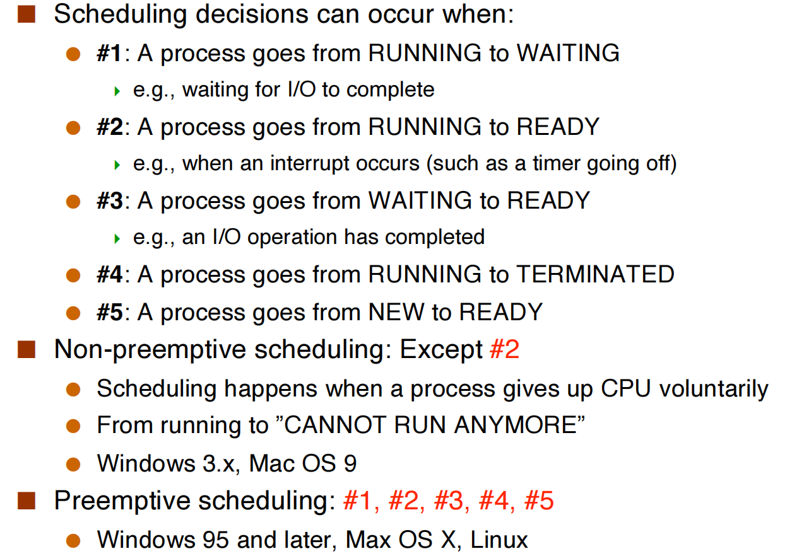

### Scheduling Criteria

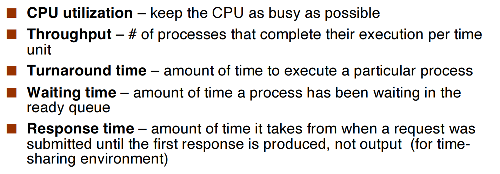

### Dispatcher

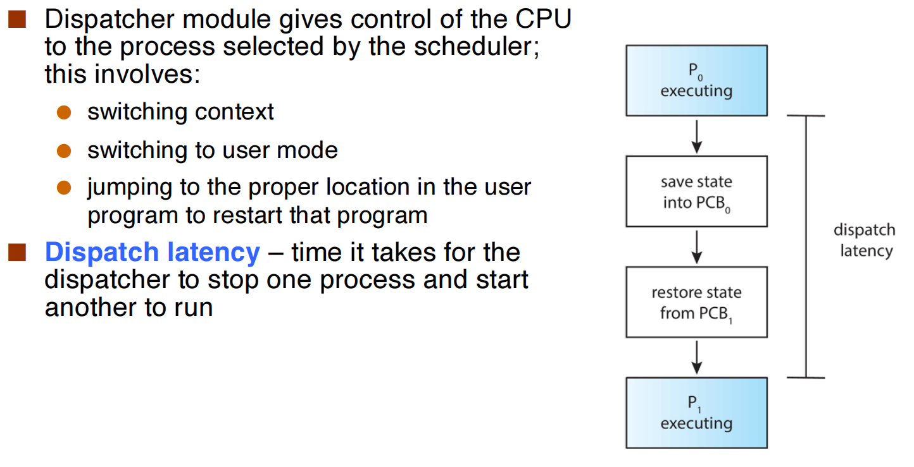

## Scheduling Algorithms

- First-Come, First-Served Scheduling
- Shortest-Job-First Scheduling
- Round-Robin Scheduling 
- Priority Scheduling 
- Multilevel Queue Scheduling 
- Multilevel Feedback Queue Scheduling

In the following, we will use examples to demonstrate the algorithms
- Consider only one CPU burst (in milliseconds) per process
- Use the average waiting time as the measure of comparison
- In the context of a single CPU that has a single processing core

### First-Come, First-Served (FCFS) Scheduling

| progress | burst time |
| :------: | :--------: |
|    P1    |     24     |
|    P2    |     3      |
|    P3    |     3      |

- if in the order of (P1 P2 P3)
    - The **Gantt chart** for the schedule is: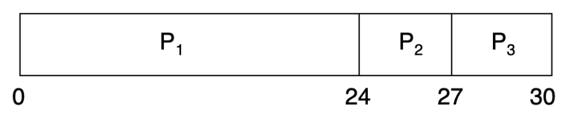
    - Average waiting time: (0 + 24 + 27) / 3 = 17
- if in the order of (P2 P3 P1)
    - The Gantt chart for the schedule is: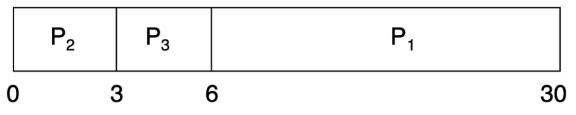
    - Average waiting time: (6 + 0 + 3) / 3 = 3
- **Convoy effect** - short process behind long process; Long jobs slow down the whole system
- FCFS is non-preemptive

### Shortest-Job-First (SJF) Scheduling

**SJF is optimal** – gives minimum average waiting time for a given set of processes. A known result is: SJF is provably optimal for average wait time. In the theoretical literature, called: **SRPT** (Shortest Remaining Processing Time)

But the difficulty is knowing the length of the next CPU request; so it is just theoretically optimal.

| Process | Arrival Time | Brust Time |
| :-----: | :----------: | :--------: |
|   P1    |      0       |     10     |
|   P2    |      2       |     6      |
|   P3    |      4       |     7      |
|   P4    |      5       |     2      |
- **Brust time**: the time of a progress need to execution
- **TurnAround time**: one progress (finish time - arrival time)
- **Waiting time**: one progress (turnaround time - burst time)
- **Response time**: one  progress (first begin time - arrival time)
- **Throughput**: # of processes that complete execution per time unit.

#### “Shortest-next-CPU-burst” algorithm

**Non-preemptive**, which measn that only after the progress before some progress finishes can the latter begins to run. So the Gantt Chart is :

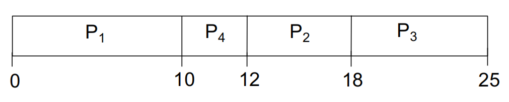

- Average turnaround time: (10 + 16 + 21 + 7) / 4 = 13.5
- Average waiting time: (0 + 10 + 14 + 5) / 4 = 7.25

#### shortest-remaining-time-first (SRTF)

**Preemptive**, which means we always find the shortest job to switch to. Now the Gantt Chart is (compare remaining time when: a new progress comes in or a old progress finishes):

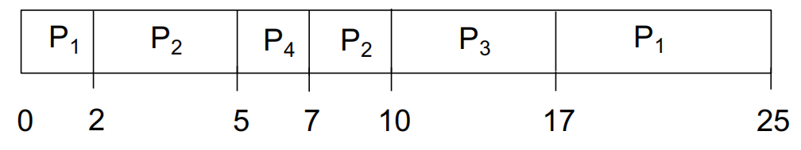

- Average turnaround time: (25 + 8 + 13 + 2) / 4 = 12
- Average waiting time: (15 + 2 + 6 + 0) / 4 = 5.75

### Round-Robin Scheduling

RR Scheduling is preemptive and designed for time-sharing
- It defines a **time quantum** (A fixed interval of time (10-100ms))
- Unless a process is the only READY process, it never runs for longer than a time quantum before giving control to another ready process
- Scheduling:
    - Pick the first process from the ready queue
    - Set a timer to interrupt the process after 1 quantum
    - Dispatch the process

#### example

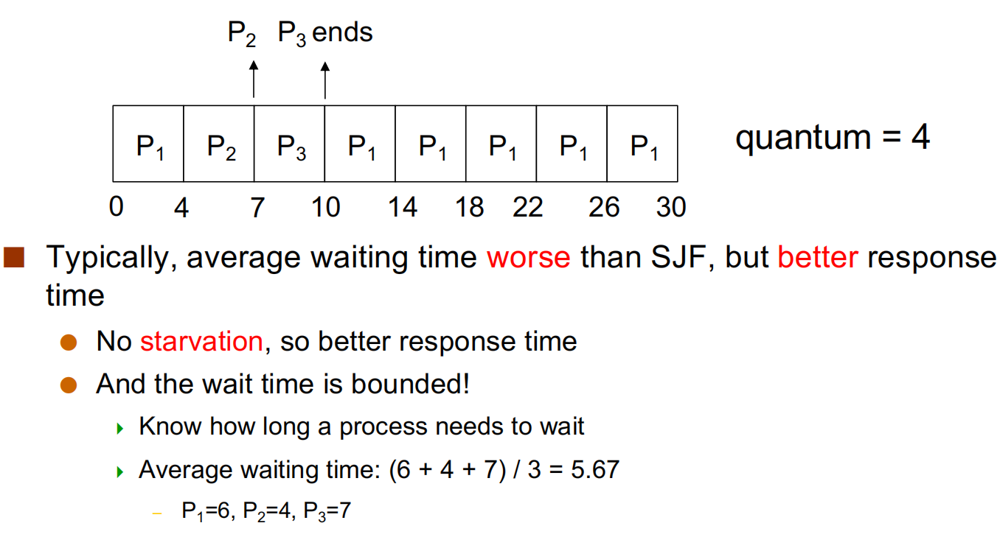

#### Pick right quantum:

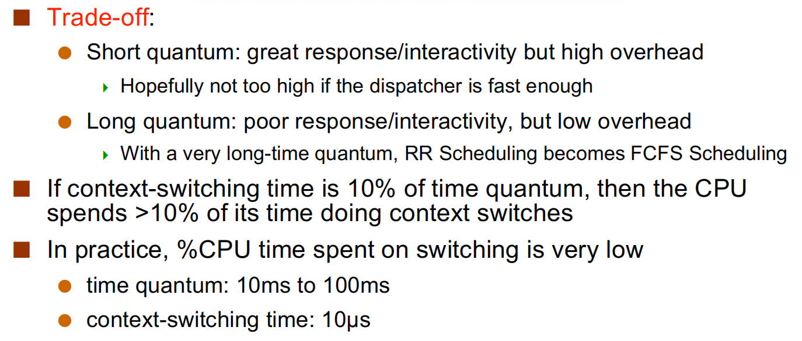

### Priority Scheduling

Simply implement the Ready Queue as a Priority Queue.
- Priorities can be internal:
    - e.g., in SJF it’s the predicted burst time, the number of open files
- Priorities can be external:
    - e.g., set by users to specify relative importance of jobs

#### Priority Scheduling w/ Round-Robin

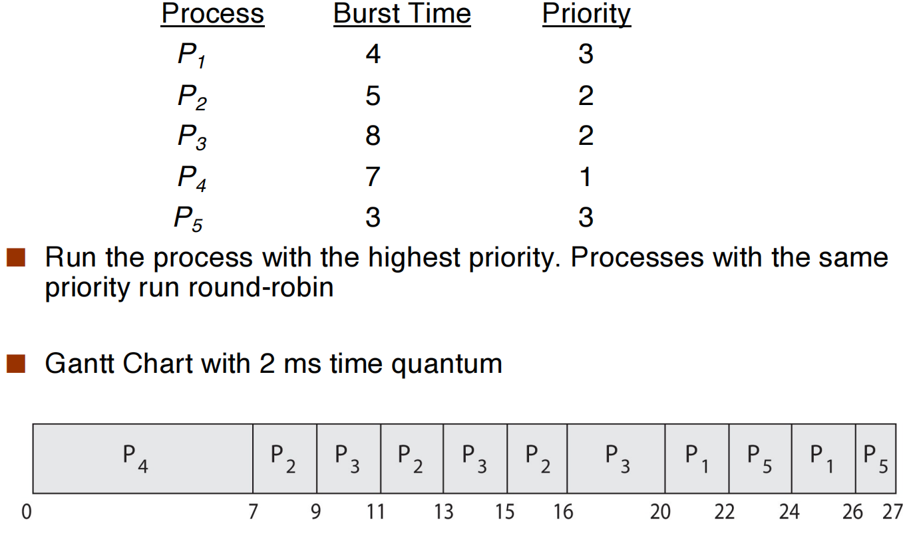

- The problem: will a low-priority process ever run??
    - A solution: Priority aging (Increase the priority of a process as it ages)

### Multi xxx

TODO

