---
tags:
  - notes
comments: true
dg-publish: true
---

## Instruction Set Architecture

### 字节寻址（byte addressing）

- 8bits - byte
- 16bits - half word
- 32bits - word
- 64bits - double word

掩码机制（mask）

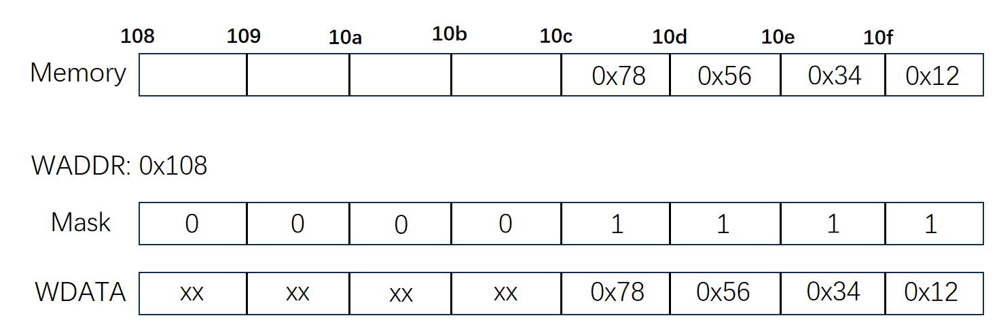

只有掩码位为 1 时，我们才读/写内存，否则不修改。

> [!QUESTION]
>
> 为什么我们使用小端格式，即低位放在低地址？
>
> 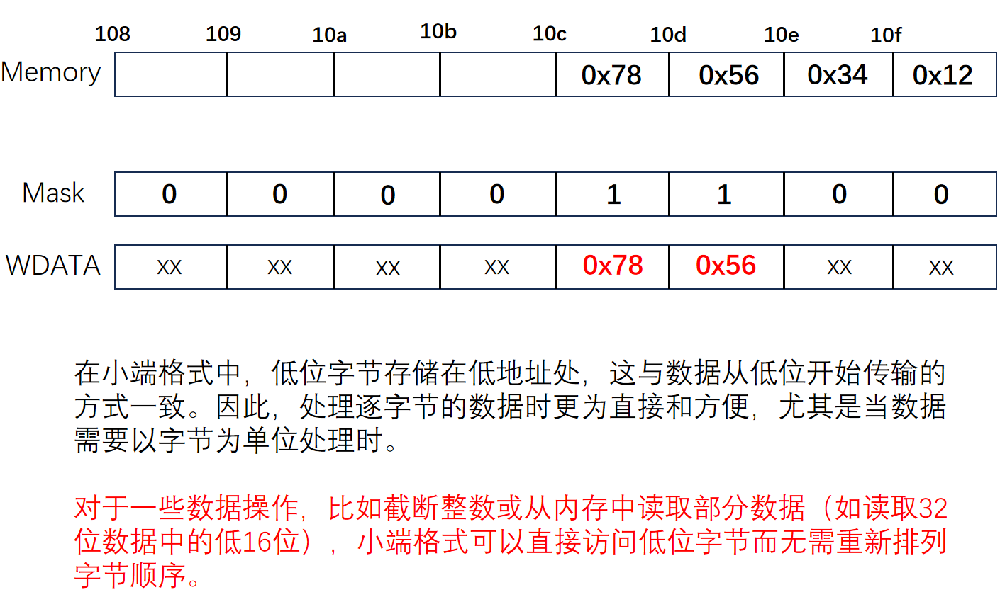

### 控制流寻址

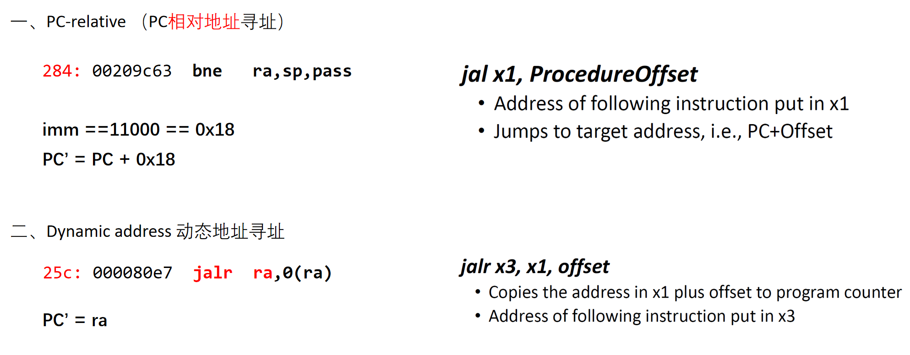

## CPU Calculation

- Clock time：$T_c$ 每个时钟周期长度，也叫 $\Delta t_0\quad or\quad t_{0}$ 
- Execution Time：m 级流水线CPU 执行 n 条指令的总时间 T，T=(n+m−1) $t_0$
- Troughput：吞吐量 TP，$TP=\frac nT=\frac n{n+m-1}\:\frac1{\Delta t_0}$
- Speedup：加速比 Sp，$\begin{aligned}\text{Sp}&=\frac{ExecutionTime_{no-pipeline}}{ExecutionTime_{pipeline}}=\frac{nm\quad t_0}{(n+m-1)\quad t_0}\end{aligned}$
- efficiency：效率 $\eta$，$\eta=\frac{Sp}m$

### 考点一

> 流水线 CPU 降低了每一条指令的执行时间？ 

No, Does Not improve latency for individual instruction.

> Another expression: Pipeline reduce individual execution time? Improving of Throughput. **Correct**

### 考点二

> 流水线 CPU 降低资源/部件的消耗？

No，bring overhead for registers

> Improving of efficiency for resources (functional unit) . **Correct**

### 考点三

>注意到 $\\lim_{ n \to \infty } Sp = m$ ，那么是不是 m（即流水线级数）越大越好？

No, overhead may be huge.

### Example

> 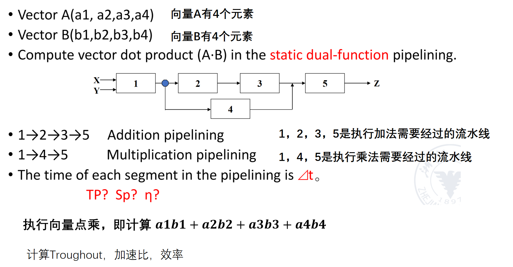

显然我们需要计算 $a_{1}b_{1}+a_{2}b_{2}+a_{3}b_{3}+a_{4}b_{4}$ ，共四次乘法三次加法，作出时空图：


## Pipeline hazard

### data hazard
#### forwarding

下图中蓝色线表示对 x2 的需求，直线指向左下就表明了这个地方出现了数据冲突：

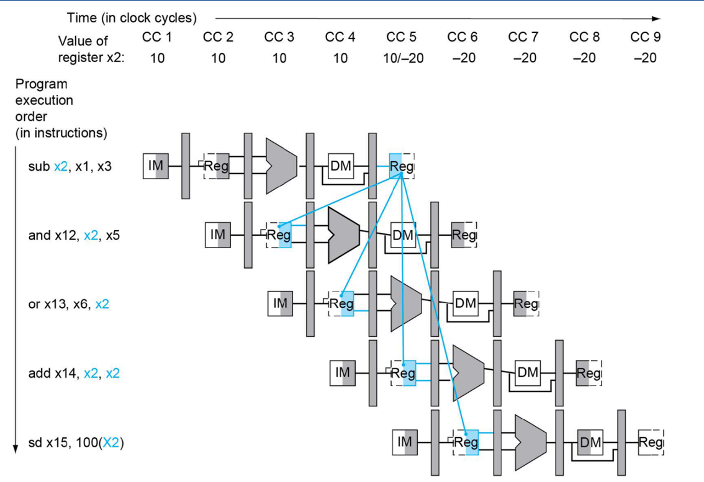

在**理论**中，我们可以通过 double bubble 的方式插入两条 nop 指令，并通过上升沿写入、下降沿输出的方式解决；当然，为了高效，我们需要 forwarding 。

在理论课上，我们的 forwarding 图如下所示（与实验课有所不同）：


在上图中，我们前递的内容为 MEM 和 WB 阶段的 alu_res 或者是访存结果，前递到 EXE 阶段；同时注意我们

#### stall

一般出现在 load-use 的情况下。

### control hazards

考试默认框架：


如果是在 ID 阶段给出比对结果，把 compare 放在 ID 阶段，那么浪费的时钟周期将会减少到一个；但是将会需要增加一个 ALU，计算跳转地址。（空间换时间）

> 能否使得时钟周期浪费的更少？

#### Branch prediction

1. 固定的预测，即预测
    - 一定跳转
    - 一定不跳转
2. 预测一些分支
    - 跳往低地址更可能是在 for 循环中，更可能需要跳转。
3. 分支延迟槽
    - 将与分支完全无关的指令放置在分支指令后面，充分利用分支带来的延迟。
4. 动态分支预测
    - 用一张表 (Branch history table, BHT) 记录是否跳转；如果表中存在相同的地址，则大概率会和上一次执行该地址指令一样的跳转与否。
    - 在表中，我们用一个比特来记录某一地址指令上一次执行是否跳转

> [!QUESTION]
>
> **一比特**动态预测器缺点：
> 
> ```c
> for (int i = 0; i < 10; i++) {
>     for (int j = 0; j < 10; j++){
>     }
>  }
> ```
>
> 一共会发生多少次分支预测错误？（假设其实状态下 BHT 为空）

很容易出现 10+1 = 11 的答案；因为第一次在认为第一次在 `j<10` 出不预测，接下来 10 次因为 `j=10` 而预测失败，最后在外层循环预测失败 1 次。

但是需要注意，在 `j=10` 预测失败时，将 BHT 中该地址设置为 0（假设 1 表示跳转）；而下一次由于外层循环再次到达此处时，`j=0` 而预测不跳转，又一次失败；这样的操作又有 9 次；所以一共发生 20 次分支预测错误。

> [!QUESTION]
>
> 那如果我们用一个两比特的分支预测器呢？
>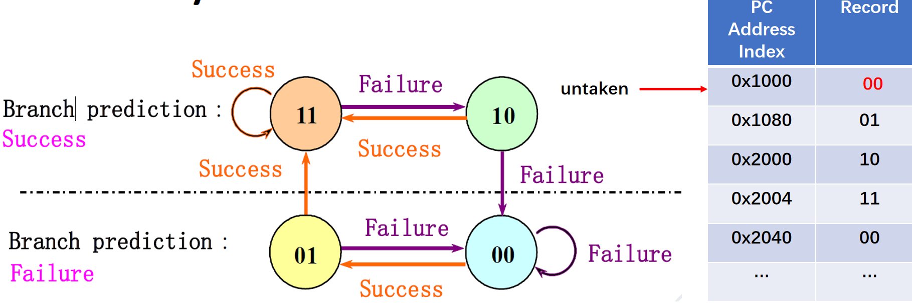
> 
> 此时执行下面的代码，一共会发生多少次分支预测错误？
> 
> ```c
> for (int i = 0; i < 10; i++) {
>     for (int j = 0; j < 10; j++){
>     }
>  }
> ```
>
> 显然，现在应该是我们之前分析的“错误答案”，即 11 次。

> 既然我们都把某个地址的跳转指令是否跳转记录下来了，把它跳转的指令一同记下来岂不是更加省时间？

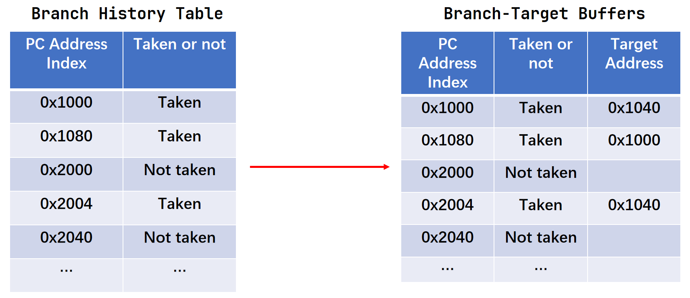

BTB 的实际效果：

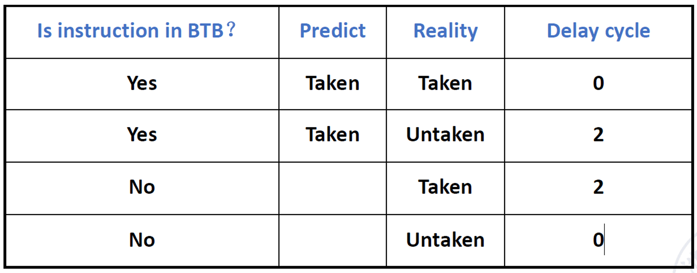

## Linear and nonlinear pipeline

我们所实现的五级流水线是一个简单的线性流水线；但是有时候我们需要使用非线性流水线，反复用到某一流水段甚至同时使用多个流水段；

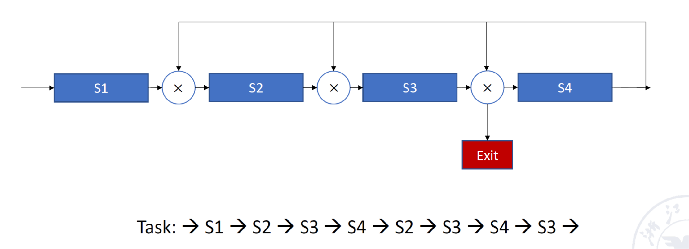

我们不可能等到一条指令执行完毕才送入下一条指令，那样等同于多周期 CPU；但是又要避免前后两条指令同时需要使用同一段流水段的竞争情况；

于是引入 **二维预约表**（即记录了某条指令在开始执行的若干个周期内对不同流水段的占用情况）；

一条指令对同一流水段的使用的周期间隔构成了**延迟禁止表(ForbiddenList)** 即表示隔多长时间不能够送入指令；

为了方标，引入 **冲突向量(CollisonVector)** 助记，即延迟禁止表中的对应位置二进制为 1：

如下图，延迟禁止表：F={1，5，6，8}，冲突向量 C=(10110001)。

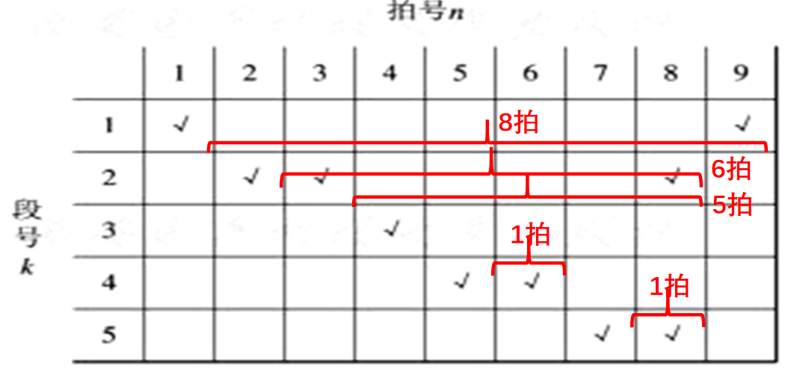

那么我们引入冲突向量只是简单简化表示吗？考虑：上述延迟禁止表，我们显然可以在第 2 拍的时候送入新的指令；那么此时对流水段的占用该如何表示？三维预约表，然后再找第 3 拍可能的送入时间？可想有多麻烦。但是我们惊奇地发现，前后两条指令的冲突向量错位相或后的结果正是两条指令都在流水线上时的等效冲突向量，如下：

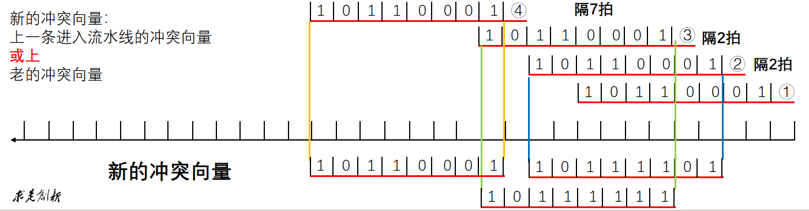

当然我们还有其他调度的可能，并能够分别绘制 **状态转移图**：

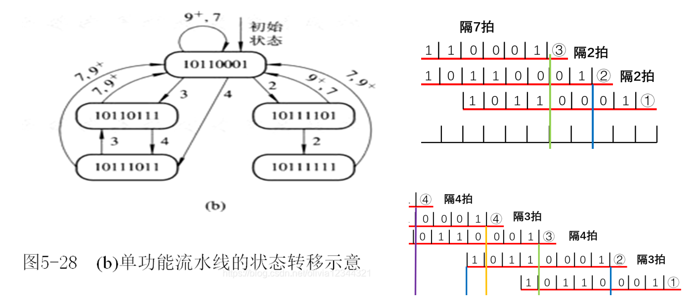

尝试所有可能的调度方式，找出最小平均间隔：


## 进程

### 进程控制块 Process Control Block (PCB) 

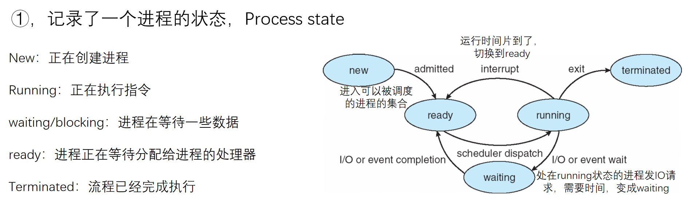

②，记录了一个进程的 PID；每启动一个进程，就会被分配一个独立的 PCB 和 PID 。

③，记录了一个进程的上下文信息；PC / 通用寄存器。

### 上下文切换/调度

**Round Robin 轮询例题：**

假设**time quantum** 为 20 个单位，而上下文切换开销为 10 个单位时间，那么 CPU 利用率是多少？

| Process | Brust Time |
| :-----: | :--------: |
|   P1    |     53     |
|   P2    |     17     |
|   P3    |     68     |
|   P4    |     24     |

绘制 Gantt chart 如下：


同时注意到切换了 9 次，所以效率为

$\eta = \frac{162}{162+9*10}*100\%$
